# 初识Kafka

> Kafka已经定位为一个分布式流式处理平台
>
> 它以高吞吐、可持久化、可水平扩展、支持流数据处理等多种特性而被广泛使用。


## 消息写入


## 分区

> 如果一个主题只对应一个文件，那么这个文件所在的机器 I/O 将会成为这个主题的性能瓶颈，而分区解决了这个问题。

## 多副本（Replica）机制

> 通过增加副本数量可以提升容灾能力

原分区和副本组成了一个小集群，他们之间是“一主多从”的关系，其中leader副本负责处理读写请求，follower副本只负责与leader副本的消息同步。

### AR、ISR、OSR关系


leader副本负责维护和跟踪ISR集合中所有follower副本的滞后状态，会根据副本的滞后情况，在ISR中移进移除

> **leader选举只会在ISR中选择**

ISR与HW和LEO也有紧密的关系。HW是High Watermark的缩写，俗称高水位，它标识了一个特定的消息偏移量（offset），消费者只能拉取到这个offset之前的消息。

### ISR与HW、LEO

HW是High Watermark的缩写，俗称高水位，它标识了一个特定的消息偏移量（offset），消费者只能拉取到这个offset之前的消息。**HW是分区的概念，一个分区只有一个HW**

LEO是Log End Offset的缩写，它标识当前日志文件中下一条待写入消息的offset。LEO的大小相当于当前日志分区中最后一条消息的offset值加1

**重点：**

​	分区ISR集合中的每个副本都会**维护自身的LEO**（也就是说ISR中可能不同的LEO，我们关注最小的LEO），而ISR集合中**最小的LEO**即为分区的**HW**，对消费者而言只能消费HW之前的消息。


假设某个分区的ISR集合中有3个副本，即一个leader副本和2个follower副本，此时分区的LEO和HW都为**3**（offset此时没有存值）。


此时写入消息3、4，HW不变，LEO上升。**因为HW不变，所以用户只能拉到消息0、1、2**

在消息写入leader副本之后，follower副本会发送拉取请求来拉取消息3和消息4以进行消息同步。


在某一时刻follower1完全跟上了leader副本而follower2只同步了消息3，如此leader副本的LEO为5，follower1的LEO为5，follower2的LEO为4，**那么当前分区的HW就是最小的LEO -> 4** ，此时消费者可以消费到offset为0至3之间的消息。


## 示例

下图所示，Kafka集群中有4个broker，某个主题中有3个分区，且副本因子（即副本个数）也为3，如此每个分区便有1个leader副本和2个follower副本。生产者和消费者只与leader副本进行交互，而follower副本只负责消息的同步，很多时候follower副本中的消息相对leader副本而言会有一定的滞后。


## Kafka 消费端

Kafka 消费端也具备一定的容灾能力。Consumer 使用**拉（Pull）模式**从服务端拉取消息，并且**保存消费的具体位置**，当消费者宕机后恢复上线时可以根据之前保存的消费位置重新拉取需要的消息进行消费，这样就不会造成消息丢失。

## Zookeeper

Kafka通过ZooKeeper来实施对**元数据信息的管理，包括集群、broker、主题、分区等内容。**

## Kafka生产端

生产端有这么几个字段


### key

key是用来指定消息的键，它不仅是消息的附加信息，还可以用来**计算分区号**进而可以让消息**发往特定的分区**。

**key可以让消息再进行二次归类，同一个key的消息会被划分到同一个分区中**

### KafkaProducer

在Kafka生产者客户端KafkaProducer中有3个参数是必填的。

bootstrap.servers：该参数用来指定生产者客户端连接Kafka集群所需的broker地址清单，至少要设置两个

key.serializer 和 value.serializer：

​		**broker 端接收的消息必须以字节数组（byte[]）的形式存在**。制定好序列化方式，可以让String在发送之前转换为byte[]


**消息在通过send（）方法发往broker的过程中，有可能需要经过拦截器（Interceptor）、序列化器（Serializer）和分区器（Partitioner）的一系列作用之后才能被真正地发往 broker**

### 分区器

> 其实就是生产者发送过程中的一个方法

在默认分区器 DefaultPartitioner 的实现中，close（）是空方法，而在 partition（）方法中定义了主要的分区分配逻辑。如果 key 不为null，那么默认的分区器会对 key 进行哈希（采用MurmurHash2算法，具备高运算性能及低碰撞率），最终根据得到的哈希值来计算分区号，拥有相同key的消息会被写入同一个分区。如果key为null，那么消息将会以轮询的方式发往主题内的各个可用分区。

### 拦截器

> 其实就是生产者发送过程中的一个方法

- KafkaProducer在将消息序列化和计算分区之前会调用生产者拦截器的onSend（）方法来对消息进行相应的定制化操作
- KafkaProducer 会在消息被应答（Acknowledgement）之前或消息发送失败时调用生产者拦截器的 onAcknowledgement（）方法
- close（）方法主要用于在关闭拦截器时执行一些资源的清理工作。

### 整体架构


整个生产者客户端由两个线程协调运行，这两个线程分别为主线程和Sender线程（发送线程）。在主线程中由KafkaProducer创建消息，然后通过可能的拦截器、序列化器和分区器的作用之后缓存到消息累加器（RecordAccumulator，也称为消息收集器）中。Sender 线程负责从RecordAccumulator中获取消息并将其发送到Kafka中。RecordAccumulator 主要用来缓存消息以便 Sender 线程可以批量发送，进而减少网络传输的资源消耗以提升性能

Sender 从 RecordAccumulator 中获取缓存的消息之后，会进一步将原本＜分区，Deque＜ProducerBatch＞＞的保存形式转变成＜Node，List＜ ProducerBatch＞的形式**，其中Node表示Kafka集群的broker节点。**

在转换成＜Node，List＜ProducerBatch＞＞的形式之后，Sender还会进一步封装成＜Node，Request＞的形式，这样就可以将Request请求发往各个Node了，**这里的Request是指Kafka的各种协议请求**

**这里我感觉我想告诉你的是，控制负载均衡，发到broker那去这个操作，就是生产者控制**

请求在从Sender线程发往Kafka之前还会保存到InFlightRequests中，它的主要作用是缓存了已经发出去但还没有收到响应的请求， InFlightRequests还可以获得leastLoadedNode，即所有Node中负载最小的那一个。这里的负载最小是通过每个Node在InFlightRequests中还未确认的请求决定的，未确认的请求越多则认为负载越大。

### 元数据更新

当需要更新元数据时，会先挑选出leastLoadedNode，然后向这个Node发送MetadataRequest请求来获取具体的元数据信息。这个更新操作是由**Sender线程**发起的，元数据虽然由Sender线程负责更新，但是主线程也需要读取这些信息，这里的数据同步通过synchronized和final关键字来保障。

### 重要参数

#### acks

acks参数有3种类型的值（都是字符串类型）。

- acks=0。生产者发送消息之后不需要等待任何服务端的响应。

  **acks 设置为 0 可以达到最大的吞吐量**

- acks=1。默认值即为1。生产者发送消息之后，只要分区的leader副本成功写入消息，那么它就会收到来自服务端的成功响应。

  **acks设置为1，是消息可靠性和吞吐量之间的折中方案。**

- acks=-1或acks=all。生产者在消息发送之后，需要等待ISR中的所有副本都成功写入消息之后才能够收到来自服务端的成功响应。在其他配置环境相同的情况下，

  **acks 设置为-1（all）可以达到最强的可靠性。**

#### max.request.size

这个参数用来限制生产者客户端能发送的消息的最大值，默认值为1048576B，即 1MB。

broker也有对应的限制最大值的参数 message.max.bytes

所以修改的时候 需要两个参数进行配合

#### retries和retry.backoff.ms

retries：失败重试次数

retry.backoff.ms: 重试间隔时间

**另外，如果max.in.flight.requests.per.connection参数配置为大于1的值，且acks不等于0时，那么就会出现错序的现象。**

**解决错序问题一般是采用把参数max.in.flight.requests.per.connection配置为1，而不是把acks配置为0，不过这样也会影响整体的吞吐。**

#### linger.ms

这个参数用来指定生产者发送 ProducerBatch 之前等待更多消息（ProducerRecord）加入ProducerBatch 的时间，**默认值为 0**。生产者客户端会在 ProducerBatch 被填满或等待时间超过linger.ms 值时发送出去。增大这个参数的值会增加消息的延迟，但是同时能提升一定的吞吐量。

#### request.timeout.ms

这个参数用来配置Producer等待请求响应的最长时间，默认值为30000（ms）。请求超时之后可以选择进行重试。注意这个参数需要比broker端参数replica.lag.time.max.ms的值要大，这样可以减少因客户端重试而引起的消息重复的概率。

我们再来看一下消费组内的消费者个数变化时所对应的分区分配的演变。假设目前某消费组内只有一个消费者 C0，订阅了一个主题，这个主题包含 7 个分区：P0、P1、P2、P3、P4、P5、P6。也就是说，这个消费者C0订阅了7个分区，具体分配情形参考图3-2。[插图]图3-1 消费者与消费组此时消费组内又加入了一个新的消费者C1，按照既定的逻辑，需要将原来消费者C0的部分分区分配给消费者C1消费

## 消费端

### 默认分区策略


基于默认的分区分配策略进行分析的，可以通过消费者客户端参数partition.assignment.strategy 来设置消费者与订阅主题之间的分区分配策略

**从这里我们可以学习到**

- 一个分区只能被一个消费端消费

- 多出的消费者没有分区可以消费

  

### 消息投递方式

对于消息中间件而言，一般有两种消息投递模式：点对点（P2P，Point-to-Point）模式和发布/订阅（Pub/Sub）模式。

> Kafka同时支持两种模式

**Kafka通过消费者与消费组模型的配合，可以达到同时支持两种模式的目的**

- 如果所有的消费者都隶属于同一个消费组，那么所有的消息都会被均衡地投递给每一个消费者，即每条消息只会被一个消费者处理，这就相当于点对点模式的应用。
-  如果所有的消费者都隶属于不同的消费组，那么所有的消息都会被广播给所有的消费者，即每条消息会被所有的消费者处理，这就相当于发布/订阅模式的应用。

### KafkaConsumer

一个正常的消费逻辑需要具备以下几个步骤：

（1）配置消费者客户端参数及创建相应的消费者实例。（2）订阅主题。（3）拉取消息并消费。（4）提交消费位移。（5）关闭消费者实例。

#### 重要参数

类似Producer

公共配置有bootstrap.servers、key.deserializer 和 value.deserializer，

独有的是 group.id、client.id、

##### **auto.offset.reset：**

**在 Kafka 中每当消费者查找不到所记录的消费位移时，就会根据消费者客户端参数auto.offset.reset的配置来决定从何处开始进行消费，**

- 这个参数的默认值为“latest”，表示从分区末尾开始消费消息。
- 如果将auto.offset.reset参数配置为“earliest”，那么消费者会从起始处，也就是0开始消费。
- auto.offset.reset参数还有一个可配置的值—“none”，配置为此值就意味着出现查到不到消费位移的时候，此时会报出NoOffsetForPartitionException异常

##### isolation.level

这个参数用来配置消费者的事务隔离级别。字符串类型，有效值为“read_uncommitted”和“read_committed”，表示消费者所消费到的位置，如果设置为“read_committed”，那么消费者就会忽略事务未提交的消息，即只能消费到 LSO（LastStableOffset）的位置，默认情况下为“read_uncommitted”，即可以消费到HW（High Watermark）处的位置。

**在开启Kafka事务时，生产者发送了若干消息到broker中，如果生产者没有提交事务（执行commitTransaction），那么对于isolation.level = read_committed的消费者而言是看不到这些消息的，而isolation.level = read_uncommitted则可以看到。**


### 消息消费模式

> 消息的消费一般有两种模式：推模式和拉模式。
>
> Kafka中的消费是基于拉模式的。

### 消费offset

分区的offset指的是偏移量

消费offset指的是offset，对特定的group有特定的值

在旧消费者客户端中，消费位移是存储在ZooKeeper中的。而在新消费者客户端中，消费位移存储在Kafka内部的主题__consumer_offsets中。


#### offset的提交

默认情况下是自动提交

在Kafka消费的编程逻辑中**位移提交**是一大难点，自动提交消费位移的方式非常简便，它免去了复杂的位移提交逻辑，让编码更简洁。但随之而来的是重复消费和消息丢失的问题。

#### 消息重复消费

假设刚刚提交完一次消费位移，然后拉取一批消息进行消费，在下一次自动提交消费位移之前，消费者崩溃了，那么又得从上一次位移提交的地方重新开始消费

#### 消息丢失


拉取线程A不断地拉取消息并存入本地缓存，比如在BlockingQueue中，另一个处理线程B从缓存中读取消息并进行相应的逻辑处理。

假设现在在Queue中还有数据未被实际处理，此时发生了崩溃，且x+4已经被自动提交了，这种情况下，就会丢失数据

### 消费端从指定位置开始消费

**seek()方法： 从指定offset开始消费**

> Kafka中的消费位移是**存储在一个内部主题中的，而本节的seek（）方法可以突破这一限制**：
>
> ​	消费位移可以保存在任意的存储介质中，例如数据库、文件系统等。以数据库为例，我们将消费位移保存	在其中的一个表中，在下次消费的时候可以读取存储在数据表中的消费位移并通过seek（）方法指向这个	具体的位置

比如我们想要消费昨天8点之后的消息

我们首先通过offsetForTimes（）方法获取一天之前的消息位置，然后使用 seek（）方法追溯到相应位置开始消费


### 重新分配分区--再均衡

在再均衡发生期间，消费组内的消费者是无法读取消息的。也就是说，在再均衡发生期间的这一小段时间内，消费组会变得不可用。

#### 可能导致重复消费

另外，当一个分区被重新分配给另一个消费者时，**消费者当前的状态也会丢失**。比如消费者消费完某个分区中的一部分消息时还没有来得及提交消费位移就发生了再均衡操作，之后这个分区又被分配给了消费组内的另一个消费者，原来被消费完的那部分消息又被重新消费一遍，也就是发生了**重复消费**。

#### **疑问？？？？？？？？？？**

假如topic非常多，那么发生再均衡不是会影响很多topic的pull？

一个分区对应几个topic


#### 避免这个问题

使用再均衡监听器用来设定发生再均衡动作前后的一些准备或收尾的动作

`ConsumerRebalanceListener `是一个接口，包含2个方法，具体的释义如下：

1. `void onPartitionsRevoked(Collection＜TopicPartition＞partitions)`这个方法会在再均衡开始之前和消费者停止读取消息之后被调用。可以通过这个回调方法来处理消费位移的提交，以此来避免一些不必要的重复消费现象的发生。参数partitions表示再均衡前所分配到的分区。
2. `void onPartitionsAssigned(Collection＜TopicPartition＞partitions)`这个方法会在重新分配分区之后和消费者开始读取消费之前被调用。

### 消费者拦截器

在某些业务场景中会对消息设置一个有效期的属性，如果某条消息在既定的时间窗口内无法到达，那么就会被视为无效，它也就不需要再被继续处理了。(这里可以用来做活动下**短信功能**，系统没能力消化掉那么多消息，可以丢掉几分钟后的消息)

下面使用消费者拦截器来实现一个简单的消息TTL（Time to Live，即**过期时间**）的功能。在代码清单3-10中，自定义的消费者拦截器 ConsumerInterceptorTTL使用消息的 timestamp字段来判定是否过期，如果消息的时间戳与当前的时间戳相差超过10秒则判定为过期，那么这条消息也就被过滤而不投递给具体的消费者。


#### 打破消费的瓶颈

> 假设分区数是12

如果生产者发送消息的速度大于消费者处理消息的速度，那么就会有越来越多的消息得不到及时的消费，造成了一定的延迟。由于Kafka 中消息保留机制的作用，有些消息有可能在被消费之前就被清理了，从而造成消息的丢失。

#### 正常方法

此时，我们使用多线程去消费，每个线程实例化一个KafkaConsumer对象，一个消费线程可以消费一个或多个分区中的消息，所有的消费线程都隶属于同一个消费组。这种实现方式的并发度受限于分区的实际个数，当消费线程的个数大于分区数时，就有部分消费线程一直处于空闲的状态。

#### 不常见也不推荐方法（但是能打破消费瓶颈）

多个消费线程同时消费同一个分区，这个通过 assign（）、seek（）等方法实现，这样可以打破原有的消费线程的个数不能超过分区数的限制，进一步提高了消费的能力。

不过这种实现方式对于**位移提交和顺序控制的处理就会变得非常复杂，实际应用中使用得极少**，笔者也并不推荐。

## 分区和主题


从Kafka的底层实现来说，主题和分区都是逻辑上的概念，分区可以有一至多个副本，每个副本对应一个日志文件，每个日志文件对应一至多个日志分段（LogSegment），每个日志分段还可以细分为索引文件、日志存储文件和快照文件等。


### 创建主题

首先建议先将broker端配置参数auto.create.topics.enable设置为false（默认值就是true），因为如果是默认值，当生产者或者消费者与一个不存在的主题有关系时会自动创建该 topic，这种自动创建主题的行为是非预期的，会增加主题的管理与维护的难度，所以在生产环境中最好不要这样。

更加推荐的方式是通过 kafka-topics.sh 脚本来创建主题，如图所示：


如果我们不想通过日志文件的根目录来查看集群中各个broker的分区副本的分配情况，还可以通过ZooKeeper客户端来获取。当创建一个主题时会在ZooKeeper的/brokers/topics/目录下创建一个同名的实节点，**该节点中记录了该主题的分区副本分配方案。**


示例数据中的”2”：[1，2]表示分区 2 分配了 2 个副本，分别在 brokerId 为 1 和 2 的 broker节点中。

### 分区副本的分配

这里的分区分配，跟前面的生产者和消费者的分区分配不一样。生产者的分区分配是指为**每条消息指定其所要发往的分区**，消费者中的分区分配是指为**消费者指定其可以消费消息的分区**，而这里的分区分配是指***为集群制定创建主题时的分区副本分配方案\***，即在哪个broker中创建哪些分区的副本。

- 在创建主题时，如果使用了replica-assignment参数，那么就按照指定的方案来进行分区副本的创建；

  注意，同一个分区内的副本不能有重复，比如指定了0：0，1：1这种，就会报出AdminCommand-FailedException异常

- 如果没有使用replica-assignment参数，那么就需要按照内部的逻辑来计算分配方案了。

  使用kafka-topics.sh脚本创建主题时的内部分配逻辑按照机架信息划分成两种策略：未指定机架信息和指定机架信息。默认就是 未指定机架信息的分配策略「即 broker.rack 参数为 null」。

### 查看主题

在 kafka-topics.sh 中使用 list 或者 describe 就可以查看主题信息。list 可以查看所有的当前可用主题， describe 可以查看单个信息的主题的详细信息。

### 如何选择合适的分区数

性能测试工具

- 用于生产者性能测试的 kafka-producer-perf-test.sh
- 用于消费者性能测试的kafka-consumer-perf-test.sh

**一个“恰如其分”的答案就是视具体情况而定。**

从吞吐量方面考虑，增加合适的分区数可以在一定程度上提升整体吞吐量，但超过对应的阈值之后吞吐量不升反降。如果应用对吞吐量有一定程度上的要求，则建议在投入生产环境之前对同款硬件资源做一个完备的吞吐量相关的测试，以找到合适的分区数阈值区间。

分区数的多少还会影响系统的可用性。**如果集群中的某个broker节点宕机，那么就会有大量的分区需要同时进行leader角色切换**，这个切换的过程会耗费一笔可观的时间，并且在这个时间窗口内这些分区也会变得不可用。

分区数越多也会让Kafka的正常启动和关闭的耗时变得越长


原文

如何选择合适的分区数？从某种意思来说，考验的是决策者的实战经验，更透彻地说，是对Kafka本身、业务应用、硬件资源、环境配置等多方面的考量而做出的选择。在设定完分区数，或者更确切地说是创建主题之后，还要对其追踪、监控、调优以求更好地利用它。读者看到本节的内容之前或许没有对分区数有太大的困扰，而看完本节的内容之后反而困惑了起来，其实大可不必太过惊慌，一般情况下，根据预估的吞吐量及是否与key相关的规则来设定分区数即可，后期可以通过增加分区数、增加broker或分区重分配等手段来进行改进。如果一定要给一个准则，则建议将分区数设定为集群中broker的倍数，即假定集群中有3个broker节点，可以设定分区数为3、6、9等，至于倍数的选定可以参考预估的吞吐量。不过，如果集群中的broker 节点数有很多，比如大几十或上百、上千，那么这种准则也不太适用

## Kafka消息文件目录

首先回顾一下kafka最最基础的架构图


为了方便删除、防止 Log 过大等，Kafka引入了日志分段（LogSegment）的概念，将Log切分为多个LogSegment，相当于一个巨型文件被平均分配为多个相对较小的文件，这样也便于消息的维护和清理。

又为了方便查找，每个LogSegment 对应于磁盘上的一个日志文件和两个索引文件，以及可能的其他文件（比如以“.txnindex”为后缀的事务索引文件）。


举个例子，假设有一个名为topic-log的主题，此主题中具有 4 个分区，且broker数量也是4个，那么每一台机在实际物理存储上表现为topic-log-0、topic-log-1、topic-log-2、topic-log-3这**4个文件夹**，每个文件夹里面都是有相应的log文件。

当我们向Log 中写入消息，我们将最后一个 LogSegment 称为**activeSegment**，只有最后一个LogSegment 才能执行写入操作，在此之前所有的LogSegment 都不能写入数据。

为了便于消息的检索，每个LogSegment中的日志文件（以“.log”为文件后缀）都有对应的两个索引文件：偏移量索引文件（以“.index”为文件后缀）和时间戳索引文件（以“.timeindex”为文件后缀）。

每个 LogSegment 都有一个基准偏移量 baseOffset，用来表示当前 LogSegment中第一条消息的offset。偏移量是一个64位的长整型数，日志文件和两个索引文件都是根据基准偏移量（baseOffset）命名的，名称固定为**20**位数字，没有达到的位数则用0填充。比如第一个LogSegment的基准偏移量为0，对应的日志文件为00000000000000000000.log


举例说明，向主题topic-log中发送一定量的消息，某一时刻topic-log-0目录中的布局如下所示。


示例中第2个LogSegment对应的基准位移是133，也说明了该LogSegment中的第一条消息的偏移量为133，同时可以反映出第一个LogSegment中共有133条消息（偏移量从0至132的消息）。

> 注意每个LogSegment中不只包含“.log”“.index”“.timeindex”这3种文件，还可能包含“.deleted”“.cleaned”“.swap”等临时文件，以及可能的“.snapshot”“.txnindex”“leader-epoch-checkpoint”等文件。


### 文件格式的进化

从0.8.x版本开始到现在的2.0.0版本，Kafka的消息格式也经历了3个版本：v0版本、v1版本和v2版本。

> vo ---> v1 ---> v2

#### v0


- crc32（4B）：crc32校验值。校验范围为magic至value之间。
- magic（1B）：消息格式版本号，此版本的magic值为0。
- attributes（1B）：消息的属性。总共占1个字节，低3位表示压缩类型：0表示NONE、1表示GZIP、2表示SNAPPY、3表示LZ4（LZ4自Kafka 0.9.x引入），其余位保留。
- key length（4B）：表示消息的key的长度。如果为-1，则表示没有设置key，即key=null。
- key：可选，如果没有key则无此字段。
- value length（4B）：实际消息体的长度。如果为-1，则表示消息为空。
- value：消息体。可以为空，比如墓碑（tombstone）消息。

因为每个RECORD（v0和v1版）必定对应一个`offset`和`message size`。每条消息都有一个offset 用来标志它在分区中的偏移量，这个offset是逻辑值，而非实际物理偏移值，message size表示消息的大小，**这两者在一起被称为日志头部（LOG_OVERHEAD）**，固定为12B。

v0版本中一个**消息的最小长度**（RECORD_OVERHEAD_V0）为

crc32+magic+attributes+key length+value length=4B+1B+1B+4B+4B=14B。也就是说，v0版本中一条消息的最小长度为14B，如果小于这个值，那么这就是一条破损的消息而不被接收。

#### v1

Kafka从0.10.0版本开始到0.11.0版本之前所使用的消息格式版本为v1，比v0版本就多了一个timestamp字段，表示消息的时间戳


attributes第4个位（bit）也被利用了起来：0表示timestamp类型为CreateTime，而1表示timestamp类型为LogAppendTime，其他位保留。timestamp类型由broker端参数log.message.timestamp.type来配置，默认值为CreateTime，即采用生产者创建消息时的时间戳。

v1 版本的消息的最小长度（RECORD_OVERHEAD_V1）要比 v0 版本的大 8 个字节，即22B。

#### v2

v2版本中消息集称为**Record Batch**，而不是先前的Message Set，其内部也包含了一条或多条消息，消息的格式参见图的中部和右部。在消息压缩的情形下，Record Batch Header部分（参见图左部，从first offset到records count字段）是不被压缩的，而被压缩的是records字段中的所有内容。生产者客户端中的ProducerBatch对应这里的RecordBatch，而ProducerRecord对应这里的Record。


先讲述消息格式Record的关键字段，可以看到内部字段大量采用了Varints，这样Kafka可以根据具体的值来确定需要几个字节来保存。v2版本的消息格式去掉了crc字段，另外增加了length（消息总长度）、timestamp delta（时间戳增量）、offset delta（位移增量）和headers信息，并且attributes字段被弃用了

v2版本对消息集（RecordBatch）做了彻底的修改，参考图最左部分，除了刚刚提及的crc字段，还多了如下字段。

- first offset：表示当前RecordBatch的起始位移。
- length：计算从partition leader epoch字段开始到末尾的长度。
- partition leader epoch：分区leader纪元，可以看作分区leader的版本号或更新次数，
- magic：消息格式的版本号，对v2版本而言，magic等于2。
- attributes：消息属性，注意这里占用了两个字节。低3位表示压缩格式，可以参考v0和v1；第4位表示时间戳类型；第5位表示此RecordBatch是否处于事务中，0表示非事务，1表示事务。第6位表示是否是控制消息（ControlBatch），0表示非控制消息，而1表示是控制消息，控制消息用来支持事务功能，
- last offset delta： RecordBatch中最后一个Record的offset与first offset的差值。主要被broker用来确保RecordBatch中Record组装的正确性。
- first timestamp： RecordBatch中第一条Record的时间戳。
- max timestamp： RecordBatch 中最大的时间戳，一般情况下是指最后一个 Record的时间戳，和last offset delta的作用一样，用来确保消息组装的正确性。
- producer id： PID，用来支持幂等和事务
- producer epoch：和producer id一样，用来支持幂等和事务
- first sequence：和 producer id、producer epoch 一样，用来支持幂等和事务
- records count： RecordBatch中Record的个数。

#### 实际消息分析

为了验证这个格式的正确性，我们往某个分区中一次性发送6 条key为“key”、value为“value”的消息，相应的日志内容如下：


逐条分析


在2.0.0版本的 Kafka 中创建一个分区数和副本因子数都为 1的主题，名称为“msg_format_v2”。然后同样插入**1**条key="key"、value="value"的消息，可以看到消息大小占用为73，比起v0，v1都是要大的。

但如果我们连续向主题msg_format_v2中再发送**10**条value长度为6、key为null的消息

本来应该占用740B大小的空间，实际上只占用了191B，在v0版本中这10条消息需要占用320B的空间大小，而v1版本则需要占用400B的空间大小，这样看来v2版本又节省了很多空间，因为它将多个消息（Record）打包存放到单个RecordBatch中，又通过Varints编码极大地节省了空间。有兴趣的读者可以自行测试一下在大批量消息的情况下，v2版本和其他版本消息占用大小的对比，比如往主题msg_format_v0和msg_format_v2中各自发送100万条1KB的消息。v2版本的消息不仅提供了更多的功能，比如事务、幂等性等，某些情况下还减少了消息的空间占用，总体性能提升很大。

### 消息压缩

常见的压缩算法是**数据量越大压缩效果越好**，一条消息通常不会太大，这就导致压缩效果并不是太好。而Kafka实现的压缩方式是将**多条消息一起进行压缩**，这样可以保证较好的压缩效果。在一般情况下，生产者发送的压缩数据在broker中也是保持压缩状态进行存储的，消费者从服务端获取的也是压缩的消息，消费者在处理消息之前才会解压消息，这样保持了端到端的压缩。

Kafka 日志中使用哪种压缩方式是通过参数 compression.type 来配置的，默认值为“producer”，表示保留生产者使用的压缩方式。这个参数还可以配置为“gzip”“snappy”“lz4”，分别对应 GZIP、SNAPPY、LZ4 这 3 种压缩算法。如果参数 compression.type 配置为“uncompressed”，则表示不压缩。

当消息压缩时是将整个消息集进行压缩作为内层消息（inner message），内层消息整体作为外层（wrapper message）的 value，其结构如图


压缩后的外层消息（wrapper message）中的key为null，所以图左半部分没有画出key字段，value字段中保存的是多条压缩消息（inner message，内层消息），其中Record表示的是从 crc32 到value 的消息格式。当生产者创建压缩消息的时候，对内部压缩消息设置的offset从0开始为每个内部消息分配offset

其实每个从生产者发出的消息集中的消息offset都是从0开始的，当然这个offset不能直接存储在日志文件中，对 offset 的转换是在服务端进行的，客户端不需要做这个工作。外层消息保存了内层消息中最后一条消息的绝对位移（absolute offset），绝对位移是相对于整个分区而言的。参考图5-6，对于未压缩的情形，图右内层消息中最后一条的offset理应是1030，但被压缩之后就变成了5，而这个1030被赋予给了外层的offset。当消费者消费这个消息集的时候，首先解压缩整个消息集，然后找到内层消息中最后一条消息的inner offset

> 压缩消息，英文是compress message
>
> Kafka中还有一个compact message，常常被人们直译成压缩消息，需要注意两者的区别。compact message是针对**日志清理策略**而言的（cleanup.policy=compact），是指日志压缩（Log Compaction）后的消息

在讲述v1版本的消息时，我们了解到v1版本比v0版的消息多了一个timestamp字段。

**对于压缩的情形，timestamp的设置如下**

- 外层消息的timestamp设置为：

  如果timestamp类型是CreateTime，那么设置的是内层消息中最大的时间戳。

  如果timestamp类型是LogAppendTime，那么设置的是Kafka服务器当前的时间戳。

- 内层消息的timestamp设置为：

  如果外层消息的timestamp类型是CreateTime，那么设置的是生产者创建消息时的时间戳。·

  如果外层消息的timestamp类型是LogAppendTime，那么所有内层消息的时间戳都会被忽略。

**对于压缩的情形，**对 **attributes** 字段而言，它的 timestamp 位只在外层消息中设置，内层消息中的timestamp类型一直都是CreateTime。

### 变长字段

Kafka从0.11.0版本开始所使用的消息格式版本为v2，这个版本的消息相比v0和v1的版本而言改动很大，同时还参考了Protocol Buffer[1]而引入了变长整型（Varints）和ZigZag编码。

#### Varints

Varints是使用一个或多个字节来序列化整数的一种方法，Varints中的每个字节都有一个位于最高位的msb位（most significant bit），除最后一个字节外，其余msb位都设置为1，最后一个字节的msb位为0。

回顾Kafka v0和v1版本的消息格式，如果消息本身没有key，那么keylength字段为-1，int类型的需要4个字节来保存，而如果采用Varints来编码则只需要1个字节。根据Varints的规则可以推导出0～63之间的数字占1个字节，64～8191之间的数字占2个字节，8192～1048575之间的数字占3个字节。而Kafka broker端配置message.max.bytes的默认大小为1000012 （Varints编码占3个字节），**如果消息格式中与长度有关的字段采用Varints的编码，那么绝大多数情况下都会节省空间**，而v2版本的消息格式也正是这样做的。


### 细说日志

复习下上边的图


正常使用中，我们一般只需要关注.log .index .timeindex三个文件

.log 是消息存储文件，另外两个索引文件是用于查找某个offset下的消息

#### 日志索引

每个日志分段文件对应了两个索引文件，主要用来提高查找消息的效率。

- .index : 偏移量索引文件用来建立消息偏移量（offset）到物理地址之间的映射关系，方便快速定位消息所在的物理文件位置；
- .timeindex : 时间戳索引文件则根据指定的时间戳（timestamp）来查找对应的偏移量信息。


- 偏移量索引文件而言，必须为8的整数倍，如果broker端参数log.index.size.max.bytes配置为67，那么Kafka在内部会将其转换为64
- 与偏移量索引文件相似，时间戳索引文件大小必须是索引项大小（12B）的整数倍

Kafka 中的索引文件以**稀疏索引**（sparse index）的方式构造消息的索引，说白了就是隔n条消息（下图中我们假设**跨度为8**，实际kafka中跨度并不是固定条数，而是取决于消息累积字节数大小）存一条索引数据。这样做比每一条消息都建索引，查找起来会慢，但是也极大的节省了存储空间。


**消息累积字节数大小**

每当写入一定量（由 broker 端参数log.index.interval.bytes指定，默认值为4096，即4KB）的消息时，偏移量索引文件和时间戳索引文件分别增加一个偏移量索引项和时间戳索引项，增大或减小log.index.interval.bytes的值，对应地可以增加或缩小索引项的密度。


#### 日志分段

日志段有当前日志段和过往日志段。Kafka在进行日志分段时，会开辟一个新的文件。触发日志分段主要有以下条件：

- 当前日志段日志文件大小超过了log.segment.bytes配置的大小
- 当前日志段中消息的最大时间戳与系统的时间戳差值超过了log.roll.ms配置的毫秒值
- 当前日志段中消息的最大时间戳与当前系统的时间戳差值超过log.roll.hours配置的小时值，优先级比log.roll.ms低
- 当前日志段中索引文件与时间戳索引文件超过了log.index.size.max.bytes配置的大小
- 追加的消息的偏移量与当前日志段中的之间的偏移量差值大于Interger.MAX_VALUE，意思就是因为要追加的消息偏移量不能转换为相对偏移量。原因在于在偏移量索引文件中，消息基于baseoffset的偏移量使用4个字节来表示。

注意，索引文件在做分段的时候首先会固定好**索引文件的大小(log.index.size.max.bytes)**，在新的分段的时候对**前一个分段的索引文件**进行裁剪，文件的大小才代表实际的数据大小。

就是说，Kafka 在创建索引文件的时候会为其**预分配log.index.size.max.bytes 大小的空间**，注意这一点与日志分段文件不同，只有当索引文件进行切分的时候，Kafka 才会把该索引文件裁剪到实际的数据大小


#### 日志查找

稀疏索引在查找中的表现是通过**二分查找法**来查找不大于该查找偏移量的最大偏移量。至于要找到对应的物理文件位置还需要根据偏移量索引文件来进行再次定位。

> 稀疏索引的方式是在磁盘空间、内存空间、查找时间三者上边的折中。


##### 偏移量索引文件查找

如果要查找偏移量为268的消息，首先Kafka 的每个日志对象中使用了**ConcurrentSkipListMap**来保存各个日志分段，每个日志分段的baseOffset作为key，这样可以根据指定偏移量来快速定位到baseOffset为251的日志分段，然后计算相对偏移量**relativeOffset=268-251=17**，之后再在对应的索引文件中通过**二分查找**找到不大于17的索引项，最后根据索引项中的position定位到具体的日志分段文件位置开始**顺序查找**目标消息。

> 总的走法是 ： 跳表  -> 二分查找(.index) -> 顺序查找(.log)


##### 时间戳索引查找

**时间戳索引查找的前提：**

​	时间戳索引文件中包含若干时间戳索引项，**每个追加的时间戳索引项中的timestamp 必须大于之前追加的索引项的 timestamp**，否则不予追加。如果broker 端参数 `log.message.timestamp.type`设置为**LogAppendTime**，那么消息的时间戳必定能够保持单调递增；相反，如果是 **CreateTime** 类型则无法保证。

**查找步骤：**

1. 将targetTimeStamp和每个日志分段中的最大时间戳largestTimeStamp逐一对比，直到找到不小于 targetTimeStamp 的 largestTimeStamp 所对应的日志分段。

   日志分段中的largestTimeStamp的计算是先查询该日志分段所对应的时间戳索引文件，找到最后一条索引项，若最后一条索引项的时间戳字段值大于0，则取其值，否则取该日志分段的最近修改时间。

2. 找到相应的日志分段之后，在时间戳索引文件中使用二分查找算法查找到不大于targetTimeStamp的最大索引项，即[1526384718283，28]，如此便找到了一个相对偏移量28。

3. 在偏移量索引文件中使用二分算法查找到不大于28的最大索引项，即[26，838]。步骤4：从步骤1中找到日志分段文件中的838的物理位置开始查找不小于targetTimeStamp的消息。

> 这里没有使用跳跃表来快速定位到相应的日志分段


### 日志清理

Kafka提供了两种日志清理策略。

1. 日志删除（Log Retention）：按照一定的保留策略直接删除不符合条件的日志分段。
2. 日志压缩（Log Compaction）：针对每个消息的key进行整合，对于有相同key的不同value值，只保留最后一个版本。

> Kafka中用于保存消费者消费位移的主题__consumer_offsets使用的就是Log Compaction策略。

我们可以通过broker端参数log.cleanup.policy来设置日志清理策略，此参数的默认值为“delete”，即采用日志删除的清理策略。如果要采用日志压缩的清理策略，就需要将log.cleanup.policy设置为“compact”，并且还需要将log.cleaner.enable（默认值为true）设定为true。

通过将log.cleanup.policy参数设置为“delete，compact”，还可以同时支持日志删除和日志压缩两种策略。日志清理的粒度可以控制到主题级别，比如与log.cleanup.policy 对应的主题级别的参数为 cleanup.policy
#### 日志删除（Log Retention）

##### 删除原理

> 在Kafka的日志管理器中会有一个专门的日志删除任务来周期性地检测和删除不符合保留条件的日志分段文件
>
> 周期可以用broker端参数log.retention.check.interval.ms来配置，默认值为300000(5分钟)。

当前日志分段被扫描时在下面三种情况下会被删除

- 基于时间

  查找过期的日志分段文件，会获取日志分段中的最大时间戳 largestTimeStamp，和阈值（默认情况下只配置了log.retention.hours参数，其值为168，故默认情况下日志分段文件的保留时间为7天）对比后过期的删掉

- 基于日志大小

  日志删除任务会检查当前日志的大小是否超过设定的阈值（retentionSize），retentionSize可以通过broker端参数log.retention.bytes来配置，默认值为-1，表示无穷大。注意**log.retention.bytes配置的是Log中所有日志文件的总大小**，而不是单个日志分段（确切地说应该为.log日志文件）的大小。单个日志分段的大小由 broker 端参数log.segment.bytes 来限制，默认值为1073741824，即**1GB**。

- 基于日志起始偏移量

  用户通过 DeleteRecordsRequest 请求（比如使用KafkaAdminClient的deleteRecords（）方法，删除某个offset之前的数据。判断依据是某日志分段的下一个日志分段的起始偏移量baseOffset 是否小于等于logStartOffset

#### 日志压缩（Log Compaction）

> 跟前面说的日志压缩不是一个概念，这里更应该说是日志压实

Kafka中的Log Compaction是指在默认的日志删除（Log Deletion）规则之外提供的一种清理过时数据的方式。如下图所示，Log Compaction对于有相同key的的不同value值，只保留最后一个版本。如果应用只关心key对应的最新value值，可以开启Kafka的日志清理功能，Kafka会定期将相同key的消息进行合并，只保留最新的value值。


Log Compaction执行前后，日志分段中的每条消息的偏移量和写入时的偏移量保持一致。Log Compaction会生成新的日志分段文件，日志分段中每条消息的物理位置会重新按照新文件来组织。Log Compaction执行过后的偏移量不再是连续的，不过这并不影响日志的查询。

我们知道可以通过配置log.dir或log.dirs参数来设置Kafka日志的存放目录，而每一个日志目录下都有一个名为`cleaner-offset-checkpoint`的文件，这个文件就是**清理检查点文件**，用来记录每个主题的**每个分区中已清理的偏移量**。通过清理检查点文件可以将Log分成两个部分


上图中firstDirtyOffset（与cleaner checkpoint相等）表示dirty部分的起始偏移量，而firstUncleanableOffset为dirty部分的截止偏移量，整个dirty部分的偏移量范围为[firstDirtyOffset, firstUncleanableOffset)，注意这里是左闭右开区间。**为了避免当前活跃的日志分段activeSegment成为热点文件**，**activeSegment不会参与Log Compaction的操作**。同时Kafka支持通过参数`log.cleaner.min.compaction.lag.ms`（默认值为0）来配置消息在被清理前的最小保留时间，默认情况下**firstUncleanableOffset等于activeSegment的baseOffset**。

注意Log Compaction是针对key的，所以在使用时应注意每个消息的key值不为null。每个broker会启动log.cleaner.thread（默认值为1）个日志清理线程负责执行清理任务，这些线程会选择“污浊率”最高的日志文件进行清理。

```sql
dirtyRatio = dirtyBytes / (cleanBytes + dirtyBytes)//污浊率
```


> Kafka中用于保存消费者消费位移的主题“__consumer_offsets”使用的就是Log Compaction策略。

##### key筛选操作

这里我们已经知道怎样选择合适的日志文件做清理操作，然而怎么对日志文件中消息的key进行筛选操作呢？Kafka中的每个日志清理线程会使用一个名为“SkimpyOffsetMap”的对象来构建 key与offset 的映射关系的哈希表。日志清理需要遍历两次日志文件，第一次遍历把每个key的哈希值和最后出现的offset都保存在SkimpyOffsetMap中，映射模型如图所示。


第二次遍历会检查每个消息是否符合保留条件，如果符合就保留下来，否则就会被清理。假设一条消息的offset为O1，这条消息的key在SkimpyOffsetMap中对应的offset为O2，如果O1大于等于O2即满足保留条件。

默认情况下，SkimpyOffsetMap使用MD5来计算key的哈希值，占用空间大小为16B，根据这个哈希值来从SkimpyOffsetMap 中找到对应的槽位，如果发生冲突则用线性探测法处理。为了防止哈希冲突过于频繁，也可以通过 broker端参数 log.cleaner.io.buffer.load.factor（默认值为0.9）来调整负载因子。偏移量占用空间大小为8B，故**一个映射项占用大小为24B**。每个日志清理线程的SkimpyOffsetMap的内存占用大小为log.cleaner.dedupe.buffer.size/log.cleaner.thread，默认值为=128MB/1=128MB。所以默认情况下SkimpyOffsetMap可以保存128MB×0.9/24B ≈ **5033164 个key** 的记录。假设每条消息的大小为 1KB，那么这个SkimpyOffsetMap可以用来映射4.8GB的日志文件，如果有重复的key，那么这个数值还会增大，整体上来说，SkimpyOffsetMap极大地节省了内存空间且非常高效。

> `SkimpyOffsetMap`的取名也很有意思，“Skimpy”可以直译为“不足的”，可以看出它最初的设计者也认为这种实现不够严谨。如果遇到两个不同的 key但哈希值相同的情况，那么其中一个key所对应的消息就会丢失。

## 磁盘存储

对于各个存储介质的速度认知大体同图所示的相同，层级越高代表速度越快。**RabbitMQ** 中，就使用**内存**作为默认的存储介质，而**磁盘作为备选介质**，以此实现高吞吐和低延迟的特性。

那么使用磁盘的kafka的性能如何保证呢？


事实上，磁盘的顺序写入是非常快的，速度不仅比随机写盘的速度快，而且也比随机写内存的速度快

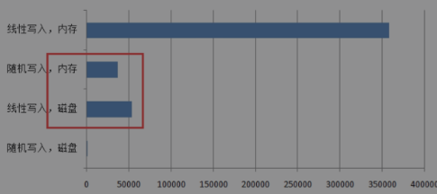

kafka也正是利用了这个特性。

kafka只能在日志文件的尾部追加新的消息，并且也不允许修改已写入的消息，这种方式保证了kafka不可小觑的性能

### 页缓存

操作系统(如linux)实现的一种主要的磁盘缓存，以此用来减少对磁盘I/O 的操作（大致工作就是读缓存，没命中就将将数据页写入页缓存，写也一样，命中就直接写到缓存，没命中就加载到缓存，写进去，最后通过另外的线程将缓存写到磁盘）

#### 可以不使用页缓存吗？

除非使用Direct I/O的方式，否则页缓存很难被禁止。

#### 在页缓存的基础上，自己进程内管理使用数据？

可以。但是对一个进程而言，它会在进程内部缓存处理所需的数据，然而这些数据有可能还缓存在操作系统的页缓存中，因此同一份数据有可能被缓存了两次。而**直接使用页缓存**省去了一份进程内部的缓存消耗，同时还可以通过**结构紧凑的字节码来替代使用对象的方式**以节省更多的空间。

内存太大的情况下，JVM垃圾回收还会越来越慢。

#### 为什么使用页缓存？

1. 使用页缓存，速度快
2. Kafka服务重启，页缓存还是会保持有效
3. 将保证一致性的问题交给操作系统，极大地简化了代码逻辑
4. **结构紧凑的字节码来替代使用对象的方式**以节省更多的空间
5. 不需要进行垃圾回收，不用担心垃圾回收的性能问题

> Kafka 中大量使用了页缓存，这是 Kafka 实现高吞吐的重要因素之一。

### 磁盘swap的调优

Linux系统会使用磁盘的一部分作为swap分区，这样可以进行进程的调度：把当前非活跃的进程调入 swap 分区，以此把内存空出来让给活跃的进程。

对大量使用系统页缓存的 Kafka而言，应当尽量避免这种内存的交换，否则会对它各方面的性能产生很大的负面影响。我们可以通过修改vm.swappiness参数（Linux系统参数）来进行调节。vm.swappiness参数的上限为 100，它表示积极地使用 swap 分区，并**把内存上的数据及时地搬运到 swap 分区**中；vm.swappiness 参数的下限为 0，表示在任何情况下都不要发生交换，这样一来，当内存耗尽时会根据一定的规则突然中止某些进程。笔者建议将这个参数的值设置为 1，这样保留了swap的机制而又最大限度地限制了它对Kafka性能的影响。

### 同步刷盘

虽然kafka将保证一致性的问题交给操作系统，但是它仍然提供了同步刷盘及间断性强制刷盘（fsync）的功能，目的是防止由于机器掉电等异常造成处于页缓存而没有及时写入磁盘的消息丢失。

但是建议不要使用，**刷盘任务就应交由操作系统去调配，消息的可靠性应该由多副本机制来保障**

### 零拷贝

除了消息顺序追加、页缓存等技术，Kafka还使用零拷贝（Zero-Copy）技术来进一步提升性能。所谓的零拷贝是指将数据直接从磁盘文件复制到网卡设备中，减少了内核和用户模式之间的上下文切换。

对 Linux操作系统而言，零拷贝技术依赖于底层的` sendfile（）`方法实现。对应于 Java 语言，`FileChannal.transferTo（）`方法的底层实现就是`sendfile（）`方法。


有一种常用的情形：你需要将静态内容（类似图片、文件）展示给用户。这个情形就意味着需要先将静态内容从磁盘中复制出来放到一个内存buf中，然后将这个buf通过套接字（Socket）传输给用户，进而用户获得静态内容。

如果不使用零拷贝，正常情况下，文件A展示给用户过程中经历了4次拷贝过程：

1. 调用read()时，文件A中的内容被复制到了内核模式下的Read Buffer中
2. CPU控制将内核模式数据复制到用户模式下
3. 调用write()时，将用户模式下的内容复制到内核模式下的Socket Buffer中
4. 将内核模式下的Socket Buffer的数据复制到网卡设备中传送


从上面的过程可以看出，数据平白无故地从**内核模式到用户模式**"走了一圈"，浪费了 2次复制过程：第一次是从内核模式复制到用户模式；第二次是从用户模式再复制回内核模式，即上面4次过程中的第2步和第3步。

而且在上面的过程中，**内核和用户模式的上下文的切换也是4次**。

如果采用了零拷贝技术，那么应用程序就可以直接将请求内核把磁盘中的数据传输给Socket


零拷贝技术通过DMA（Direct Memory Access）技术将文件内容复制到内核模式下的Read Buffer 中。不过没有数据被复制到 Socket Buffer，相反只有包含数据的位置和长度的信息的文件描述符被加到Socket Buffer中。DMA引擎直接将数据从内核模式中传递到网卡设备（协议引擎）。这里数据**只经历了2次复制**就从磁盘中传送出去了，并且**上下文切换也变成了2次**。

> 零拷贝是针对内核模式而言的，数据在内核模式下实现了零拷贝。


## 协议

在目前的 Kafka 2.0.0 中，一共包含了 43 种协议类型，每种协议类型都有对应的请求（Request）和响应（Response），它们都遵守特定的协议模式。每种类型的Request都包含相同结构的协议请求头（RequestHeader）和不同结构的协议请求体（RequestBody）。


在目前的 Kafka 2.0.0 中，一共包含了 43 种协议类型，每种协议类型都有对应的请求（Request）和响应（Response），它们都遵守特定的协议模式。

**每种类型的Request都包含相同结构的协议请求头**（RequestHeader）和**不同结构的协议请求体**（RequestBody）。

协议请求头中包含 4 个域（Field）：api_key、api_version、correlation_id 和client_id

| ApiKey        | 这是一个表示所调用的API的数字id（即它表示是一个元数据请求？生产请求？获取请求等）. |
| :------------ | :----------------------------------------------------------- |
| ApiVersion    | 这是该API的一个数字版本号。我们为每个API定义一个版本号，该版本号允许服务器根据版本号正确地解释请求内容。响应消息也始终对应于所述请求的版本的格式。 |
| CorrelationId | 这是一个用户提供的整数。它将会被服务器原封不动地回传给客户端。用于匹配客户机和服务器之间的请求和响应。 |
| ClientId      | 这是为客户端应用程序的自定义的标识。用户可以使用他们喜欢的任何标识符，他们会被用在记录错误时，监测统计信息等场景。例如，你可能不仅想要监视每秒的总体请求，还要根据客户端应用程序进行监视，那它就可以被用上（其中每一个都将驻留在多个服务器上）。这个ID作为特定的客户端对所有的请求的逻辑分组。 |

每种类型的Response也包含相同结构的协议响应头（ResponseHeader）和不同结构的响应体

| 域（FIELD）   | 描述                                                     |
| :------------ | :------------------------------------------------------- |
| CorrelationId | 服务器传回给客户端它所提供用作关联请求和响应消息的整数。 |

### 消息集（Message sets）

生产和获取消息指令请求共享同一个消息集结构

```
MessageSet => [Offset MessageSize Message] Offset => int64 MessageSize => int32
```

###　消息发送协议

#### request

```
ProduceRequest => RequiredAcks Timeout [TopicName [Partition MessageSetSize MessageSet]]
  RequiredAcks => int16
  Timeout => int32
  Partition => int32
  MessageSetSize => int32
```
| 域（FIELD）    | 描述                                                         |
| :------------- | :----------------------------------------------------------- |
| RequiredAcks   | 这个值表示服务端收到多少确认后才发送反馈消息给客户端。如果设置为0，那么服务端将不发送response（这是唯一的服务端不发送response的情况）。如果这个值为1，那么服务器将等到数据写入到本地日之后发送response。如果这个值是-1，那么服务端将阻塞，知道这个消息被所有的同步副本写入后再发送response。 |
| Timeout        | 这个值提供了以毫秒为单位的超时时间，服务器可以在这个时间内可以等待接收所需的Ack确认的数目。超时并非一个确切的限制，有以下原因：（1）不包括网络延迟，（2）计时器开始在这一请求的处理开始，所以如果有很多请求，由于服务器负载而导致的排队等待时间将不被包括在内，（3）如果本地写入时间超过超时，我们将不会终止本地写操作，这样这个超时时间就不会得到遵守。要使硬超时时间，客户端应该使用套接字超时。 |
| TopicName      | 该数据将会发布到的topic名称                                  |
| Partition      | 该数据将会发布到的分区                                       |
| MessageSetSize | 后续消息集的长度，字节为单位                                 |
| MessageSet     | 上面描述的标准格式的消息集合                                 |


#### response

```
ProduceResponse => [TopicName [Partition ErrorCode Offset Timestamp]] ThrottleTime
  TopicName => string
  Partition => int32
  ErrorCode => int16
  Offset => int64
  Timestamp => int64
  ThrottleTime => int32
```

| 域           | 描述                                                         |
| :----------- | :----------------------------------------------------------- |
| Topic        | 此响应对应的主题。                                           |
| Partition    | 此响应对应的分区。                                           |
| ErrorCode    | 如果有，此分区对应的错误信息。错误以分区为单位提供，因为可能存在给定的分区不可用或者被其他的主机维护（非Leader），但是其他的分区的请求操作成功的情况 |
| Offset       | 追加到该分区的消息集中的分配给第一个消息的偏移量。           |
| Timestamp    | 如果该主题使用了LogAppendTime，这个时间戳就是broker分配给这个消息集。这个消息集中的所有消息都有相同的时间戳。如果使用的是CreateTime，这个域始终是-1。如果没有返回错误码，生产者可以假定消息的时间戳已经被broker接受。单位为从UTC标准准时间1970年1月1日0点到所在时间的毫秒数。 |
| ThrottleTime | 由于限额冲突而导致的时间延迟长度，以毫秒为单位。（如果没有违反限额条件，此值为0） |

### 拉取消息的协议

### request

```
FetchRequest => ReplicaId MaxWaitTime MinBytes [TopicName [Partition FetchOffset MaxBytes]]
  ReplicaId => int32
  MaxWaitTime => int32
  MinBytes => int32
  TopicName => string
  Partition => int32
  FetchOffset => int64
  MaxBytes => int32
```

| 域          | 描述                                                         |
| :---------- | :----------------------------------------------------------- |
| ReplicaId   | 副本ID的是发起这个请求的副本节点ID。普通消费者客户端应该始终将其指定为-1，因为他们没有节点ID。其他broker设置他们自己的节点ID。基于调试目的，以非代理身份模拟副本broker发出获取数据指令请求时，这个值填-2。 |
| MaxWaitTime | 如果没有足够的数据可发送时，最大阻塞等待时间，以毫秒为单位。 |
| MinBytes    | 返回响应消息的最小字节数目，必须设置。如果客户端将此值设为0，服务器将会立即返回，但如果没有新的数据，服务端会返回一个空消息集。如果它被设置为1，则服务器将在至少一个分区收到一个字节的数据的情况下立即返回，或者等到超时时间达到。通过设置较高的值，结合超时设置，消费者可以在牺牲一点实时性能的情况下通过一次读取较大的字节的数据块从而提高的吞吐量（例如，设置MaxWaitTime至100毫秒，设置MinBytes为64K，将允许服务器累积数据达到64K前等待长达100ms再响应）。 |
| TopicName   | topic名称                                                    |
| Partition   | 获取数据的Partition id                                       |
| FetchOffset | 获取数据的起始偏移量                                         |
| MaxBytes    | 此分区返回消息集所能包含的最大字节数。这有助于限制响应消息的大小。 |

### response

```
v1 (supported in 0.9.0 or later) and v2 (supported in 0.10.0 or later)
FetchResponse => ThrottleTime [TopicName [Partition ErrorCode HighwaterMarkOffset MessageSetSize MessageSet]]
  ThrottleTime => int32
  TopicName => string
  Partition => int32
  ErrorCode => int16
  HighwaterMarkOffset => int64
  MessageSetSize => int32
```

| ThrottleTime        | 由于限额冲突而导致的时间延迟长度，以毫秒为单位。（如果没有违反限额条件，此值为0） |
| ------------------- | ------------------------------------------------------------ |
| TopicName           | 返回消息所对应的Topic名称。                                  |
| Partition           | 返回消息所对应的分区id。                                     |
| HighwaterMarkOffset | 此分区日志中最末尾的偏移量。此信息可被客户端用来确定后面还有多少条消息。 |
| MessageSetSize      | 此分区中消息集的字节长度                                     |
| MessageSet          | 此分区获取到的消息集，格式与之前描述相同                     |


协议的具体定义可以让我们从另一个角度来了解Kafka的本质。以PRODUCE和FETCH为例，从协议结构中就可以看出消息的写入和拉取消费都是细化到每一个分区层级的。


## kafka定时任务、延时队列实现

### 时间轮

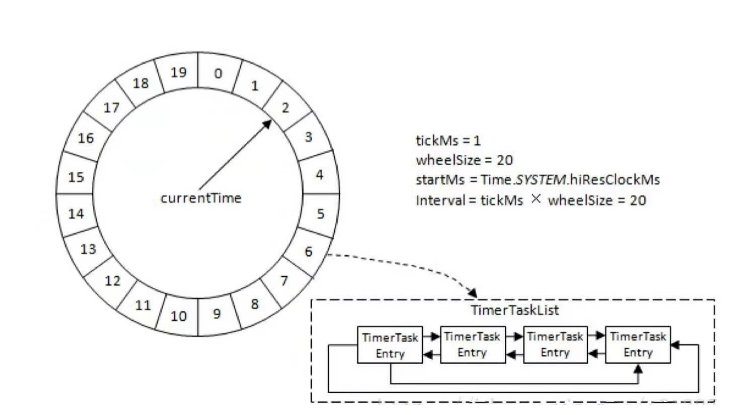

Kafka中的时间轮（TimingWheel）是一个存储定时任务的环形队列，底层采用数组实现，数组中的每个元素可以存放一个定时任务列表（TimerTaskList）。TimerTaskList是一个环形的双向链表，链表中的每一项表示的都是定时任务项（TimerTaskEntry），其中封装了真正的定时任务（TimerTask）。

时间轮由多个时间格组成，每个时间格代表当前时间轮的基本时间跨度（tickMs）。时间轮的时间格个数是固定的，可用wheelSize来表示，那么整个时间轮的总体时间跨度（interval）可以通过公式 tickMs×wheelSize计算得出。时间轮还有一个表盘指针（currentTime），用来表示时间轮当前所处的时间

#### 层级时间轮

Kafka 使用了了层级时间轮的概念，当任务的到期时间超过了当前时间轮所表示的时间范围时，就会尝试添加到上层时间轮中。

假如有350ms的定时任务，显然第一层时间轮不能满足条件，所以就升级到第二层时间轮中，最终被插入第二层时间轮中时间格17所对应的TimerTaskList。如果此时又有一个定时为450ms的任务，那么显然第二层时间轮也无法满足条件，所以又升级到第三层时间轮中，最终被插入第三层时间轮中时间格1的TimerTaskList。注意到在到期时间为[400ms，800ms）区间内的多个任务（比如446ms、455ms和473ms的定时任务）都会被放入第三层时间轮的时间格1，时间格1对应的TimerTaskList的超时时间为400ms。**随着时间的流逝**，当此TimerTaskList到期之时，原本定时为450ms的任务还剩下50ms的时间，还不能执行这个任务的到期操作。

#### 时间轮降级

这里就有一个**时间轮降级**的操作，会将这个剩余时间为 50ms 的定时任务重新提交到层级时间轮中，此时第一层时间轮的总体时间跨度不够，而第二层足够，所以该任务被放到第二层时间轮到期时间为[40ms，60ms）的时间格中。再经历40ms之后，此时这个任务又被“察觉”，不过还剩余10ms，还是不能立即执行到期操作。所以还要再有一次时间轮的降级，此任务被添加到第一层时间轮到期时间为[10ms，11ms）的时间格中，之后再经历10ms 后，此任务真正到期，最终执行相应的到期操作。

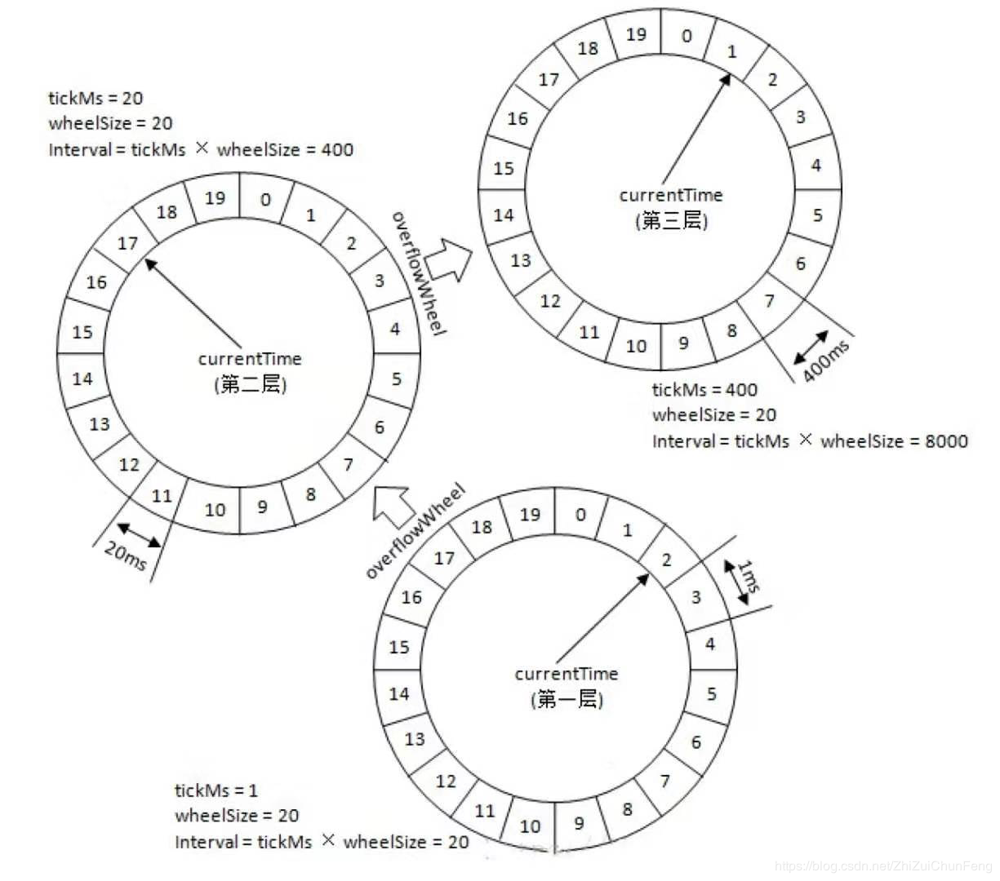

#### 时间流逝--DelayQueue

在Kafka中到底是怎么推进时间的呢？类似采用JDK中的scheduleAtFixedRate来每秒推进时间轮？显然这样并不合理，TimingWheel也失去了大部分意义。

Kafka中的定时器借了JDK中的DelayQueue来协助推进时间轮。具体做法是对于每个使用到的**TimerTaskList都加入DelayQueue**

DelayQueue会根据TimerTaskList对应的超时时间**expiration**来排序，最短expiration的TimerTaskList会被排在DelayQueue的队头

**为何这里要引入DelayQueue呢？**

注意对定时任务项TimerTaskEntry的插入和删除操作而言，TimingWheel时间复杂度为O（1），性能高出DelayQueue很多，如果直接将TimerTaskEntry插入DelayQueue（时间复杂度O(nlogn)），那么性能显然难以支撑。

Kafka 中的 **TimingWheel** **专门用来执行插入和删除 TimerTaskEntry的操作**，而 **DelayQueue** 专门**负责时间推进的**任务。

试想一下，DelayQueue 中的第一个超时任务列表的expiration为200ms，第二个超时任务为840ms，这里获取DelayQueue的队头只需要O（1）的时间复杂度（获取之后DelayQueue内部才会再次切换出新的队头）。如果采用每秒定时推进，那么获取第一个超时的任务列表时执行的200次推进中有199次属于“空推进”，而获取第二个超时任务时又需要执行639次“空推进”，这样会无故空耗机器的性能资源，这里采用DelayQueue来辅助以少量空间换时间

#### 系统定时器

时间轮只是保存了任务，而定时器负责管理时间轮和执行过期的任务。 定时器的接口由Timer表示

Kafka中会有一个线程来获取 DelayQueue 中到期的任务列表，当线程获取 DelayQueue 中超时的任务列表TimerTaskList之后，既可以根据 TimerTaskList 的 expiration 来推进时间轮的时间，也可以就获取的TimerTaskList执行相应的操作，对里面的TimerTaskEntry该执行过期操作的就执行过期操作，该降级时间轮的就降级时间轮。

```scala
trait Timer {
  // 添加任务
  def add(timerTask: TimerTask): Unit

  // 更新时间，并且提交延迟任务给线程池执行
  def advanceClock(timeoutMs: Long): Boolean
}
```

### 延时操作

如果在使用生产者客户端发送消息的时候将 acks 参数设置为-1，那么就意味着需要等待ISR集合中的所有副本都确认收到消息之后才能正确地收到响应的结果，或者捕获超时异常。
假设某个分区有3个副本：leader、follower1和follower2，它们都在分区的ISR集合中。为了简化说明，这里我们不考虑ISR集合伸缩的情况。Kafka在收到客户端的生产请求（ProduceRequest）后，将消息3和消息4写入leader副本的本地日志文件。由于客户端设置了acks为-1，那么需要等到follower1和follower2两个副本都收到消息3和消息4后才能告知客户端正确地接收了所发送的消息。

#### 延时生产

在将消息写入 leader 副本的本地日志文件之后，**Kafka会创建一个延时的生产操作（DelayedProduce）**，用来处理消息正常写入所有副本或超时的情况，以返回相应的响应结果给客户端。

在Kafka中有多种延时操作，比如前面提及的延时生产，还有延时拉取（DelayedFetch）、延时数据删除（DelayedDeleteRecords）等。延时操作需要延时返回响应的结果，首先它必须有一个超时时间（delayMs），**如果在这个超时时间内没有完成既定的任务，那么就需要强制完成以返回响应结果给客户端**。

其次，**延时操作不同于定时操作，定时操作是指在特定时间之后执行的操作，而延时操作可以在所设定的超时时间之前完成**，所以延时操作能够支持**外部事件**的触发。就延时生产操作而言，它的外部事件是所要写入消息的某个分区的 HW（高水位）发生增长。也就是说，随着follower副本不断地与leader副本进行消息同步，进而促使HW进一步增长，**HW 每增长一次都会检测是否能够完成此次延时生产操作**，如果可以就执行以此返回响应结果给客户端；如果在超时时间内始终无法完成，则强制执行。

延时操作创建之后会被加入延时操作管理器（DelayedOperationPurgatory）来做专门的处理。延时操作有可能会超时，每个延时操作管理器都会配备一个定时器（SystemTimer）来做超时管理，定时器的底层就是采用时间轮（TimingWheel）实现的。时间轮的轮转是靠“收割机”线程ExpiredOperationReaper来驱动的，这里的“收割机”线程就是由延时操作管理器启动的。也就是说，定时器、“收割机”线程和延时操作管理器都是一一对应的。延时操作需要支持外部事件的触发，所以还要配备一个**监听池**来负责监听每个分区的外部事件—查看是否有分区的HW发生了增长

也就是说，如果客户端设置的 acks 参数不为-1，或者没有成功的消息写入，那么就直接返回结果给客户端，否则就需要创建延时生产操作并存入延时操作管理器，最终要么由**外部事件触发**，要么由**超时触发**而执行。

**kafka居然将这种称为延时操作。。这我没想到的，不应该称作限时任务吗**

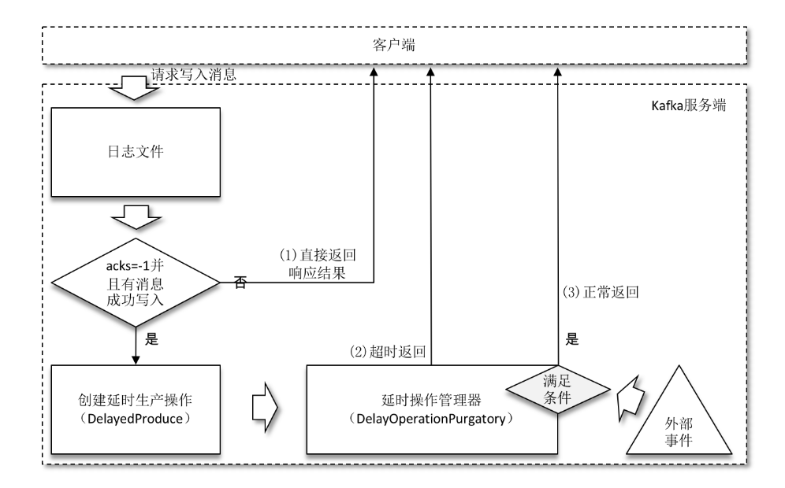

对于需要耗时处理的网络请求，都是利用 `DelayedOperation` 和 `DelayedOperationPurgatory` 来进行**异步延迟操作**，防止阻塞 `KafkaRequestHandler` 线程。

#### 延时拉取

以图6-13为例，两个follower副本都已经拉取到了leader副本的最新位置，此时又向leader副本发送拉取请求，而leader副本并没有新的消息写入，那么此时leader副本该如何处理呢？可以直接返回空的拉取结果给follower副本，不过在leader副本一直没有新消息写入的情况下，follower副本会一直发送拉取请求，并且总收到空的拉取结果，这样**徒耗资源，显然不太合理。**


Kafka选择了延时操作来处理这种情况。Kafka在处理拉取请求时，会先读取一次日志文件，如果收集不到足够多的消息，那么就会创建一个延时拉取操作（DelayedFetch）以等待拉取到足够数量的消息。

延时拉取操作同样是由超时触发或外部事件触发而被执行的。

- 超时触发很好理解，就是等到超时时间之后触发第二次读取日志文件的操作。

- 外部事件触发就稍复杂了一些，因为**拉取请求不单单由 follower 副本发起，也可以由消费者客户端发起**，两种情况所对应的外部事件也是不同的。

  ​	如果是**follower副本的延时拉取**，它的外部事件就是消息追加到了**leader副本的本地日志文件中**

  ​	如果是**消费者客户端的延时拉取**，它的外部事件可以简单地理解为**HW的增长**


## 控制器

在 Kafka 集群中会有一个或多个 broker，**其中有一个 broker会被选举为控制器**（Kafka Controller），它负责管理整个集群中所有分区和副本的状态。

- 当某个分区的leader副本出现故障时，由控制器负责为该分区选举新的leader副本。
- 当检测到某个分区的ISR集合发生变化时，由控制器负责通知所有broker更新其元数据信息。
- 当使用kafka-topics.sh脚本为某个topic增加分区数量时，同样还是由控制器负责分区的重新分配。

###　竞选

当ZooKeeper 中不存在/controller节点（临时节点），或者某个节点中的**数据异常**，那么就会尝试去创建/controller节点。当前broker去创建节点的时候，也有可能其他broker同时去尝试创建这个节点，只有创建成功的那个broker才会成为控制器，而创建失败的broker**竞选失败**。每个broker都会在**内存中保存当前控制器的brokerid值**，这个值可以标识为activeControllerId。

ZooKeeper 中还有一个与控制器有关的/controller_epoch 节点，这个节点是持久（PERSISTENT）节点，节点中存放的是一个整型的controller_epoch值。controller_epoch用于记录控制器发生变更的次数，**即记录当前的控制器是第几代控制器**，我们也可以称之为“控制器的纪元”。

#### 保证控制器唯一性

每个和控制器交互的请求都会携带controller_epoch这个字段，如果请求的controller_epoch值小于内存中的controller_epoch值，则认为这个请求是向已经过期的控制器所发送的请求，那么这个请求会被认定为无效的请求。如果请求的controller_epoch值大于内存中的controller_epoch值，那么说明已经有新的控制器当选了。由此可见，**Kafka 通过controller_epoch 来保证控制器的唯一性，进而保证相关操作的一致性**。

###　控制器职责细节

具备控制器身份的broker需要比其他普通的broker多一份职责，具体细节如下：

1. 监听分区相关的变化

   为ZooKeeper中的/admin/reassign_partitions 节点注册PartitionReassignmentHandler，用来处理分区重分配的动作。

   为 ZooKeeper 中的/isr_change_notification节点注册IsrChangeNotificetionHandler，用来处理ISR集合变更的动作。

   为ZooKeeper中的/admin/preferred-replica-election节点添加PreferredReplicaElectionHandler，用来处理优先副本的选举动作。

2. 监听主题相关的变化

   为 ZooKeeper 中的/brokers/topics节点添加TopicChangeHandler，用来处理主题增减的变化

   为 ZooKeeper 中的/admin/delete_topics节点添加TopicDeletionHandler，用来处理删除主题的动作

3. 监听broker相关的变化

   为ZooKeeper中的/brokers/ids节点添加BrokerChangeHandler，用来处理broker增减的变化。

4. 从ZooKeeper中读取获取当前所有与主题、分区及broker有关的信息并进行相应的管理。对所有主题对应的 ZooKeeper 中的/brokers/topics/＜topic＞节点添加PartitionModificationsHandler，用来监听主题中的分区分配变化

5. 启动并管理分区状态机和副本状态机

6. 更新集群的元数据信息

7. 如果参数 auto.leader.rebalance.enable 设置为 true，则还会开启一个名为“auto-leader-rebalance-task”的定时任务来负责维护分区的优先副本的均衡。


### 选举成功初始化

控制器在**选举成功**之后会读取 ZooKeeper 中各个节点的数据来初始化上下文信息（ControllerContext），并且需要管理这些上下文信息。比如为某个主题增加了若干分区，控制器在负责创建这些分区的同时要更新上下文信息，并且需要将这些变更信息同步到其他普通的broker 节点中。不管是监听器触发的事件，还是定时任务触发的事件，都会读取或更新控制器中的上下文信息，那么这样就会涉及多线程间的同步。

Kafka 的控制器使用**单线程基于事件队列**的模型，将每个事件都做一层封装，然后按照事件发生的先后顺序暂存到 LinkedBlockingQueue 中，最后使用一个专用的线程（ControllerEventThread）按照FIFO顺序逐个处理各个事件

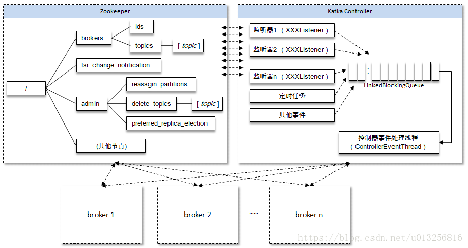


在Kafka的早期版本中，**并没有采用Kafka Controller这样一个概念**来对分区和副本的状态进行管理，而是依赖于**ZooKeeper**，每个broker都会在ZooKeeper上为分区和副本**注册大量的监听器（Watcher）**。当分区或副本状态变化时，会唤醒很多不必要的监听器，**这种严重依赖ZooKeeper 的设计会有脑裂、羊群效应**，以及造成 ZooKeeper 过载的隐患

在目前的新版本的设计中，只有Kafka Controller在ZooKeeper上注册相应的监听器，其他的broker极少需要再监听ZooKeeper中的数据变化，这样省去了很多不必要的麻烦。**不过每个broker还是会对/controller节点添加监听器，以此来监听此节点的数据变化（ControllerChangeHandler）**

### 什么时候会重新选举？

当/controller节点被删除时，每个broker都会进行选举，如果broker在节点被删除前是控制器，那么在选举前还需要有一个“退位”的动作。如果有特殊需要，则可以**手动删除/controller 节点**来触发新一轮的选举。当然**关闭控制器所对应的 broker**，以及**手动向/controller节点写入新的brokerid的所对应的数据**，同样可以**触发新一轮的选举。**

### 优雅关闭kafka

按照以下两个步骤就可以优雅地关闭Kafka的服务进程：

（1）获取Kafka的服务进程号PIDS。可以使用Java中的jps命令或使用Linux系统中的ps命令来查看。

（2）使用 kill-s TERM $PIDS 或 kill-15 $PIDS 的方式来关闭进程，注意千万不要使用kill-9的方式。

为什么这样关闭的方式会是优雅的？

Kafka 服务入口程序中有一个名为“kafka-shutdown-hock”的关闭钩子，待 Kafka 进程捕获终止信号的时候会执行这个关闭钩子中的内容，其中除了正常关闭一些必要的资源，还会执行一个控制关闭（`ControlledShutdown`）的动作。使用`ControlledShutdown`的方式关闭Kafka有两个优点：一是可以让消息完全同步到磁盘上，在服务下次重新上线时不需要进行日志的恢复操作；二是` ControllerShutdown` 在关闭服务之前，会对其上的leader副本进行迁移，这样就可以减少分区的不可用时间。

### 分区leader选举

当创建分区（创建主题或增加分区都有创建分区的动作）或分区上线（原先的leader副本下线）的时候都需要执行 leader 的选举动作，对应的选举策略为`OfflinePartitionLeaderElectionStrategy`。

这种策略的基本思路是按照 **AR 集合中副本的顺序查找第一个存活的副本**，并且这个副本在ISR集合中。一个分区的AR集合在分配的时候就被指定，并且只要不发生重分配的情况，集合内部副本的顺序是保持不变的，而分区的ISR集合中副本的顺序可能会改变。


## 客户端

### 分区分配策略

1. RangeAssignor（默认）
2. RoundRobinAssignor
3. StickyAssignor

假设上面例子中2个主题都有3个分区，那么订阅的所有分区可以标识为：t0p0、t0p1、t0p2、t1p0、t1p1、t1p2

RangeAssignor：

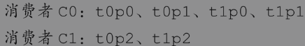

RoundRobinAssignor：

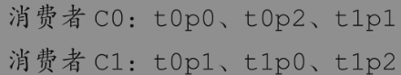

假设消费组内有3个消费者（C0、C1和C2），它们共订阅了3个主题（t0、t1、t2），这3个主题分别有1、2、3个分区，即整个消费组订阅了t0p0、t1p0、t1p1、t2p0、t2p1、t2p2这6个分区。具体而言，消费者C0订阅的是主题t0，消费者C1订阅的是主题t0和t1，消费者C2订阅的是主题t0、t1和t2，那么最终的分配结果为：

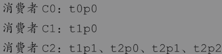

StickyAssignor：

我们再来看一下StickyAssignor分配策略，“sticky”这个单词可以翻译为“黏性的”，Kafka从0.11.x版本开始引入这种分配策略，它主要有两个目的：

（1）分区的分配要尽可能均匀。

（2）分区的分配尽可能与上次分配的保持相同。

和上面一样的条件下，StickyAssignor分配策略的分配结果

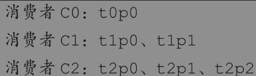


## 事务

### 消息传输保障

一般而言，消息中间件的消息传输保障有3个层级，分别如下

（1）at most once：至多一次。消息可能会丢失，但绝对不会重复传输

（2）at least once：最少一次。消息绝不会丢失，但可能会重复传输

（3）exactly once：恰好一次。每条消息肯定会被传输一次且仅传输一次

Kafka 的消息传输保障机制非常直观。如果生产者发送消息到 Kafka之后，**遇到了网络问题而造成通信中断**，那么生产者就**无法判断该消息是否已经提交**。虽然Kafka无法确定网络故障期间发生了什么，但生产者可以进行多次重试来确保消息已经写入 Kafka，这个**重试的过程中**有可能会造成消息的**重复写入**，所以这里 Kafka 提供的消息传输保障为 **at least once**。

对消费者而言，消费者处理消息和提交消费位移的顺序在很大程度上决定了消费者提供哪一种消息传输保障。一般来说，我们用的都是消费者在拉取完消息之后，应用逻辑先处理消息后提交消费位移，那么在消息处理之后且在位移提交之前消费者宕机了，待它重新上线之后，会从上一次位移提交的位置拉取，这样就出现了重复消费，此时就对应**at least once**。


> Kafka从0.11.0.0版本开始引入了幂等和事务这两个特性，以此来实现EOS（exactly once semantics

### 幂等

开启幂等性功能的方式很简单，只需要显式地将生产者客户端参数enable.idempotence设置为true

另外如果用户需要确保

- retries 参数（默认Integer.MAX_VALUE）的值必须大于 0
- acks 参数需要保证这个参数的值为-1（all）
- max.in.flight.requests.per.connection参数的值不能大于5

否则会报ConfigException！

前面讲过V2版本的报文有RecordBatch的producer id和first seqence这两个字段，kafka正是利用这两个字段进行幂等的保证，那么它是怎么做的幂等呢？

首先，每个新的生产者实例在初始化的时候都会被分配一个**PID**，broker端会在内存中为每一对**＜PID，分区＞**维护一个**序列号**，消息发送到的每一个分区都有对应的序列号，这些序列号从0开始单调递增。接着，生产者每发送一条消息就会将**＜PID，分区＞对应的序列号的值加1**。对于收到的每一条消息，只有当它的序列号的值（SN_new）比broker端中维护的对应的序列号的值（SN_old）大1（即SN_new=SN_old+1）时，broker才会接收它

### 事务 （有点难 不太会）

幂等性并不能**跨多个分区**运作，而事务以弥补这个缺陷。事务可以保证对多个分区写入操作的原子性。操作的原子性是指多个操作要么全部成功，要么全部失败，不存在部分成功、部分失败的可能。

> 事务要求生产者开启幂等特性

为了实现事务，应用程序必须提供唯一的 `transactionalId`，这个`transactionalId` 通过客户端参数`transactional.id`来显式设置

在使用KafkaConsumer的时候要将enable.auto.commit参数设置为false，代码里也不能手动提交消费位移。


为了实现事务的功能，Kafka还引入了事务协调器（`TransactionCoordinator`）来负责处理事务.每一个生产者都会被指派一个特定的TransactionCoordinator，所有的事务逻辑包括分派 PID 等都是由 TransactionCoordinator 来负责实施的。TransactionCoordinator 会将事务状态持久化到内部主题__transaction_state 中。

transactionalId 与 PID 一一对应，两者之间所不同的是 transactionalId 由用户显式设置，而 PID 是由 Kafka 内部分配的。另外，为了保证新的生产者启动后具有相同 transactionalId 的旧生产者能够立即失效，每个生产者通过 transactionalId 获取 PID 的同时，还会获取一个单调递增的 producer epoch（对应下面要讲述的 KafkaProducer.initTransactions() 方法）。如果使用同一个 transactionalId 开启两个生产者，那么前一个开启的生产者会报出如下的错误：

下面就以最复杂的consume-transform-produce的流程为例来分析Kafka事务的实现原理

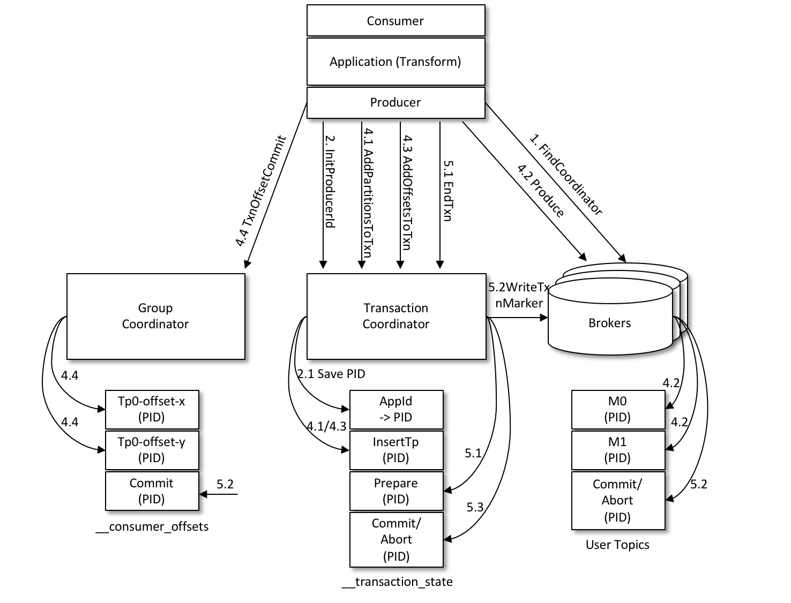

#### 查找TransactionCoordinator

根据**transactionalId**的**哈希值**计算主题__transaction_state中的分区编号

```sql
--代码清单14-3 计算分区编号
--其中 transactionTopicPartitionCount 为主题 __transaction_state 中的分区个数，默认50
Utils.abs(transactionalId.hashCode) % transactionTopicPartitionCount
```

找到对应的分区之后，再寻找此分区 leader 副本所在的 broker 节点，该 broker 节点即为这个 transactionalId 对应的 TransactionCoordinator 节点。

#### 获取pid

在找到 TransactionCoordinator 节点之后，就需要为当前生产者分配一个 PID 了。凡是开启了**幂等性功能的生产者都必须执行这个操作**

生产者获取 PID 的操作是通过 InitProducerIdRequest 请求来实现的，InitProducerIdRequest 请求体结构如下图所示

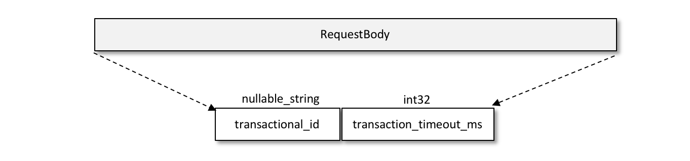

##### 保存pid

生产者的 InitProducerIdRequest 请求会被发送给 TransactionCoordinator

当 `TransactionCoordinator` 第一次收到包含该` transactionalId `的` InitProducerIdRequest` 请求时，将 <transaction_Id, PID> 的对应关系保存到主题 __transaction_state 中，从而保证即使 TransactionCoordinator 宕机该对应关系也不会丢失。存储到主题 __transaction_state 中的具体内容格式如下图所示。

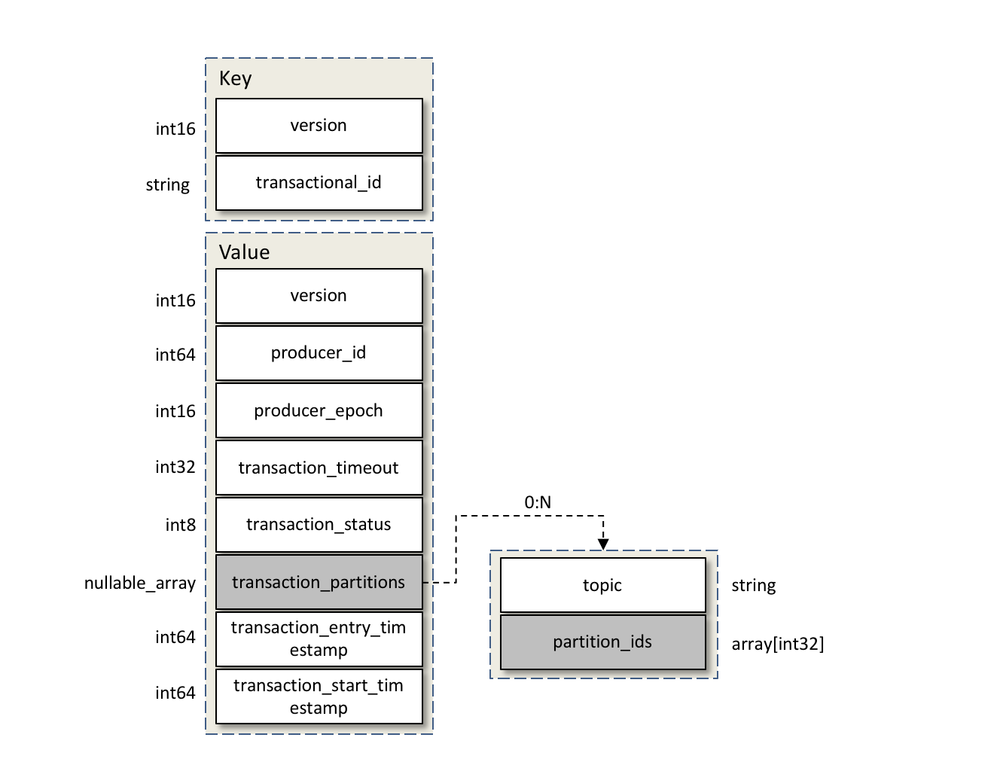

其中 transaction_status 包含 Empty(0)、Ongoing(1)、PrepareCommit(2)、PrepareAbort(3)、CompleteCommit(4)、CompleteAbort(5)、Dead(6) 这几种状态。在存入主题 __transaction_state 之前，事务日志消息同样会根据单独的 transactionalId 来计算要发送的分区

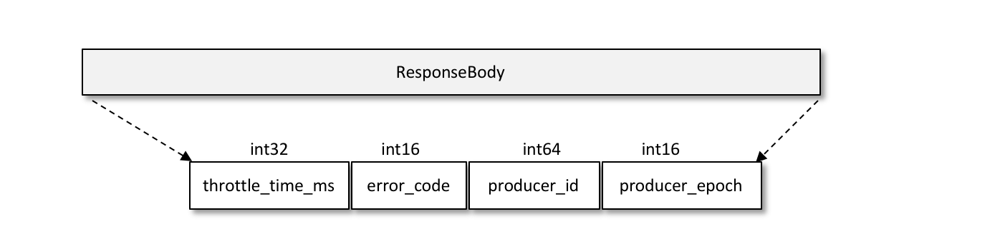

获取pid的接口，InitProducerIdResponse 响应体结构如上图所示，除了返回 PID，InitProducerIdRequest 还会触发执行以下任务：

- 增加该 PID 对应的 producer_epoch。具有相同 PID 但 producer_epoch 小于该 producer_epoch 的其他生产者新开启的事务将被拒绝。
- 恢复（Commit）或中止（Abort）之前的生产者未完成的事务。

#### 开启事务

通过KafkaProducer的beginTransaction（）方法可以开启一个事务，调用该方法后，生产者本地会标记已经开启了一个新的事务，只有在生产者发送第一条消息之后 TransactionCoordinator才会认为该事务已经开启。

#### Consume-Transform-Produce

##### AddPartitionsToTxnRequest

当生产者给一个新的分区（TopicPartition）发送数据前，它需要先向` TransactionCoordinator `发送 `AddPartitionsToTxnRequest` 请求，这个请求会让 `TransactionCoordinator` 将 `<transactionId, TopicPartition> `的对应关系存储在主题 `__transaction_state` 中,有了这个对照关系之后，我们就可以在后续的步骤中为每个分区设置 COMMIT 或 ABORT 标记

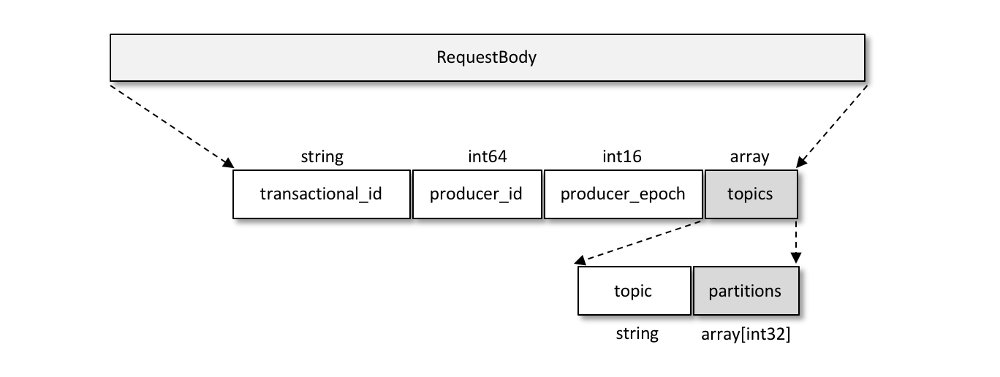


##### **ProduceRequest**

发送消息，和普通的消息不同的是，ProducerBatch 中会包含实质的 **PID**、**producer_epoch** 和 **sequence number**。

##### **AddOffsetsToTxnRequest**

通过KafkaProducer的sendOffsetsToTransaction（）方法可以在一个事务批次里处理消息的消费和发送，方法中包含2个参数：Map＜TopicPartition，OffsetAndMetadata＞ offsets和groupId。这 个方 法 会 向 TransactionCoordinator 节 点 发 送AddOffsetsToTxnRequest 请 求，TransactionCoordinator收到这个请求之后会通过groupId来推导出在__consumer_offsets中的分区，之后TransactionCoordinator会将这个分区保存在__transaction_state中，如图7-21步骤4.3所示。

##### **TxnOffsetCommitRequest**

这个请求也是 sendOffsetsToTransaction() 方法中的一部分，在处理完 AddOffsetsToTxnRequest 之后，生产者还会发送 TxnOffsetCommitRequest 请求给 GroupCoordinator，从而将本次事务中包含的消费位移信息 offsets 存储到主题 __consumer_offsets 中，如事务流程图步骤4.4所示

##### 提交或者中止事务

一旦数据被写入成功，我们就可以调用 KafkaProducer 的 commitTransaction() 方法或 abortTransaction() 方法来结束当前的事务。

**1）EndTxnRequest** 无论调用 commitTransaction() 方法还是 abortTransaction() 方法，生产者都会向 TransactionCoordinator 发送 EndTxnRequest 请求（对应的 EndTxnRequest 请求体结构如下图所示），以此来通知它提交（Commit）事务还是中止（Abort）事务。

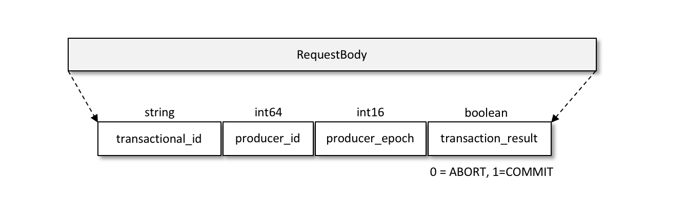

TransactionCoordinator 在收到 EndTxnRequest 请求后会执行如下操作：

1. 将 PREPARE_COMMIT 或 PREPARE_ABORT 消息写入主题 __transaction_state，如事务流程图步骤5.1所示。
2. 通过 WriteTxnMarkersRequest 请求将 COMMIT 或 ABORT 信息写入用户所使用的普通主题和 __consumer_offsets，如事务流程图步骤5.2所示。
3. 将 COMPLETE_COMMIT 或 COMPLETE_ABORT 信息写入内部主题 __transaction_state，如事务流程图步骤5.3所示。

**2）WriteTxnMarkersRequest**

WriteTxnMarkersRequest 请求是由 TransactionCoordinator 发向事务中各个分区的 leader 节点的，当节点收到这个请求之后，会在相应的分区中写入控制消息（ControlBatch）。控制消息用来标识事务的终结，它和普通的消息一样存储在日志文件中，前面章节中提及了控制消息，RecordBatch 中 attributes 字段的第6位用来标识当前消息是否是控制消息。如果是控制消息，那么这一位会置为1，否则会置为0

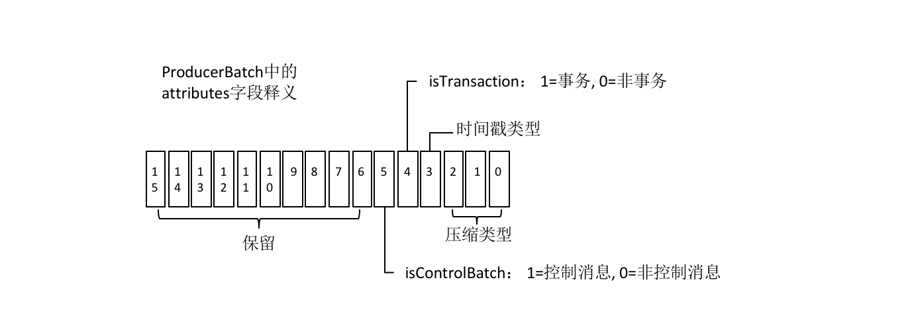
attributes 字段中的第5位用来标识当前消息是否处于事务中，如果是事务中的消息，那么这一位置为1，否则置为0。由于控制消息也处于事务中，所以attributes字段的第5位和第6位都被置为1。ControlBatch 中只有一个 Record，Record 中的 timestamp delta 字段和 offset delta 字段的值都为0，而控制消息的 key 和 value 的内容如下图所示。


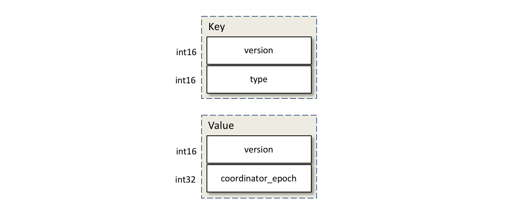

就目前的 Kafka 版本而言，key 和 value 内部的 version 值都为0，key 中的 type 表示控制类型：0表示 ABORT，1表示 COMMIT；value 中的 coordinator_epoch 表示 TransactionCoordinator 的纪元（版本），TransactionCoordinator 切换的时候会更新其值。

**3）写入最终的COMPLETE_COMMIT或COMPLETE_ABORT**

TransactionCoordinator 将最终的 COMPLETE_COMMIT 或 COMPLETE_ABORT 信息写入主题 __transaction_state 以表明当前事务已经结束，此时可以删除主题 __transaction_state 中所有关于该事务的消息。由于主题 __transaction_state 采用的日志清理策略为日志压缩，所以这里的删除只需将相应的消息设置为墓碑消息即可。

## 消费者协调器和组协调器

### 旧版消费者客户端

每个消费者在启动时都会在/consumers/＜group＞/ids 和/brokers/ids 路径上注册一个监听器。当/consumers/＜group＞/ids路径下的子节点发生变化时，表示消费组中的消费者发生了变化；当/brokers/ids路径下的子节点发生变化时，表示broker出现了增减。这样通过ZooKeeper所提供的Watcher，每个消费者就可以监听消费组和Kafka集群的状态了。

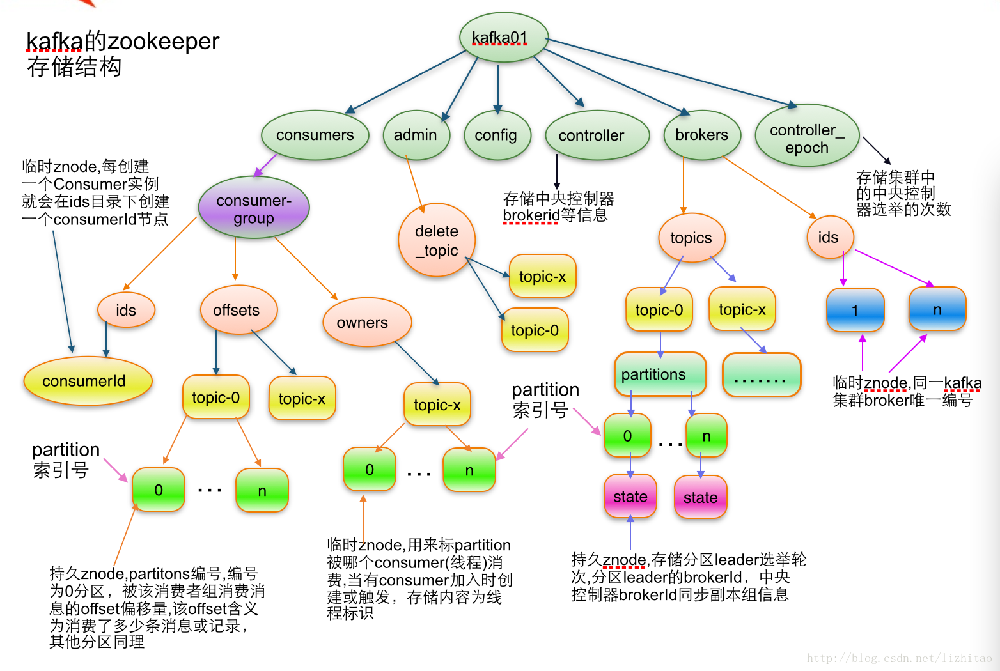

这种方式下每个消费者对ZooKeeper的相关路径分别进行监听，当触发再均衡操作时，一个消费组下的所有消费者会同时进行再均衡操作，而消费者之间并不知道彼此操作的结果，这样可能导致Kafka工作在一个不正确的状态。与此同时，这种严重依赖于ZooKeeper集群的做法还有两个比较严重的问题。

- 羊群效应（Herd Effect）：所谓的羊群效应是指ZooKeeper中一个被监听的节点变化，大量的 Watcher 通知被发送到客户端，导致在通知期间的其他操作延迟，也有可能发生类似死锁的情况。
- 脑裂问题（Split Brain）：消费者进行再均衡操作时每个消费者都与ZooKeeper进行通信以判断消费者或broker变化的情况，由于ZooKeeper本身的特性，可能导致在同一时刻各个消费者获取的状态不一致，这样会导致异常问题发生。

### 新版的消费者客户端

对此进行了重新设计，将全部消费组分成多个子集，每个消费组的子集在服务端对应一个**GroupCoordinator**对其进行管理，**GroupCoordinator是Kafka服务端中用于管理消费组的组件**。而消费者客户端中的ConsumerCoordinator组件负责与GroupCoordinator进行交互。

ConsumerCoordinator与GroupCoordinator之间最重要的职责就是负责执行**消费者再均衡**的操作

前面提及的分区分配的工作也是在再均衡期间完成的。就目前而言，一共有如下几种情形会触发再均衡的操作：·有新的消费者加入消费组。

- 有消费者宕机下线。消费者并不一定需要真正下线，例如遇到长时间的 GC、网络延迟导致消费者长时间未向GroupCoordinator发送心跳等情况时，GroupCoordinator会认为消费者已经下线
- 有消费者主动退出消费组（发送 LeaveGroupRequest 请求）。比如客户端调用了unsubscrible（）方法取消对某些主题的订阅
- 消费组所对应的GroupCoorinator节点发生了变更
- 消费组内所订阅的任一主题或者主题的分区数量发生变化

下面就以一个简单的例子来讲解一下再均衡操作的具体内容。

当有消费者加入消费组时，消费者、消费组及组协调器之间会经历一下几个阶段。

#### 第一阶段（FIND_COORDINATOR）

查找GroupCoordinator的方式是先根据消费组groupId的哈希值计算__consumer_offsets中的分区编号

```sql
= groupId.hashCode()%(__consumer_offsets的个数，默认50个)
```

找到对应的__consumer_offsets中的分区之后，再寻找此分区leader副本所在的broker节点，该broker节点即为这个groupId所对应的**GroupCoordinator**节点

消费者groupId最终的分区分配方案及组内消费者所提交的消费位移信息都会发送给此分区leader副本所在的broker节点，让**此broker节点既扮演GroupCoordinator的角色，又扮演保存分区分配方案和组内消费者位移的角色**，这样可以省去很多不必要的中间轮转所带来的开销。

#### 第二阶段（JOIN_GROUP）

在此阶段的消费者会向GroupCoordinator发送JoinGroupRequest请求

JoinGroupRequest的结构包含多个域：

- group_id就是消费组的id，通常也表示为groupId
- session_timout 对应消费端参数 session.timeout.ms，默认值为 10000，即10秒。GroupCoordinator超过session_timeout指定的时间内没有收到心跳报文则认为此消费者已经下线
- rebalance_timeout 对应消费端参数 max.poll.interval.ms，默认值为300000，即 5 分钟。表示当消费组再平衡的时候，GroupCoordinator 等待各个消费者重新加入的最长等待时间
- member_id 表示 GroupCoordinator 分配给**消费者的 id 标识**。消费者第一次发送JoinGroupRequest请求的时候此字段设置为null
- protocol_type表示消费组实现的协议，对于消费者而言此字段值为“consumer”


服务端在收到JoinGroupRequest 请求后会交由 GroupCoordinator 来进行处理。GroupCoordinator 首先会对JoinGroupRequest请求做合法性校验，然后组协调器为此消费者生成一个 member_id，接着GroupCoordinator需要为消费组内的消费者选举出一个消费组的leader，当消费者提交多种分配策略上来时，GroupCoordinator 需要选举分区分配策略，选举完Kafka服务端就要发送JoinGroupResponse响应给各个消费者

最终各个消费者收到的 JoinGroupResponse响应中的member_metadata就是这个确定了的protocol_metadata，Kafka把分区分配的具体分配交还给客户端，**自身并不参与具体的分配细节**，**这样即使以后分区分配的策略发生了变更，也只需要重启消费端的应用即可，而不需要重启服务端。**

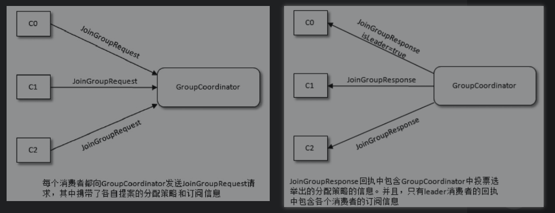

#### 第三阶段（SYNC_GROUP）

leader 消费者根据在第二阶段中选举出来的分区分配策略来实施具体的分区分配，在此之后需要将分配的方案同步给各个消费者，此时leader消费者并不是直接和其余的普通消费者同步分配方案，而是通过 GroupCoordinator 这个“中间人”来负责转发同步分配方案的。在第三阶段，也就是同步阶段，**各个消费者会向GroupCoordinator发送SyncGroupRequest请求来同步分配方案**，如图7-11所示。

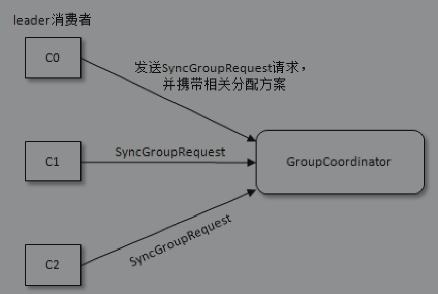


leader消费者发送的 SyncGroupRequest 请求中才包含具体的分区分配方案，这个分配方案保存在group_assignment中，group_assignment 是一个数组类型，其中包含了各个消费者对应的具体分配方案

当消费者收到所属的分配方案之后会调用PartitionAssignor中的onAssignment（）方法。随后再调用ConsumerRebalanceListener中的OnPartitionAssigned（）方法。

**之后开启心跳任务，消费者定期向服务端的GroupCoordinator发送HeartbeatRequest来确定彼此在线。**


##### 消费组元数据信息

消费者客户端提交的消费位移会保存在Kafka的__consumer_offsets主题中，这里也一样，只不过保存的是消费组的元数据信息（GroupMetadata），具体来说，每个消费组的元数据信息都是一条消息

#### 第四阶段（HEARTBEAT）


进入这个阶段之后，消费组中的所有消费者就会处于正常工作状态。在正式消费之前，消费者还需要确定拉取消息的起始位置。假设之前已经将最后的消费位移提交到了GroupCoordinator，并且GroupCoordinator将其保存到了Kafka内部的__consumer_offsets主题中，此时消费者可以通过OffsetFetchRequest请求获取上次提交的消费位移并从此处继续消费。

## __consumer_offsets 剖析

客户端提交消费位移是使用OffsetCommitRequest 请求实现的

OffsetCommitRequest 的报文如下

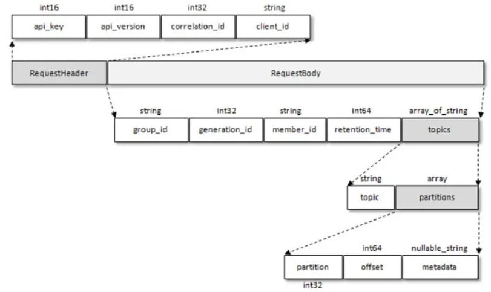

retention_time 表示当前提交的消费位移所能保留的时长，默认为7天 （broker端默认设置好）

有些定时消费的任务在执行完某次消费任务之后保存了消费位移，之后隔了一段时间再次执行消费任务，如果这个间隔时间超过offsets.retention.minutes的配置值（默认7天），那么原先的位移信息就会丢失


同消费组的元数据信息一样，最终提交的消费位移也会以消息的形式发送至主题__consumer_offsets，与消费位移对应的消息也只定义了 key 和 value 字段的具体内容，它不依赖于具体版本的消息格式

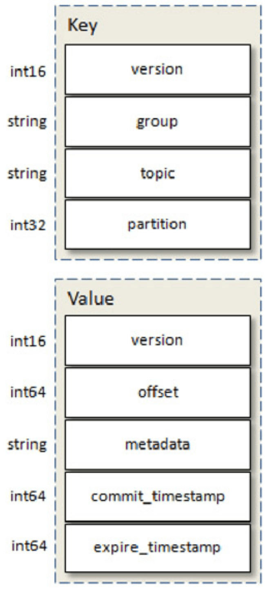

虽然key中包含了4个字段，但最终确定这条消息所要存储的分区还是根据单独的 group 字段来计算的，这样就可以保证消费位移信息与消费组对应的GroupCoordinator 处于同一个 broker 节点上，省去了中间轮转的开销

value中包含了5个字段，除version字段外，其余的offset、metadata、commit_timestamp、expire_timestamp字段分别表示消费位移、自定义的元数据信息、位移提交到 Kafka 的时间戳、消费位移被判定为超时的时间戳。


我们可以通过kafka-console-consumer.sh脚本来查看__consumer_offsets中的内容，不过要设定formatter 参数为kafka.coordinator.group.GroupMetadataManager$OffsetsMessageFormatter。假设我们要查看消费组“consumerGroupId”的位移提交信息，首先可以根据代码清单7-1中的计算方式得出分区编号为20，然后查看这个分区中的消息

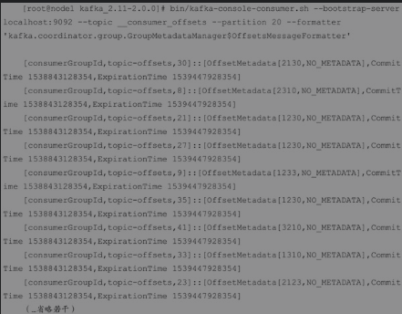


在Kafka中有一个名为“delete-expired-group-metadata”的定时任务来负责清理过期的消费位移

## 可靠性分析

### 副本


#### 失效副本

Kafka从0.9.x版本开始就通过唯一的broker端参数`replica.lag.time.max.ms`来抉择，当ISR集合中的一个**follower副本滞后leader副本的时间超过此参数指定的值**时则判定为同步失败，需要将此follower副本剔除出ISR集合，具体可以参考图8-1。`replica.lag.time.max.ms`参数的默认值为10000。

当follower副本将leader副本LEO（LogEndOffset）之前的日志全部同步时，则认为该 follower 副本已经追赶上 leader 副本，此时更新该副本的lastCaughtUpTimeMs标识。

> follower副本滞后leader副本的时间 = now - lastCaughtUpTimeMs

> Kafka 的副本管理器会**启动一个副本过期检测的定时任务**，**而这个定时任务会定时检查当前时间与副本的 lastCaughtUpTimeMs差值**是否大于参数`replica.lag.time.max.ms` 指定的值

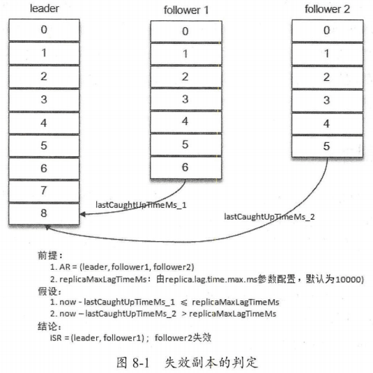

一般有两种情况会导致副本失效：

- follower副本进程卡住，在一段时间内根本没有向leader副本发起同步请求，比如频繁的Full GC
- follower副本进程同步过慢，在一段时间内都无法追赶上leader副本，比如I/O开销过大

#### ISR的伸缩

Kafka 在启动的时候会开启两个与 ISR 相关的定时任务，名称分别为“isr-expiration”和“isr-change-propagation”。

- isr-expiration任务会周期性地检测每个分区是否需要缩减其ISR集合，ISR 集合发生变更时还会将变更后的记录缓存到isrChangeSet 中

- isr-change-propagation任务会周期性（固定值为 2500ms）地检查 isrChangeSet，如果发现isrChangeSet中有ISR集合的变更记录，那么它会在ZooKeeper的/isr_change_notification路径下创建一个以 isr_change_开头的持久顺序节点，**Kafka控制器**为/isr_change_notification添加了一个**Watcher**（IsrChangeNotificetionHandler），当这个节点中有子节点发生变化时会触发Watcher的动作，以此通知控制器更新相关元数据信息并向它管理的broker节点发送更新元数据的请求，最后删除/isr_change_notification路径下已经处理过的节点。

#### LEO与HW

我们知道整个消息追加的过程可以概括如下：

（1）生产者客户端发送消息至leader副本（副本1）中。

（2）消息被追加到leader副本的本地日志，并且会更新日志的偏移量。

（3）follower副本（副本2和副本3）向leader副本请求同步数据。

（4）leader副本所在的服务器读取本地日志，并更新对应拉取的follower副本的信息。

（5）leader副本所在的服务器将拉取结果返回给follower副本。

（6）follower副本收到leader副本返回的拉取结果，将消息追加到本地日志中，并更新日志的偏移量信息。

分析在这个过程中各个副本LEO和HW的变化情况

##### 分析LEO和HW

> 前提：某一时刻，leader副本的LEO增加至5，并且所有副本的HW还都为0。

follower副本向leader副本拉取消息（FetchRequest），在拉取的请求中会带有自身的LEO信息，**这个LEO信息对应的是FetchRequest请求中的fetch_offset**。

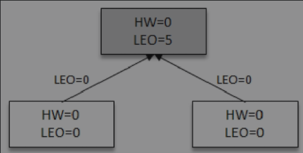

leader副本返回给follower副本相应的消息，并且还带有自身的HW信息

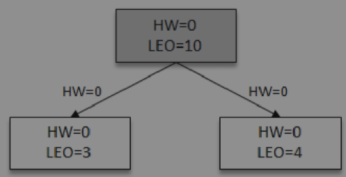

此时两个follower副本各自拉取到了消息，并更新各自的LEO为3和4。

与此同时，follower副本还会更新自己的HW，**更新HW的算法是比较当前LEO和leader副本中传送过来的HW的值，取较小值作为自己的HW值。当前两个follower副本的HW都等于0**（min（LEO，0）=0）。


接下来follower副本再次请求拉取leader副本中的消息

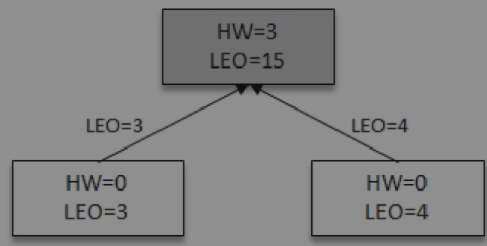

此时leader副本进行更新HW，**即min（15，3，4）=3**

> 注意leader副本的HW是一个很重要的东西，因为它**直接影响了分区数据对消费者的可见性**

然后连同消息和HW一起返回FetchResponse给follower副本

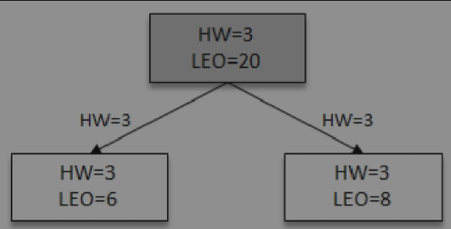

两个follower副本在收到新的消息之后更新LEO并且**更新自己的HW为3（min（LEO，3）=3）**。

在一个分区中，leader副本所在的节点会记录所有副本的LEO，而follower副本所在的节点只会记录自身的LEO，而不会记录其他副本的LEO。对HW而言，各个副本所在的节点都只记录它自身的HW。

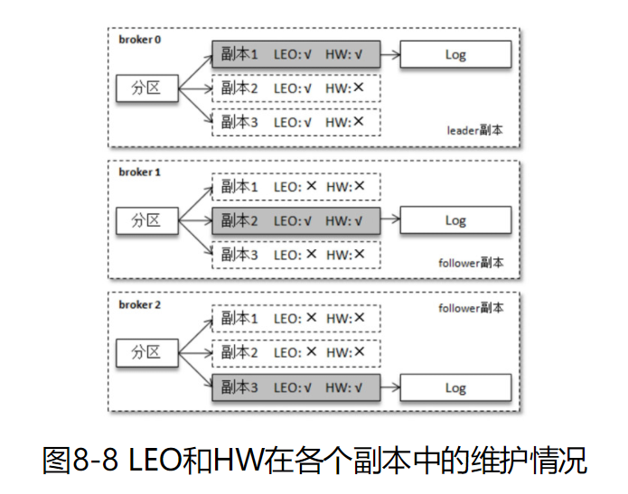


#### 根目录检查点文件

Kafka 的根目录下有 cleaner-offset-checkpoint、log-start-offset-checkpoint、recovery-point-offset-checkpoint和replication-offset-checkpoint四个检查点文件

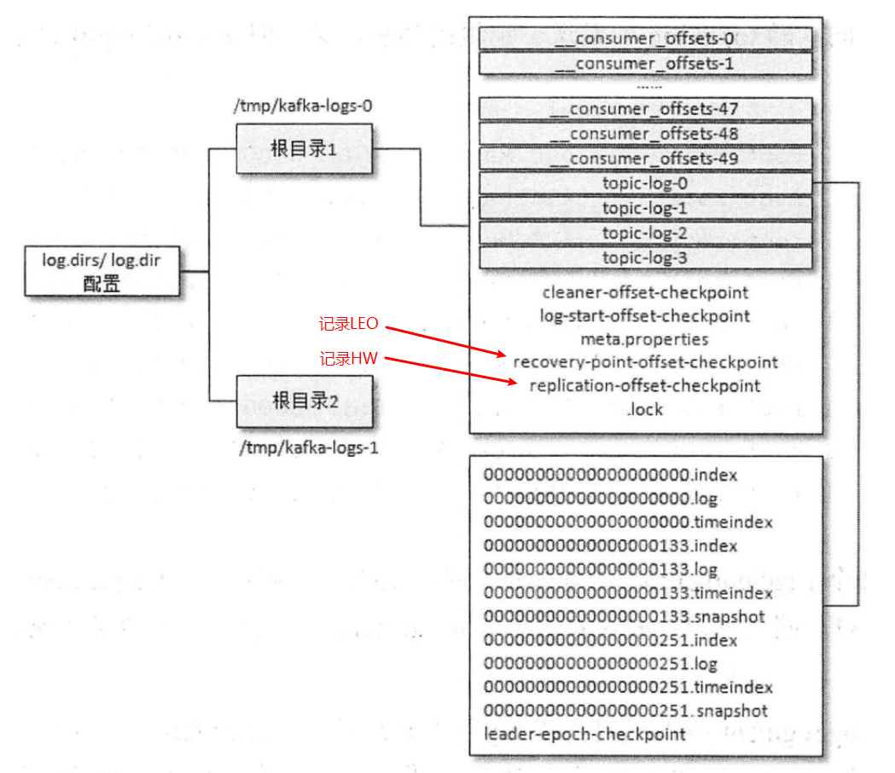

recovery-point-offset-checkpoint 和replication-offset-checkpoint 这两个文件分别对应了 LEO和 HW

log-start-offset-checkpoint文件对应标识日志的起始偏移量

####  Leader Epoch的介入

Epoch : 纪元

用来解决副本之间数据丢失、数据不一致的问题


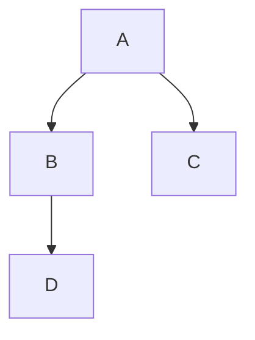
```mermaid
graph TD;
    A-->B;
    A-->C;
    B-->D;
```


## 保证有序性

1. 在创建主题时可以设定分区数为1，通过分区有序性的这一特性来达到主题有序性的目的。
2. Kafka通过消息的key来计算出消息将要写入哪个具体的分区，这样具有相同 key 的数据可以写入同一个分区