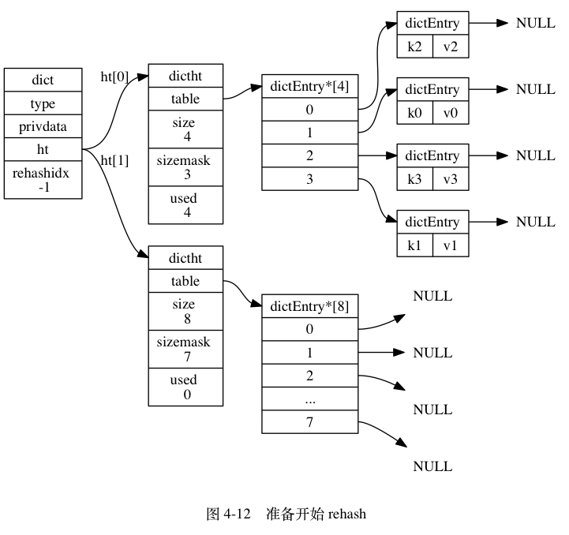

### 持久化

> Redis 支持同时开启 RDB 和 AOF,系统重启后，Redis 会优先使用 **AOF** 来恢复数据，这样丢失的数据会最少。

#### RDB

> RDB ：Redis Database

**默认 Redis 是会以快照 “RDB” 的形式将数据持久化到磁盘的，一个二进制文件，dump.rdb**

 

##### 工作原理**

> Redis是单线程的，那在RDB的过程中，是不是就没法对外提供服务了？
>
> 不是~

当 Redis 需要做持久化时，Redis 会 **fork** 一个子进程，子进程将数据写到磁盘上一个临时 RDB 文件中。当子进程完成写临时文件后，将原来的 RDB 替换掉。这里利用刀了COW这项技术

> linux 的 Copy On Write这项技术了，原理也很简单：
>
> - fork创建出的子进程，**与父进程共享内存空间**。也就是说，如果子进程**不对内存空间进行写入操作的话，内存空间中的数据并不会复制给子进程**，这样创建子进程的速度就很快了
> - fork()之后，kernel把父进程中所有的内存页的权限都设为read-only，然后子进程的地址空间指向父进程。当父子进程都只读内存时，相安无事。当其中某个进程写内存时，CPU硬件检测到内存页是read-only的，于是触发页异常中断（page-fault），陷入kernel的一个中断例程。中断例程中，kernel就会**把触发的异常的页复制一份**，于是父子进程各自持有独立的一份。


##### 配置

Redis 默认的持久化方式是 RDB ，并且默认是打开的。RDB 的保存有方式分为主动保存与被动保存。

**被动保存**需要满足配置文件中设定的触发条件，目前官方默认的触发条件可以在 `redis.conf` 中看到：

```sql
save 900 1 # 服务器在900秒之内，对数据库进行了至少1次修改
save 300 10 # 服务器在300秒之内，对数据库进行了至少10次修改。
save 60 10000 # 服务器在60秒之内，对数据库进行了至少10000次修改。
```

**主动保存方式除了save(同步，阻塞主进程)还有bgsave (异步 不阻塞)、shutdown(关闭前将数据保存下来)**


##### 优点

这种文件非常适合用于进行备份： 比如说，你可以在最近的 24 小时内，每小时备份一次 RDB 文件，并且在每个月的每一天，也备份一个 RDB 文件。

##### 缺点:

- 因为你可能会至少 5 分钟才保存一次 RDB 文件。 在这种情况下， 一旦发生故障停机， 你就可能会丢失好几**分钟的数据**。
- RDB 需要经常 fork 子进程来保存数据集到硬盘上,当数据集比较大的时候, fork 的过程是非常耗时的,可能会导致 Redis 在一些毫秒级内不能响应客户端的请求

#### AOF

> AOF全称Append Only File

##### 工作原理

使用 AOF 做持久化，每一个写命令都通过write函数追加到 appendonly.aof 中,配置方式：启动 AOF 持久化的方式


##### 配置：

```sql
# 是否开启AOF，默认关闭（no）
appendonly yes

# Redis支持三种不同的刷写模式：
# appendfsync always #每次收到写命令就立即强制写入磁盘，是最有保证的完全的持久化，但速度也是最慢的，一般不推荐使用。
appendfsync everysec #每秒钟强制写入磁盘一次，在性能和持久化方面做了很好的折中，是受推荐的方式。
# appendfsync no     #完全依赖OS的写入，一般为30秒左右一次，性能最好但是持久化最没有保证，不被推荐。
```

开启AOF后，Redis 每执行一个修改数据的命令，都会把它添加到缓冲中，根据不同的fsync模式，在不同的时刻写入磁盘

> 也可以通过fsync()来强制输出到硬盘中

##### 优点

使用 AOF 持久化会让 Redis 变得非常耐久（much more durable）：你可以设置不同的 fsync 策略，比如无 fsync ，每秒钟一次 fsync ，或者每次执行写入命令时 fsync 。 AOF 的默认策略为每秒钟 fsync 一次，在这种配置下，Redis 仍然可以保持良好的性能，并且就算发生故障停机，也最多只会丢失一秒钟的数据（ fsync 会在后台线程执行，所以主线程可以继续努力地处理命令请求）。

##### 缺点

- AOF 文件的体积通常要大于 RDB 文件的体积。
- 根据所使用的 fsync 策略，AOF 的速度可能会慢于 RDB 。

### 如何选择持久化方式

分析对比两种方式并做了测试后，发现这是两种不同风格的持久化方式，那么应该如何选择呢？

- 对于企业级的中大型应用，如果不想牺牲数据完整性但是又希望保持高效率，那么你应该同时使用 RDB 和 AOF 两种方式
- 如果你不打算耗费精力在这个地方，只需要保证数据完整性，那么优先考虑使用 AOF 方式
- RDB 方式非常适合**大规模的数据恢复**，如果业务对数据完整性和一致性要求不高，RDB是很好的选择

### Pipeline？

正常情况下，每个请求命令发出后client通常会阻塞并等待redis服务端处理，redis服务端处理完后将结果返回给client。

当client使用pipeline发送命令时，redis server必须部分请求放到队列中（使用内存）执行完毕后一次性发送结果。在一定程度上，可以较大的提升性能,性能提升的原因主要是TCP链接中较少了“交互往返”的时间。

```java
//SpringDataRedis中使用pipeline。
@Test
public void pipeline(){
        List<Object> results = template.executePipelined(new RedisCallback<Object>() {
                    public Object doInRedis(RedisConnection connection){
                        StringRedisConnection stringRedisConn = 
                             (StringRedisConnection)connection;
                        for(int i=0; i< 10; i++) {
                            stringRedisConn.lPush("myqueue","item"+i);
                        }
                        return null;
                    }
       });
}
```

### Redis的同步机制

主从刚刚连接的时候，进行全量同步；全同步结束后，进行增量同步。当然，如果有需要，slave 在任何时候都可以发起全量同步。redis 策略是，无论如何，首先会尝试进行增量同步，如不成功，要求从机进行全量同步。

```sql
从节点执行 slaveof 192.168.x.xx //开启同步
```


**主从同步分为 2 个步骤：同步和命令传播**

#### 同步 sync

1. 从服务器向主服务器发送 sync 命令
2. 收到 sync 命令后，主服务器执行 bgsave 命令，用来生成 rdb 文件，并在**一个缓冲区中记录从现在开始执行的写命令**。
3. bgsave 执行完成后，将生成的 rdb 文件发送给从服务器，用来给从服务器更新数据
4. 主服务器再将缓冲区记录的写命令发送给从服务器，从服务器执行完这些写命令后，此时的数据库状态便和主服务器一致了。

#### 命令传播

在完成同步之后，也许主服务器马上就接受到了新的写命令，执行完该命令后，主从的数据库状态又不一致。**为了再次让主从数据库状态一致，主服务器就需要向从服务器执行命令传播操作** 

#### 2.8之后，不使用sync（耗资源）而是使用psync

**psync 具有完整重同步和部分重同步两种模式**：

- 完整重同步：用于初次复制情况，执行过程同 sync，在这不赘述了。

- 部分重同步：用于断线后重复制情况，如果满足一定条件，主服务器只需要将断线期间执行的写命令发送给从服务器即可。

  主服务器会根据复制偏移量、复制积压缓冲区和 run id，来确定执行完整重同步还是部分重同步

### redis的高可用

在 `Redis` 中，实现 **高可用** 的技术主要包括 **持久化**、**复制**、**哨兵** 和 **集群**，下面简单说明它们的作用，以及解决了什么样的问题：

- **持久化**：持久化是 **最简单的** 高可用方法。它的主要作用是 **数据备份**，即将数据存储在 **硬盘**，保证数据不会因进程退出而丢失。
- **复制**：复制是高可用 `Redis` 的基础，**哨兵** 和 **集群** 都是在 **复制基础** 上实现高可用的。复制主要实现了数据的多机备份以及对于读操作的负载均衡和简单的故障恢复。缺陷是故障恢复无法自动化、写操作无法负载均衡、存储能力受到单机的限制。
- **哨兵**：在复制的基础上，哨兵实现了 **自动化** 的 **故障恢复**。缺陷是 **写操作** 无法 **负载均衡**，**存储能力** 受到 **单机** 的限制。
- **集群**：通过集群，`Redis` 解决了 **写操作** 无法 **负载均衡** 以及 **存储能力** 受到 **单机限制** 的问题，实现了较为 **完善** 的 **高可用方案**。

#### redis sentinel

> `Redis 3.0` 之前，使用 **哨兵**（`sentinel`）机制来监控各个节点之间的状态

`Sentinel` 的主要功能包括 **主节点存活检测**、**主从运行情况检测**、**自动故障转移** （`failover`）、**主从切换**。`Redis` 的 `Sentinel` 最小配置是 **一主一从**。


- **监控**

`Sentinel` 会不断的检查 **主服务器** 和 **从服务器** 是否正常运行。

- **通知**

当被监控的某个 `Redis` 服务器出现问题，`Sentinel` 通过 `API` **脚本** 向 **管理员** 或者其他的 **应用程序** 发送通知。

- **自动故障转移**

当 **主节点** 不能正常工作时，`Sentinel` 会开始一次 **自动的** 故障转移操作，它会将与 **失效主节点** 是 **主从关系** 的其中一个 **从节点** 升级为新的 **主节点**，并且将其他的 **从节点** 指向 **新的主节点**。

- **配置提供者**

在 `Redis Sentinel` 模式下，**客户端应用** 在初始化时连接的是 `Sentinel` **节点集合**，从中获取 **主节点** 的信息。

#### Redis集群

> Redis Cluster 是 Redis 的 分布式解决方案，在 3.0 版本正式推出，有效地解决了 Redis 在 分布式方面的需求。当遇到 单机内存、并发、流量 等瓶颈时，可以采用 Cluster 架构方案达到 负载均衡 的目的。

#### Redis集群方案

**redis用虚拟槽分区原因：解耦数据与节点关系，节点自身维护槽映射关系，分布式存储**

##### 1. 客户端分区方案

**codis 基于客户端来进行分片**

客户端 就已经决定数据会被 **存储** 到哪个 `redis` 节点或者从哪个 `redis` 节点 **读取数据**。其主要思想是采用 **哈希算法** 将 `Redis` 数据的 `key` 进行散列，通过 `hash` 函数，特定的 `key`会 **映射** 到特定的 `Redis` 节点上。

**缺点**:

​	**客户端** 无法 **动态增删** 服务节点，客户端需要自行维护 **分发逻辑**，客户端之间 **无连接共享**，会造成 **连接浪费**。

##### 2. 代理分区方案

**客户端** 发送请求到一个 **代理组件**，**代理** 解析 **客户端** 的数据，并将请求转发至正确的节点，最后将结果回复给客户端。

- **优点**：简化 **客户端** 的分布式逻辑，**客户端** 透明接入，切换成本低，代理的 **转发** 和 **存储** 分离。
- **缺点**：多了一层 **代理层**，加重了 **架构部署复杂度** 和 **性能损耗**。


##### 3. 查询路由方案

> 官方cluster方案

**客户端随机地** 请求任意一个 `Redis` 实例，然后由 `Redis` 将请求 **转发** 给 **正确** 的 `Redis` 节点。`Redis Cluster` 实现了一种 **混合形式** 的 **查询路由**，但并不是 **直接** 将请求从一个 `Redis` 节点 **转发** 到另一个 `Redis` 节点，而是在 **客户端** 的帮助下直接 **重定向**（ `redirected`）到正确的 `Redis` 节点。


#### 分区原则

`Redis Cluster` 采用 **哈希分区规则**，这里重点讨论 **哈希分区**

##### 1. 节点取余分区

最常见的分区方式

扩容时通常采用 **翻倍扩容**，避免 **数据映射** 全部被 **打乱**，导致 **全量迁移** 的情况。


##### 2. 一致性哈希分区

可以将所有的 **存储节点** 排列在 **收尾相接** 的 `Hash` 环上，每个 `key` 在计算 `Hash` 后会 **顺时针** 找到 **临接** 的 **存储节点** 存放。而当有节点 **加入** 或 **退出** 时，仅影响该节点在 `Hash` 环上 **顺时针相邻** 的 **后续节点**。


##### 3. 虚拟槽分区

当前集群有 `5` 个节点，每个节点平均大约负责 `3276` 个 **槽**。由于采用 **高质量** 的 **哈希算法**，每个槽所映射的数据通常比较 **均匀**，将数据平均划分到 `5` 个节点进行 **数据分区**。`Redis Cluster` 就是采用 **虚拟槽分区**。


#### Redis的数据分区

`Redis Cluster` 采用 **虚拟槽分区，所有的 **键** 根据 **哈希函数** 映射到 `0~16383` 整数槽内，计算公式：`slot = CRC16（key）& 16383`。每个节点负责维护一部分槽以及槽所映射的 **键值数据**，如图所示：


##### 优点

- 解耦 **数据** 和 **节点** 之间的关系，简化了节点 **扩容** 和 **收缩** 难度。
- **节点自身** 维护槽的 **映射关系**，不需要 **客户端** 或者 **代理服务** 维护 **槽分区元数据**。
- 支持 **节点**、**槽**、**键** 之间的 **映射查询**，用于 **数据路由**、**在线伸缩** 等场景。

##### 缺点

- `key` **批量操作** 支持有限。

  类似 `mset`、`mget` 操作，目前只支持对具有相同 `slot` 值的 `key` 执行 **批量操作**。对于 **映射为不同** `slot` 值的 `key` 由于执行 `mget`、`mget` 等操作可能存在于多个节点上，因此不被支持。

- `key` **事务操作** 支持有限。

  只支持 **多** `key` 在 **同一节点上** 的 **事务操作**，当多个 `key` 分布在 **不同** 的节点上时 **无法** 使用事务功能。

- `key` 作为 **数据分区** 的最小粒度

  不能将一个 **大的键值** 对象如 `hash`、`list` 等映射到 **不同的节点**。

- 不支持 **多数据库空间**

  **单机** 下的 `Redis` 可以支持 `16` 个数据库（`db0 ~ db15`），**集群模式** 下只能使用 **一个** 数据库空间，即 `db0`。

- **复制结构** 只支持一层

  **从节点** 只能复制 **主节点**，不支持 **嵌套树状复制** 结构。

### 数据结构和内部编码

`type` 命令实际返回的就是当前 **键** 的 **数据结构类型**，它们分别是：`string`（**字符串**）、`hash`（**哈希**）、`list`（**列表**）、`set`（**集合**）、`zset`（**有序集合**），但这些只是 `Redis` 对外的 **数据结构**。如图所示：


对于每种 **数据结构**，实际上都有自己底层的 **内部编码** 实现，而且是 **多种实现**。这样 `Redis` 会在合适的 **场景** 选择合适的 **内部编码**，如图所示：


#### 字符串

**字符串类型** 是 `Redis` 最基础的数据结构。**字符串类型** 的值实际可以是 **字符串**（**简单** 和 **复杂** 的字符串，例如 `JSON`、`XML`）、**数字**（整数、浮点数），甚至是 **二进制**（图片、音频、视频），但是值最大不能超过 `512MB`。

**字符串** 类型的 **内部编码** 有 `3` 种：

- **int**：`8` 个字节的 **长整型**。
- **embstr**：**小于等于** `39` 个字节的字符串。
- **raw**：**大于** `39` 个字节的字符串。

`Redis` 会根据当前值的 **类型** 和 **长度** 决定使用哪种 **内部编码实现**。

#### 哈希

下面为 `user：1` 添加一对 `field-value`，如果设置成功会返回 `1`，反之会返回 `0`。

```sql
127.0.0.1:6379> hset user:1 name tom
(integer) 1
```

此外 `Redis` 提供了 `hsetnx` 命令，它们的关系就像 `set` 和 `setnx` 命令一样，只不过 **作用域** 由 **键** 变为 `field`。

**哈希类型** 的 **内部编码** 有两种：

##### ziplist（压缩列表）

当 **哈希类型** 元素个数 **小于** `hash-max-ziplist-entries` 配置（默认 `512` 个）、同时 **所有值** 都 **小于** `hash-max-ziplist-value` 配置（默认 `64` 字节）时，`Redis` 会使用 `ziplist` 作为 **哈希** 的 **内部实现**，`ziplist` 使用更加 **紧凑的结构** 实现多个元素的 **连续存储**，所以在 **节省内存** 方面比 `hashtable` 更加优秀。

##### hashtable（哈希表）

当 **哈希类型** 无法满足 `ziplist` 的条件时，`Redis` 会使用 `hashtable` 作为 **哈希** 的 **内部实现**，因为此时 `ziplist` 的 **读写效率** 会下降，而 `hashtable` 的读写 **时间复杂度** 为 `O（1）`。

#### 列表

列表类型的 **内部编码** 有两种：

##### ziplist（压缩列表）

当列表的元素个数 **小于** `list-max-ziplist-entries` 配置（默认 `512` 个），同时列表中 **每个元素** 的值都 **小于**  `list-max-ziplist-value` 配置时（默认 `64` 字节），`Redis` 会选用 `ziplist` 来作为 **列表** 的 **内部实现** 来减少内存的使用。

##### linkedlist（链表）

当 **列表类型** 无法满足 `ziplist` 的条件时， `Redis` 会使用 `linkedlist` 作为 **列表** 的 内部实现

#### 集合

**集合类型** 的 **内部编码** 有两种：

#####  intset（整数集合）

当集合中的元素都是 **整数** 且 **元素个数** 小于 `set-max-intset-entries` 配置（默认 `512` 个）时，`Redis` 会选用 `intset` 来作为 **集合** 的 **内部实现**，从而 **减少内存** 的使用。

##### hashtable（哈希表）

当集合类型 **无法满足** `intset` 的条件时，`Redis` 会使用 `hashtable` 作为集合的 **内部实现**。

#### 有序集合

skipList + hashtable

### 跳表

跳表就是在**有序链表的基础上**通过增加**额外的指针节点**来解决查询效率，通过随机插入来提高变更效率的一种数据结构。


每个节点随机出一个层数(level)。比如，一个节点随机出的层数是3，那么就把它链入到第1层到第3层这三层链表中。


刚刚创建的这个skiplist总共包含4层链表，现在假设我们在它里面依然查找23，下图给出了查找路径：


#### skiplist与平衡树、哈希表的比较

- skiplist和各种平衡树（如AVL、红黑树等）的元素是有序排列的，而哈希表不是有序的。因此，在哈希表上只能做单个key的查找，不适宜做范围查找。所谓范围查找，指的是查找那些大小在指定的两个值之间的所有节点。
- 在做范围查找的时候，平衡树比skiplist操作要复杂。在平衡树上，我们找到指定范围的小值之后，还需要以中序遍历的顺序继续寻找其它不超过大值的节点。如果不对平衡树进行一定的改造，这里的中序遍历并不容易实现。而在skiplist上进行范围查找就非常简单，只需要在找到小值之后，对第1层链表进行若干步的遍历就可以实现。
- 平衡树的插入和删除操作可能引发子树的调整，逻辑复杂，而skiplist的插入和删除只需要修改相邻节点的指针，操作简单又快速。
- 从内存占用上来说，skiplist比平衡树更灵活一些。一般来说，平衡树每个节点包含2个指针（分别指向左右子树），而skiplist每个节点包含的指针数目平均为1/(1-p)，具体取决于参数p的大小。如果像Redis里的实现一样，取p=1/4，那么平均每个节点包含1.33个指针，比平衡树更有优势。
- 查找单个key，skiplist和平衡树的时间复杂度都为O(log n)，大体相当；而哈希表在保持较低的哈希值冲突概率的前提下，查找时间复杂度接近O(1)，性能更高一些。所以我们平常使用的各种Map或dictionary结构，大都是基于哈希表实现的。
- 从算法实现难度上来比较，skiplist比平衡树要简单得多。

#### Redis中的skiplist实现


### ziplist

#### 什么是ziplist

ziplist是一个经过**特殊编码**的双向链表，它的设计目标就是为了**提高存储效率**。ziplist可以用于存储字符串或整数，其中**整数是按真正的二进制**表示进行编码的，而不是编码成字符串序列。它能以O(1)的时间复杂度在表的两端提供`push`和`pop`操作。

一个普通的双向链表，链表中每一项都占用独立的一块内存，各项之间用地址指针（或引用）连接起来。这种方式会带来大量的内存碎片，而且地址指针也会占用额外的内存。而ziplist却是将表中每一项存放在前后连续的地址空间内，一个ziplist整体占用一大块内存。它是一个表（list），但**其实不是一个链表**（linked list）。

另外，ziplist为了在细节上节省内存，对于值的存储采用了变长的编码方式.大概意思是说，对于大的整数，就多用一些字节来存储，而对于小的整数，就少用一些字节来存储。

ziplist的内存结构如下：

```sql
<zlbytes><zltail><zllen><entry>...<entry><zlend>
```

这里太过复杂，想了解可以看这里

https://mp.weixin.qq.com/s?__biz=MzA4NTg1MjM0Mg==&mid=2657261265&idx=1&sn=e105c4b86a5640c5fc8212cd824f750b#rd

ziplist本质上就是一块连续内存，内部组成结构又是一个高度动态的设计（变长编码），节省内存。

#### ziplist的接口

我们先不着急看实现，先来挑几个ziplist的重要的接口，看看它们长什么样子：

```sql
unsigned char *ziplistNew(void);
unsigned char *ziplistMerge(unsigned char **first, unsigned char **second);
unsigned char *ziplistPush(unsigned char *zl, unsigned char *s, unsigned int slen, int where);
unsigned char *ziplistIndex(unsigned char *zl, int index);
unsigned char *ziplistNext(unsigned char *zl, unsigned char *p);
unsigned char *ziplistPrev(unsigned char *zl, unsigned char *p);
unsigned char *ziplistInsert(unsigned char *zl, unsigned char *p, unsigned char *s, unsigned int slen);
unsigned char *ziplistDelete(unsigned char *zl, unsigned char **p);
unsigned char *ziplistFind(unsigned char *p, unsigned char *vstr, unsigned int vlen, unsigned int skip);
unsigned int ziplistLen(unsigned char *zl);
```

- ziplistNew: 创建一个空的ziplist（只包含``）。
- ziplistMerge: 将两个ziplist合并成一个新的ziplist。
- ziplistPush: 在ziplist的头部或尾端插入一段数据（产生一个新的数据项）。注意一下这个接口的返回值，是一个新的ziplist。调用方必须用这里返回的新的ziplist，替换之前传进来的旧的ziplist变量，而经过这个函数处理之后，原来旧的ziplist变量就失效了。为什么一个简单的插入操作会导致产生一个新的ziplist呢？这是因为ziplist是一块连续空间，对它的追加操作，会引发内存的realloc，因此ziplist的内存位置可能会发生变化。实际上，我们在之前介绍sds的文章中提到过类似这种接口使用模式（参见sdscatlen函数的说明）。
- ziplistIndex: 返回index参数指定的数据项的内存位置。index可以是负数，表示从尾端向前进行索引。
- ziplistNext和ziplistPrev分别返回一个ziplist中指定数据项p的后一项和前一项。
- ziplistInsert: 在ziplist的任意数据项前面插入一个新的数据项。
- ziplistDelete: 删除指定的数据项。
- ziplistFind: 查找给定的数据（由vstr和vlen指定）。注意它有一个skip参数，表示查找的时候每次比较之间要跳过几个数据项。为什么会有这么一个参数呢？其实这个参数的主要用途是当用ziplist表示hash结构的时候，是按照一个field，一个value来依次存入ziplist的。也就是说，偶数索引的数据项存field，奇数索引的数据项存value。当按照field的值进行查找的时候，就需要把奇数项跳过去。
- ziplistLen: 计算ziplist的长度（即包含数据项的个数）。

#### hash与ziplist

```sql
hash-max-ziplist-entries 512
hash-max-ziplist-value 64
```

这个配置的意思是说，在如下两个条件之一满足的时候，ziplist会转成map：

- 当hash中的数据项（即field-value对）的数目超过512的时候
- 当hash中插入的任意一个value的长度超过了64的时候

Redis的hash之所以这样设计，是因为当ziplist变得很大的时候，它有如下几个缺点：

- 每次插入或修改引发的realloc操作会有更大的概率造成内存拷贝，从而降低性能。
- 一旦发生内存拷贝，内存拷贝的成本也相应增加，因为要拷贝更大的一块数据。
- 当ziplist数据项过多的时候，在它上面查找指定的数据项就会性能变得很低，因为ziplist上的查找需要进行遍历。

总之，ziplist本来就设计为各个数据项挨在一起组成连续的内存空间，这种结构并不擅长做修改操作。一旦数据发生改动，就会引发内存realloc，可能导致内存拷贝。


##### 注意

**ziplist上很多操作其实并不是O(1)（如查找），但是由于只是在长度64以内才会使用ziplist，实际的操作并没有对效率会产生多大影响**

### quicklist

> redis 3.2版本后 list的实现


Redis对外暴露的上层list数据类型，经常被用作队列使用。比如它支持的如下一些操作：

- `lpush`: 在左侧（即列表头部）插入数据。
- `rpop`: 在右侧（即列表尾部）删除数据。
- `rpush`: 在右侧（即列表尾部）插入数据。
- `lpop`: 在左侧（即列表头部）删除数据。

这些操作都是O(1)时间复杂度的。

#### quicklist概述

> A doubly linked list of ziplists  
>
> 它确实是一个双向链表，而且是一个ziplist的双向链表。

双向链表是由多个节点（Node）组成的。这个描述的意思是：quicklist的每个节点都是一个ziplist。

#### quicklist的设计

quicklist的结构为什么这样设计呢？总结起来，大概又是一个空间和时间的折中：

- 双向链表便于在表的两端进行push和pop操作，但是它的内存开销比较大。首先，它在每个节点上除了要保存数据之外，还要额外保存两个指针；其次，双向链表的各个节点是单独的内存块，地址不连续，节点多了容易产生内存碎片。
- ziplist由于是一整块连续内存，所以存储效率很高。但是，它不利于修改操作，每次数据变动都会引发一次内存的realloc。特别是当ziplist长度很长的时候，一次realloc可能会导致大批量的数据拷贝，进一步降低性能。

于是，结合了双向链表和ziplist的优点，quicklist就应运而生了。

## redis rehash

> hashmap resize会rehash，redis同样也会

在Redis中，键值对（Key-Value Pair）存储方式是由字典（Dict）保存的，而字典底层是通过哈希表来实现的。

字典

Redis Dict 中定义了两张哈希表，是为了后续字典的扩展作Rehash之用

v

### rehash过程-渐进式rehash：

1. 为 `ht[1]` 分配空间， 让字典同时持有 `ht[0]` 和 `ht[1]` 两个哈希表。
2. 在字典中维持一个索引计数器变量 `rehashidx` ， 并将它的值设置为 `0` ， 表示 rehash 工作正式开始。
3. 在 rehash 进行期间， 每次对字典执行添加、删除、查找或者更新操作时， 程序除了执行指定的操作以外， 还会顺带将 `ht[0]` 哈希表在 `rehashidx` 索引上的所有键值对 rehash 到 `ht[1]` ， 当 rehash 工作完成之后， 程序将 `rehashidx` 属性的值增一。
4. 随着字典操作的不断执行， 最终在某个时间点上， `ht[0]` 的所有键值对都会被 rehash 至 `ht[1]` ， 这时程序将 `rehashidx` 属性的值设为 `-1` ， 表示 rehash 操作已完成。

### 渐进式 rehash 执行期间的哈希表操作

因为在进行渐进式 rehash 的过程中， 字典会同时使用 `ht[0]` 和 `ht[1]` 两个哈希表， 所以在渐进式 rehash 进行期间， 字典的删除（delete）、查找（find）、更新（update）等操作会在两个哈希表上进行： 比如说， 要在字典里面查找一个键的话， 程序会先在 `ht[0]` 里面进行查找， 如果没找到的话， 就会继续到 `ht[1]` 里面进行查找， 诸如此类。

另外， 在渐进式 rehash 执行期间， 新添加到字典的键值对一律会被保存到 `ht[1]` 里面， 而 `ht[0]` 则不再进行任何添加操作： 这一措施保证了 `ht[0]` 包含的键值对数量会只减不增， 并随着 rehash 操作的执行而最终变成空表。