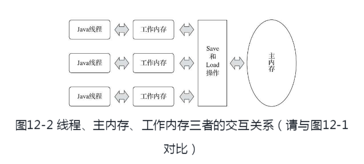
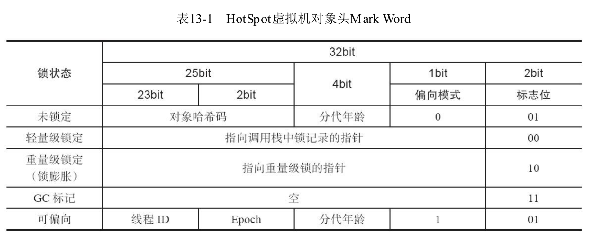
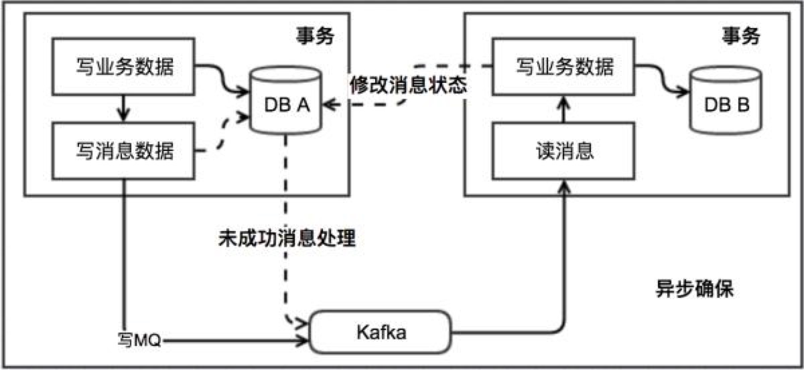

# qwe
# JVM

## JVM内存分区


堆区、栈区、方法区

- 堆区

  存放对象实例，jvm管理的内存占用最大一块，可以通过-xmx,-xms配置

- 栈区(`线程私有`)

  - 虚拟机栈

    它是**Java方法**执行的**线程内存模型**。每个方法的执行，Java虚拟机都会同步创建一个栈帧用于**存储局部变量表**、操作数栈、动态连接、方法出口等信息

  - 本地方法栈

    类似于虚拟机栈，但是作用是native方法

  - 程序计数器

    **线程私有，指向当前线程正在执行的虚拟机字节码指令的地址**。它是程序控制流的指示器，分支、循环、跳转、异常处理、线程恢复等基础功能都需要依赖这个计数器来完成

- 方法区

  线程共享，存储**已被虚拟机加载的类信息、常量、静态变量、运行时常量池（不包括字符串常量池）**

> 方法区也经常被称为永久代，主要是因为java8以前，HotSpot选择**用分代设计管理堆那样管理方法区**，节省代码量（java8已经去除永久代，将所有的类信息、常量、静态变量放到元空间，不包括字符串常量池，字符串常量池在堆中）。不过事实上，永久代也并非是永久存在，这区域的内存回收目标主要是针对**常量池的回收和对类型的卸载**
>
> 永久代和元空间其实都是方法区的实现，jvm并没有强制要求方法区如何去实现


## java7和java8的内存分区有什么区别

- **1.8将永久代取消，取而代之的是元空间**
- 1.7运行时常量池都在方法区，而1.8运行时常量池中的字符串常量池被放到了堆中
- 元空间属于本地内存

## 四种引用

1. 强引用Strong Reference（内存泄露主因）
2. 软引用SoftReference（空间不足将被回收），适合缓存用 
3. 弱引用WeakReference（只要GC就会回收）
4. 虚引用  （一个对象设置虚引用关联的唯一目的只是为了能在这个对象被收集器回收时收到一个系统通知）

## 对象的构成

对象在堆内存中的存储布局可以划分为三个部分：对象头（Header）、实例数据（Instance Data）和对齐填充（Padding）。

- 对象头

  Mark Word（存储HashCode、GC分代年龄、锁信息） + Class Point（Java虚拟机通过这个指针来确定该对象是哪个类的实例） + Array Length（数组的长度）

- 实例数据部分

  对象真正存储的有效信息

- 对齐填充

  这个意义不是很大，主要在虚拟机规范中对象必须是8字节的整数，所以当对象不满足这个情况时，就会用占位符填充

### 对象头

具体如下

|     内容     |                             说明                             |
| :----------: | :----------------------------------------------------------: |
|  Mark Word   |             存储对象的hashCode、锁信息、分代年龄             |
| Klass Point  | 存储到对象类型数据的指针，虚拟机通过这个指针来确定对象是哪个类的实例 |
| Array Length |            数组的长度(仅当是数组对象才存在该字段)            |

#### Mark Word

| 25 bit         | 4 bit        | 1 bit          | 2 bit       |
| -------------- | ------------ | -------------- | ----------- |
| 对象的hashCode | 对象分代年龄 | 是否是偏向锁 0 | 锁标志位 01 |

# GC

## 如何判断一个对象可以被回收

- 引用计数（可以提到 Netty 中的使用案例）

  ByteBuf

- 可达性分析（JVM 使用）

  **从这些GC Roots对象作为起始节点，根据引用关系向下搜索，如果从GC Roots到这个对象不可达时，则证明此对象是不可能再被使用的**

### GC Roots有以下几种：

- 在虚拟机栈（栈帧中的本地变量表）中引用的对象，譬如各个线程被调用的方法堆栈中使用到的参数、局部变量、临时变量等。在方法区中类静态属性引用的对象，譬如Java类的引用类型静态变量
- 在方法区中常量引用的对象，譬如字符串常量池（StringTable）里的引用
- 在本地方法栈中JNI（即通常所说的Native方法）引用的对象
- Java虚拟机内部的引用，如基本数据类型对应的Class对象，一些常驻的异常对象（比如NullPointExcepiton、OutOfMemoryError）等，还有系统类加载器
- 所有被同步锁（synchronized关键字）持有的对象
- 反映Java虚拟机内部情况的JMXBean、JVMTI中注册的回调、本地代码缓存

简化版

- 虚拟机栈中的引用对象
- 本地方法栈中的引用对象
- 方法区的类变量的引用
- 方法区中的常量引用

## 垃圾回收算法

分代收集，新生代由于朝夕生死使用复制算法，老年代生命力较强使用标记清除（或者标记整理）算法

### 复制

朝夕生死使用复制算法

### 标记清除

会有内存碎片问题。当碎片过多时，将会给大对象分配带来麻烦，往往会出现老年代还有很多空间但就已经不能保存对象了。不得不提前触发一次Full GC

> CMS收集器提供了-XX:UseCMSCompactAtFullCollection开关参数，用于在CMS收集器不得不进行Full GC时开启内存碎片的合并整理过程

### 标记整理

首先标记出所有需要回收的对象，让所有存活的对象都向一端移动，然后直接清理掉端边界以外的内存。

## 垃圾回收器

### Serial收集器

**单线程，简单而高效，复制算法**

单cpu环境下，没用线程交互开销，可以有最高的单线程收集效率

### ParNew收集器

**Serial的多线程版本，唯一能和CMS收集器配合的新生代收集器**

### Parallel Scavenge

> JDK7\8 都是用的Parallel Scavenge（新生代）+Parallel Old（老年代）
>
> 9是G1

**和Parnew类似，但Parallel收集器目的是可控制的吞吐量**

吞吐量 ＝ （cpu总消耗时间的比值 ➖ 垃圾收集的时间） ➗  cpu总消耗时间的比值

> ”吞吐量优先“收集器

#### 重要参数

- -XX:MaxGCPauseMillis

  设置最大垃圾停顿时间（并不是越小越好，越小会导致新生代空间变小，也就是会收集更加频繁，反而吞吐量下降）

- -XX:GCTimeRadio

  设置吞吐量，默认99（有点没看懂怎么算。。）

- -XX:+UseAdaptiveSizePolicy

  打开GC自适应调节策略，打开之后只需要设置好堆大小和前面两个参数，**系统自动调节Eden、Eden:Survivor等大小**

### Serial Old收集器

- Serial收集器的老年代版本
- 和Serial一样，是个单线程收集器
- 使用”标记-整理“算法

### Parallel Old收集器

- Parallel Scavenge的老年代版本
- 多线程
- 标记-整理

JDK7\8 指定组合 Parallel Scavenge（新生代）+Serial Old（老年代）

### CMS收集器

> Concurrent Mark Sweep

**特点是：**

- 强调最短回收停顿时间
- 标记-清除算法

- 并发收集

#### cms垃圾回收过程：

1. 初始标识 找到GC Roots（需要STW）
2. 并发标记 从GCRoots的直接关联对象开始遍历整个对象图的过程，不需要STW
3. 重新标记  为了修正并发标记期间，因用户程序继续运作而导致标记产生改变的标记，会导致swt
4. 并发清除 清理删除掉标记阶段判断的已经死亡的对象，不需要STW

从整个过程来看，并发标记和并发清除的耗时最长，但是不需要停止用户线程，而初始标记和重新标记的耗时较短，但是需要停止用户线程，总体而言，整个过程造成的停顿时间较短，大部分时候是可以和用户线程一起工作的。

### G1收集器

G1的回收过程分为以下四个步骤：

1. 初始标记：标记GC ROOT能关联到的对象，需要STW 
2. 并发标记：从GCRoots的直接关联对象开始遍历整个对象图的过程，扫描完成后还会重新处理并发 标记过程中产生变动的对象 
3. 最终标记：短暂暂停用户线程，再处理一次，需要STW 
4. 筛选回收：更新Region的统计数据，对每个Region的回收价值和成本排序，根据⽤户设置的停顿 时间制定回收计划。再把需要回收的Region中存活对象复制到空的Region，同时清理旧的 Region。需要STW 

总的来说除了并发标记之外，其他3个过程也还是需要短暂的STW，G1的目标是在停顿和延迟可控的情 况下尽可能提高吞吐量。

## 什么时候会触发YGC和FGC？

当一个新的对象来申请内存空间的时候，如果Eden区无法满足内存分配需求，则触发YGC

使用中的`Survivor`区和`Eden`区存活对象送到未使用的`Survivor`区，如果`YGC`之后还是没有足够空间，则直接进入老年代分配，如果老年代也无法分配空间，触发`FGC`，`FGC`之后还是放不下则报出`OOM`异常

### **另外一些导致fullGC的原因**

- 方法区空间不足
- 显式调用system.gc()

### 提前进入老年代原因

- YGC之后，存活的对象将会被复制到未使⽤的Survivor区，如果S区放不下，则直接晋升到老年代。
- Survivor空间中相同年龄所有对象⼤⼩的总和⼤于Survivor空间的一半，年龄⼤于或等于该年龄的对象就 可以直接进⼊⽼年代。

## 频繁full gc 排查

猜测可能的原因：

1. Eden区太小，导致对象频繁进入老年代
2. survivor太小，导致对象频繁进入老年代
3. 发生内存泄漏，对象gc不掉，频繁进入老年代

排查过程：

1. jstat -gcutil或者查看gc.log日志，查看内存回收情况

   
   
2. 观察是否有特别的现象
   
   1. 例如老年代增长特别块 就是上面的1、2种原因
   2. 如果fullgc后不怎么减少，就是内存泄漏
   
3. jmap 命令dump出内存文件

## CPU飙升，同时FGC

一般都是线程一致执行导致的，所以找出

> top -H以线程模式查看

1. 找到当前进程的pid，top -p pid -H 查看资源占⽤，找到线程 
2. printf “%x\n” pid，把线程pid转为16进制，比如0x32d 
3.  jstack pid|grep -A 10 0x32d查看线程的堆栈⽇志，还找不到问题继续 
4. 实在不得已，dump出内存⽂件⽤MAT等⼯具进⾏分析，定位到代码，修复


# 类加载

虚拟机规范规定有且只有5种情况必须立即对类初始化

- new|读取一个类的静态字段|调用类的静态方法
- 使用java.lang.reflect包进行反射调用
- 初始化一个类，如果父类还没初始化，必须先初始化父类
- 虚拟机启动时指定的主类要初始化
- 使用Jdk1.7动态语言支持的时候

## 类加载过程

将类的数据加载到内存，就叫做类加载机制

加载 -> 验证 -> 准备 -> 解析 -> 初始化 -> 使用 -> 卸载

类初始化是类加载过程最后一步

**简单来说就是加载 -> 连接 -> 初始化**

### 加载

“加载”阶段，虚拟机需要做3件事情

- 通过一个类的全限定名来获取定义此类的二进制字节流

- 将这个字节流所代表的**静态存储结构**转化为**方法区的运行时数据结构**

  > 类加载后，类和接口名字，字段名，和其他一些在class中引用的常量 会存在方法区的运行时常量池

- 在内存中生成一个代表这个类的class对象，作为方法区这个类的各种数据的访问入口

### 连接

包括验证、准备、解析

- 保证加载进来的字节流符合虚拟机规范，不会造成安全错误。
- 是为类变量（注意，不是实例变量）分配内存
- 将常量池内的符号引用替换为直接引用

### 初始化

对`static`修饰的变量或语句进行初始化，如果初始化一个类的时候，其父类尚未初始化，则优先初始化其父类。

如果同时包含多个静态变量和静态代码块，则按照自上而下的顺序依次执行。


## 知道new对象的过程吗？


JVM在new的时候会先判断类是否已经加载，如果没有，会先执行类加载过程：

1. 加载：从字节码解析成二进制流
2. 验证：校验class文件是否符合虚拟机规范
3. 准备：为静态变量、常量赋默认值
4. 解析：把常量池中符号引用替换为直接引用的过程
5. 初始化：执行static代码块，如果由父类，先执行父类的static

当类加载完成之后，紧接着就是对象分配内存空间和初始化的过程 

1. 先为对象分配合适的内存空间 
2. 接着为实例变量赋默认值 
3. 设置对象的头信息，对象hash码、GC分代年龄、元数据信息等 
4. 执行构造函数(init)初始化

## 类加载器

实现了“通过一个类的全限定名来获取定义此类的二进制字节流”这个操作的代码称为“类加载器”

> 比较两个类是否“相等” ，只要这两个类时同一个类加载器加载的前提下才有意义！！否则即使两个类是来自同一个class文件，只要类加载器不一样，就一定不相等

从开发人员的角度看，类加载器有以下

- 启动类加载器Bootstrap ClassLoader

  负责JAVA_HOME/lib目录种的包

- 扩展类加载器 Extension ClassLoader

  负责JAVA_HOME/lib/ext目录种的包

- 应用程序类加载器 Application ClassLoader

## 双亲委派机制

类加载器收到类加载的请求，把这个请求委托给父加载器去完成，一直向上委托，直到启动类加载器，无法加载

带来的好处：

1. 保障类的唯一性和安全性以及保证JDK核心类的优先加载
2. 避免类的重复加载

## 实现双亲委派

> 双亲委派不靠继承来实现(AppClassLoader是内部静态非public类，无法继成)，而是通过组合的方式，即有个成员变量parent存父类加载器。

自定义加载器

```java
class MyClassLoader extends ClassLoader{
        @Override
        protected Class<?> findClass(String name) throws ClassNotFoundException{
            try{
                int lastIndexOf = name.lastIndexOf(".");
                String path = "bmdfs-http-test\\target\\classes\\cn\\com\\bluemoon\\"+name.substring(lastIndexOf+1) + ".class";
                byte[] classDate = getClassBinaryData(path);
                name = name.substring(2);
                if (classDate != null){// defineClass方法将字节码转化为类
                    return defineClass(name, classDate, 0, classDate.length);
                }
            }catch (IOException e){
                e.printStackTrace();
            }
            return super.findClass(name);
        } // 返回类的字节码

        private byte[] getClassBinaryData(String className) throws IOException{
            InputStream in = null;
            ByteArrayOutputStream out = null;
            String path = className;
            try{
                in = new FileInputStream(path);
                out = new ByteArrayOutputStream();
                byte[] buffer = new byte[2048];
                int len = 0;
                while ((len = in.read(buffer)) != -1){
                    out.write(buffer, 0, len);
                }
                return out.toByteArray();
            }
            catch (FileNotFoundException e){
                e.printStackTrace();
            }finally{
                in.close();
                out.close();
            }
            return null;
        }
```

```java
public static void main(String[] args) throws ClassNotFoundException, IllegalAccessException, InstantiationException {
        MyClassLoader myLoader = new MyClassLoader();
        Class<?> aClass = myLoader.loadClass("ffcn.com.bluemoon.HLSTest");//乱写，就为了可以走到自定义的classloader
        //Hello类的类加载器
        ClassLoader classLoaderOfHello = aClass.getClassLoader();

        //取得扩展器加载器的类对象Class
        ClassLoader classLoader = classLoaderOfHello;

        while (classLoader != null) {
            System.out.println(classLoader);
            classLoader = classLoader.getParent();
        }
    }
```

打印：

```java
cn.com.bluemoon.Test$MyClassLoader@6aceb1a5
sun.misc.Launcher$AppClassLoader@18b4aac2
sun.misc.Launcher$ExtClassLoader@ba4d54
```

### 为什么不需要继承AppClassLoader？

AppClassLoader没法继承，

### 为什么不继承它的parent也是AppClassLoader？

因为继承的ClassLoader在构造函数写了相关代码

```java
//一旦实例化MyClassLoader，就能执行这行代码
protected ClassLoader(ClassLoader parent) {
        this(checkCreateClassLoader(), parent);
}
```

## 如何打破双亲委派模式

自定义类加载器，继承ClassLoader类重写loadClass方法

或者像spi一样(jdbc、jndi)

> JDBC
>
> DriverManager位于 JAVA_HOME中jre/lib/rt.jar 包，由BootStrap类加载器加载，为了加载驱动类实现，java使用了线程上下文类加载器，结果就是父类加载器请求子类加载器去完成类加载动作，违背了双亲委派模型

## Tomcat为什么要打破双亲委派模式

因为一个功能健全的Web服务器应该要实现以下几点：

1. 部署在同一个服务器上的两个Web应用程序所使用的Java类库应该相互隔离（因为第三方jar的版本可能不同，必须相互独立）
2. 部署在同一个服务器上的两个Web应用程序所使用的Java类库相同版本的应该可以相互共享
3. 服务器安全保证不受web程序影响
4. 热部署（主流web服务器支持jsp文件的热部署）

所以，为了实现上面几点，tomcat提供了几个classpath去存放第三方类库，每一个目录都会有一个自定义类加载器去加载，**每个webappClassLoader加载自己的目录下的class文件，不会传递给父类加载器**，所以打破了双亲委派模式

**对于Tomcat来说，实现第二点（共享类库），可以通过将Spring放到Common或者Shared目录下让程序共享**

##### 拓展

Tomcat的类加载器架构如下

- commonLoader：Tomcat最基本的类加载器，加载路径中的class可以被Tomcat容器本身以及各个Webapp访问

  加载目录 /common/*

- catalinaLoader：Tomcat容器私有的类加载器，加载路径中的class对于Webapp不可见

  加载目录 /server/*

- sharedLoader：各个Webapp共享的类加载器，加载路径中的class对于所有Webapp可见，但是对于Tomcat容器不可见

  加载目录/shared/* 

- WebappClassLoader：各个Webapp私有的类加载器，加载路径中的class只对当前Webapp可见；

  加载目录/WebApp/WEB-INF/*

大致图如下


**Tomcat的6.x版本对/common、/server、/shared三个目录合并成为了一个/lib目录，这个目录相当于之前/common。如果还是想使用原来的结构，需要作另外配置。**

也就是说我们可以只关注

- CommonClassLoader
- WebAppClassLoader

##### 如果将Spring放到共享类库，那么CommonClassLoader加载的Spring如何访问并不在其加载范围内的用户程序？

用户程序正常来说应该是由WebApp类加载器加载，对于父类访问子类，我们会使用**线程上下文加载器**，仔细看源码你会发现，spring加载类所用的classloader都是通过Thread.currentThread().getContextClassLoader()来获取的，而当线程创建时会默认 setContextClassLoader(AppClassLoader)，即spring中始终可以获取到这个AppClassLoader(在tomcat里就是WebAppClassLoader)子类加载器来加载bean，以后任何一个线程都可以通过getContextClassLoader()获取到WebAppClassLoader来getbean了

# 内存模型（JMM）

JMM的目的是为了解决Java多线程对共享数据的读写一致性问题，通过Happens-Before语义定义了Java程序对数据的访问规则，修正之前由于读写冲突导致的Cache数据不一致的问题。

JMM就是Java内存模型(java memory model)。因为在不同的硬件生产商和不同的操作系统下，内存的访问有一定的差异，所以会造成相同的代码运行在不同的系统上会出现各种问题。所以**java内存模型(JMM)屏蔽掉各种硬件和操作系统的内存访问差异，以实现让java程序在各种平台下都能达到一致的并发效果。**


> 自己总结
>
> JMM就是java内存模型，它是为了屏蔽不同硬件厂商、不同操作系统，对内存访问的差异性，它定义了线程和主内存之间的抽象关系。简单来说，java线程工作操作变量在线程私有的工作内存，而工作内存从主内存操作各种变量。
>
> 它的三大特性分别是原子性(一个操作是不可分割)、可见性(可见性指当一个线程修改共享变量的值，其他线程能够立即知道被修改了)、有序性（）

大致模型如下图所示：




整个Java内存模型实际上是围绕着三个特征建立起来的。分别是：原子性，可见性，有序性。这三个特征可谓是整个Java并发的基础。

- 原子性：一个操作是不可分割

  ```java
  i++;//先读取i的值，再+1，最后赋值到i，三步操作了，不能保证原子性。
  ```

- 可见性：可见性指当一个线程修改共享变量的值，其他线程能够立即知道被修改了

  > final和synchronized也能实现可见性。

- 有序性：指的是指令有可能被优化，出现指令重排的问题

  volatile关键字是使用内存屏障达到禁止指令重排序，以保证有序性

  synchronized的原理是，一个线程lock之后，必须unlock后，其他线程才可以重新lock，使得被synchronized包住的代码块在多线程之间是串行执行的。

## 内存间交互操作

Java 内存模型中定义了以下 **8 种原子操作**来完成主内存与工作内存之间交互的实现细节：

- lock（锁定）：作用于主内存的变量，它把一个变量标示为一条线程独占的状态。
- unlock（解锁）：作用于主内存的变量，它把一个处于锁定状态的变量释放出来，释放后的变量才可以被其
  他线程锁定。
- read（读取）：作用于主内存的变量，它把一个变量的值从主内存传输到工作内存中，以便随后的 load 动
  作使用。
- load（载入）：作用于工作内存的变量，它把 read 操作从主内存中得到的变量值放入工作内存的变量副本
  中。
- use（使用）：作用于工作内存的变量，它把工作内存中的一个变量的值传递给执行引擎，每当虚拟机遇到
  一个需要使用到变量的值得字节码指令时将会执行这个操作。
- assign（赋值）：作用于工作内存的变量，它把一个从执行引擎接收到的值赋给工作内存的变量，每当虚拟
  机遇到一个给变量赋值的字节码指令时执行这个操作。
- store（存储）：作用于工作内存的变量，它把工作内存中的一个变量的值传递到主内存中，以便随后的 write 操作使用。
- write（写入）：作用于主内存的变量，它把 store 操作从工作内存中得到的变量值放入主内存的变量中。

> 虚拟机未把lock和unlock操作开放给用户使用，但是却提供了更高层次的字节码指定monitorenter和monitorexit来隐式使用这两个操作，反应到java代码中就是同步块——synchronized关键字，因此synchronized块之间的操作也具备原子性


Java 内存模型还规定了执行上述 8 种基本操作时必须满足如下规则：

- 不允许 read 和 load、store 和 write 操作之一单独出现，以上两个操作必须按顺序执行，但没有保证必须
  连续执行，也就是说，read 与 load 之间、store 与 write 之间是可插入其他指令的。
- 不允许一个线程丢弃它的最近的 assign 操作，即变量在工作内存中改变了之后必须把该变化同步回主内
  存。
- 不允许一个线程无原因地（没有发生过任何 assign 操作）把数据从线程的工作内存同步回主内存中。
- 一个新的变量只能从主内存中“诞生”，不允许在工作内存中直接使用一个未被初始化（load 或 assig
  n）的变量，换句话说就是对一个变量实施 use 和 store 操作之前，必须先执行过了 assign 和 load 操作。
- 一个变量在同一个时刻只允许一条线程对其执行 lock 操作，但 lock 操作可以被同一个条线程重复执行多
  次，多次执行 lock 后，只有执行相同次数的 unlock 操作，变量才会被解锁。
- **如果对一个变量执行 lock 操作，将会清空工作内存中此变量的值**，在执行引擎使用这个变量前，需要重新执
  行 load 或 assign 操作初始化变量的值。
- 如果一个变量实现没有被 lock 操作锁定，则不允许对它执行 unlock 操作，也不允许去 unlock 一个被其他
  线程锁定的变量。
- **对一个变量执行 unlock 操作之前，必须先把此变量同步回主内存**（执行 store 和 write 操作）。

## volatile的理解

volatile保证了可见性和有序性

- 可见性

  保证新值能立即同步到主内存，以及每次使用前都会从主内存拿

- 有序性

  禁止处理器优化和指令重排，使用内存屏障保证指定不会被重排

### volatile和synchronized的区别

`volatile`关键字解决的是`内存可见性`的问题

`synchronized`关键字解决的是`执行控制`的问题，它会阻止其它线程获取当前对象的监控锁，这样就使得当前对象中被`synchronized`关键字保护的代码块无法被其它线程访问，也就无法并发执行。

## 如何保证可见性

可以使用下面三个关键字

- Volatile

   通过保证**写新值**能立即同步到主内存，以及每次使用前都会从主内存拿（MESI？）

- Synchronized

  同步块的可见性是由“对于unlock操作之前，必须先把此变量同步回主内存”

- final

  被 final 修饰的字段在构造器中一旦被初始化完成，并且构造器没有把“this”的引用传递出去（this 引用逃逸是一件很危险的事情，其他线程有可能通过这个引用访问到“初始化了一半”的对象），那么在其他线程中就能看到 final 字段的值，而且其外、外部可见状态永远也不会改变。它所带来的安全性是最简单最纯粹的。

## volatile的使用场景

### 错误使用方式

```java
public class VolatileTest01 {
    volatile int i;

    public void addI(){
        i++;
    }

    public static void main(String[] args) throws InterruptedException {
        final  VolatileTest01 test01 = new VolatileTest01();
        for (int n = 0; n < 20; n++) {
            new Thread(new Runnable() {
                @Override
                public void run() {
                    for (int n = 0; n < 10000; n++) {
                        test01.addI();
                    }
                }
            }).start();
        }
		while(Thread.activeCount() > 1){
            Thread.yield();
        }
        System.out.println(test01.i);//这里输出发现每次都小于200000
    }
}
```

原因是race++不是原子操作，可能会出现race从主内存获取到一个正确的值（volatile的可见性），假设为100，当线程在自己的工作内存里赋值做100+1操作时，此时刚好有其他线程更新了race的值（更新为101），接下来线程将自己计算出的101写回主内存，导致一个100+1的操作无效了，就会出现小于200000的结果

### 正确食用方式

符合下边的场景，我们可以使用`volatile`

- 运算结果并不依赖变量的当前值，或者能够确保只有单一的线程修改变量的值
- 变量不需要与其他的状态变量共同参与不变约束

```java
public class VolatileTest02 {
    volatile  boolean isShutdown;
    public VolatileTest02(){
        isShutdown = true;
    }
    public void work(){
        while(!isShutdown){
            //do something
        }
    }
}
```

## 谈谈对happens-before的理解

**在JMM中，如果一个操作执行的结果需要对另一个操作可见，那么这两个操作之间必须存在happens-before关系。**

假设有以下代码，分别由线程A、B顺序执行setValue和getValue，此时线程B getValue返回的值是什么？

```java
private int value = 0;

public void setValue(int value){
    this.value = value;
}
public int getValue(){
    return this.value;
}
```

由于上述情形不符合程序次序规则(在一个线程中)、管程锁定规则（lock、unlock中）、valatile变量规则（可见性）等等等...所以，这个操作不是线程安全的

**总结：我们衡量并发安全问题时，不要受时间顺序的干扰，一切必须以happens-before原则为准**

**happen-before原则是JMM中非常重要的原则，它是判断数据是否存在竞争、线程是否安全的主要依据，保证了多线程环境下的可见性。**

## 重排序

在执行程序时为了提高性能，编译器和处理器常常会对指令做重排序。重排序分三种类型：

1. 编译器优化的重排序。编译器在不改变单线程程序语义的前提下，可以重新安排语句的执行顺序。
2. 指令级并行的重排序。现代处理器采用了指令级并行技术（Instruction-Level Parallelism， ILP）来将多条指令重叠执行。如果不存在数据依赖性，处理器可以改变语句对应机器指令的执行顺序。
3. 内存系统的重排序。由于处理器使用缓存和读 / 写缓冲区，这使得加载和存储操作**看上去**(只是看上去)可能是在乱序执行。

上述的 1 属于编译器重排序，2 和 3 属于处理器重排序。这些重排序都可能会导致多线程程序出现内存可见性问题。对于编译器，JMM 的编译器重排序规则会禁止特定类型的编译器重排序（不是所有的编译器重排序都要禁止）。对于处理器重排序，**JMM 的处理器重排序规则会要求 java 编译器在生成指令序列时，插入特定类型的内存屏障（memory barriers，intel 称之为 memory fence）指令，通过内存屏障指令来禁止特定类型的处理器重排序**（不是所有的处理器重排序都要禁止）。

JMM 属于语言级的内存模型，它确保在不同的编译器和不同的处理器平台之上，通过禁止特定类型的编译器重排序和处理器重排序，为程序员提供一致的内存可见性保证。

### 处理器重排序与内存屏障指令

由于现代的处理器都会使用**写缓冲区**（上边的第三点），因此现代的处理器都会允许对写 - 读操做重排序。

|           | Load-Load | Load-Store | Store-Store | Store-Load | 数据依赖 |
| :-------- | :-------- | :--------- | :---------- | :--------- | -------- |
| sparc-TSO | N         | N          | N           | Y          | N        |
| x86       | N         | N          | N           | Y          | N        |
| ia64      | Y         | Y          | Y           | Y          | N        |
| PowerPC   | Y         | Y          | Y           | Y          | N        |

上表单元格中的“N”表示处理器不允许两个操作重排序，“Y”表示允许重排序。

从上表我们可以看出：**常见的处理器都允许 Store-Load 重排序；常见的处理器都不允许对存在数据依赖的操作做重排序**。

为了保证内存可见性，java **编译器在生成指令序列的适当位置会插入内存屏障指令**来禁止特定类型的处理器重排序。JMM 把内存屏障指令分为下列四类：

> java编译器会根据不同cpu来生成不同的屏障指令吗，因为有些本身的粒度已经很大
>
> 
>
> java编译器到底做了多少屏障指令，为什么还需要volatile


| 屏障类型            | 指令示例                   | 说明                                                         |
| :------------------ | :------------------------- | :----------------------------------------------------------- |
| LoadLoad Barriers   | Load1; LoadLoad; Load2     | 确保 Load1 数据的装载，之前于 Load2 及所有后续装载指令的装载。 |
| StoreStore Barriers | Store1; StoreStore; Store2 | 确保 Store1 数据对其他处理器可见（刷新到内存），之前于 Store2 及所有后续存储指令的存储。 |
| LoadStore Barriers  | Load1; LoadStore; Store2   | 确保 Load1 数据装载，之前于 Store2 及所有后续的存储指令刷新到内存。 |
| StoreLoad Barriers  | Store1; StoreLoad; Load2   | 确保 Store1 数据对其他处理器变得可见（指刷新到内存），之前于 Load2 及所有后续装载指令的装载。StoreLoad Barriers 会使该屏障之前的所有内存访问指令（存储和装载指令）完成之后，才执行该屏障之后的内存访问指令。 |

StoreLoad Barriers 是一个“全能型”的屏障，它同时具有其他三个屏障的效果。现代的多处理器大都支持该屏障（其他类型的屏障不一定被所有处理器支持）。执行该屏障开销会很昂贵，因为当前处理器通常要把写缓冲区中的数据全部刷新到内存中（buffer fully flush）。

### volatile到底是怎么解决的重排序

使用lock前缀（相当于插入内存屏障），使指令不能重排序


# 并发编程

## 什么是线程安全

这种一般是对某个对象，例如HashMap这种

当多个线程访问一个对象时，如果不考虑这些线程在运行时环境下的调度和交替执行，也不需要的同步，调用这个对象的行为都可以获得正确的结果，那么这个对象是线程安全的。

## CAS

> Compare And Swap，乐观锁。
>
> 前提是“硬件指令集的发展”，也就是需要硬件上支持“操作”和“冲突检测”是一个原子性操作

内存值V，旧的预期值A，要修改的新值B，当A=V时，将内存值修改为B，否则什么都不做；

CAS由Unsafe类提供，Unsafe类只有启动类加载器加载的class才能访问它，**不提供给用户使用**

### 缺点

- ABA问题

  CAS存在一个问题是如果准备赋值时查到是预期值，并不能说明这个值没有被改变过。

- 如果CAS失败，自旋会给CPU带来压力

- 只能保证对一个变量的原子性操作，i++这种是不能保证的

### 怎么解决ABA问题

> 很多时候ABA问题不需要解决

加版本号、时间戳

## 锁相关

### **Synchronized原理**

> 1.6被优化，级别从低到高依次是：无锁状态、偏向锁状态、轻量级锁状态和重量级锁状态

在回答这个问题之前我们需要了解两个重要的概念：“Java对象头”、“Monitor”

#### 对象头

|     内容     |                             说明                             |
| :----------: | :----------------------------------------------------------: |
|  Mark Word   |             存储对象的hashCode、锁信息、分代年龄             |
| Klass Point  | 存储到对象类型数据的指针，虚拟机通过这个指针来确定对象是哪个类的实例 |
| Array Length |            数组的长度(仅当是数组对象才存在该字段)            |

我们主要关注Mark Word，**MarkWord存储信息会根据锁的状态而改变**



#### Monitor

Monitor可以理解为一个同步工具或一种同步机制，通常被描述为一个对象。每一个Java对象就有一把看不见的锁，称为内部锁或者Monitor锁。

每一个被锁住的对象都会和一个`monitor`关联，同时`monitor`中有一个`Owner`字段存放拥有该锁的线程的唯一标识，表示该锁被这个线程占用。

```c++
ObjectMonitor() {
    _header       = NULL;
    _count        = 0;
    _waiters      = 0,
    _recursions   = 0;  // 线程重入次数
    _object       = NULL;  // 存储Monitor对象
    _owner        = NULL;  // 持有当前线程的owner
    _WaitSet      = NULL;  // wait状态的线程列表
    _WaitSetLock  = 0 ;
    _Responsible  = NULL ;
    _succ         = NULL ;
    _cxq          = NULL ;  // 单向列表
    FreeNext      = NULL ;
    _EntryList    = NULL ;  // 处于等待锁状态block状态的线程列表
    _SpinFreq     = 0 ;
    _SpinClock    = 0 ;
    OwnerIsThread = 0 ;
    _previous_owner_tid = 0;
  }
```

> Monitor是依赖于底层的操作系统的Mutex Lock（互斥锁）来实现的线程同步


#### Synchronized底层原理

##### 先这样答

**Java1.6以前**（**这样答仅仅出现在**不用回答到偏向锁、轻量锁那么多场景的时候）

​	当一个线程访问同步代码块时，**首先是需要得到锁才能执行同步代码，当退出或者抛出异常时必须要释放锁**，那么它是如何来实现这个机制的呢？我们先看一段简单的代码：

```java
public class SynchronizedDemo {
    public void method() {
        synchronized (this) {
            System.out.println("Method 1 start");
        }
    }
}
```

查看反编译后结果：


**线程执行`monitorenter`指令时尝试获取monitor的所有权**，过程如下：

- 如果`monitor`的重入数为0，则该线程进入`monitor`，然后将进入数设置为1，该线程即为`monitor`的所有者；
- 如果线程已经占有该`monitor`，只是重新进入，则进入`monitor`的进入数加1；
- 如果其他线程已经占用了`monitor`，则该线程进入阻塞状态，直到`monitor`的进入数为0，再重新尝试获取`monitor`的所有权；

**线程执行`monitorexit`指令用来释放`monitor`，执行该指令的线程必须是monitor的所有者**。指令执行时，monitor的进入数减1，如果减1后进入数为0，那线程退出`monitor`，不再是这个`monitor`的所有者。其他被这个`monitor`阻塞的线程可以尝试去获取这个 `monitor`的所有权。

> 注意：`monitor`指令出现了两次，第1次为正常释放`monitor`；第2次为发生异常时释放`monitor`。

**总结，通过上面的描述，我们应该能很清楚的看出**`Synchronized`的语义底层是通过一个`monitor`的对象来完成。**，两个指令的执行是JVM通过调用操作系统的互斥原语mutex来实现，被阻塞的线程会被挂起、等待重新调度**，会导致“用户态和内核态”两个态之间来回切换，对性能有较大影响。

>  这种依赖于操作系统Mutex Lock所实现的锁我们称之为“重量级锁”

##### 问到优化后，可以这么回答

JDK 6中为了减少获得锁和释放锁带来的性能消耗，引入了“偏向锁”和“轻量级锁”。所以目前锁一共有4种状态，级别从低到高依次是：无锁、偏向锁、轻量级锁和重量级锁。

> 锁状态只能升级不能降级。

- Java对象头的`Mark Word`会根据不同的锁状态存储不同内容

| 锁状态   | 存储内容                                                | 存储内容 |
| :------- | :------------------------------------------------------ | :------- |
| 无锁     | 对象的hashCode、对象分代年龄、是否是偏向锁（0）         | 01       |
| 偏向锁   | 偏向线程ID、偏向时间戳、对象分代年龄、是否是偏向锁（1） | 01       |
| 轻量级锁 | 指向栈中锁记录`lock record`的指针                       | 00       |
| 重量级锁 | 指向互斥量（重量级锁）的指针                            | 10       |


假设存在线程A与线程B同时执行同步代码块

##### 偏向锁

> 偏向锁：其目标就是在只有一个线程执行同步代码块时能够提高性能。
>
> 号外，**java15废弃偏向锁**
>
> 其实偏向锁的意义出现在使用了早期 Java 集合 API的程序（JDK 1.1），这些 API（Hasttable 和 Vector） 每次访问时都进行同步

一开始，当线程A访问同步块并获取锁时处理流程如下：

1. 当锁对象第一次被线程A获取的时候，虚拟机将会把对象头中的标志位设置偏向模式。同时使用**CAS操作**把获取到这个锁的线程的ID记录在对象的`MarkWord`之中
2. 如果CAS操作成功，代表**获取锁成功**。
3. 此时若线程A再次进入这个锁相关的同步块时，判断到线程A记录在对象的MarkWord之中，会直接进入同步块内。若是线程B尝试去获取锁，**偏向模式会宣告结束，**此时开始执行锁的`撤销`。此时它会首先**等待全局安全点**后暂停拥有偏向锁的线程，然后**检查持有偏向锁的线程是否活着**
4. 如果不存活，则`Mark Word`设置成无锁状态，线程B尝试再去获取锁。如果存活，就升级成轻量级锁


**偏向锁使用了一种等到竞争出现才释放锁的机制，所以当其他线程尝试竞争偏向锁时，持有偏向锁的线程才会释放锁。**

> 如果程序中大多数的锁都总是被多个不同的线程访问，那**偏向模式就是多余**的
>
> 有时候使用参数-XX：-UseBiasedLocking来禁止偏向锁优化反而可以提升性能。

##### 轻量级锁

当锁是偏向锁的时候，被另外的线程所访问，偏向锁就会升级为轻量级锁，其他线程会通过自旋的形式尝试获取锁，不会阻塞，从而提高性能。

1. 在代码进入同步块的时候，如果同步对象锁状态为无锁状态（锁标志位为“01”状态，是否为偏向锁为“0”），虚拟机首先将在当前线程的栈帧中建立一个名为锁记录（Lock Record）的空间，用于存储锁对象目前的Mark Word的拷贝，然后拷贝对象头中的Mark Word复制到Lock Record中，虚拟机将使用CAS操作尝试把对象的Mark Word更新为指向Lock Record的指针
2. **如果CAS操作成功，代表该线程拥有了这个对象的锁**，并且对象Mark Word的锁标志位设置为“00”，表示此对象处于轻量级锁定状态。
3. 如果CAS失败，表示其他线程竞争锁，若当前只有一个等待线程，当前线程便尝试使用**自旋**来获取锁。自旋一定次数获取不到或者有第三个线程竞争会升级为重量级锁

##### **重量级锁**

升级为重量级锁时，锁标志的状态值变为“10”，此时Mark Word中存储的是指向重量级锁的指针，此时等待锁的线程都会进入阻塞状态。


> **重量级锁为什么慢**
>
> **阻塞或唤醒一个Java线程需要操作系统切换CPU状态来完成，这种状态转换需要耗费处理器时间。**如果同步代码块中的内容过于简单，状态转换消耗的时间有可能比用户代码执行的时间还要长”。这种方式就是synchronized最初实现同步的方式，这就是JDK 6之前synchronized效率低的原因。这种依赖于操作系统Mutex Lock所实现的锁我们称之为“重量级锁”，JDK 6中为了减少获得锁和释放锁带来的性能消耗，引入了“偏向锁”和“轻量级锁”。
>
> 分析“偏向锁”和“轻量级锁”，**是没有阻塞唤醒这个操作的**，所以不会由“操作系统切换CPU状态”的问题

##### 总结

JVM 在 JDK1.6 中引入了**分级锁机制**来优化 Synchronized，当一个线程获取锁时，首先对象锁将成为一个偏向锁，这样做是为了优化同一线程重复获取导致的用户态与内核态的切换问题；其次如果有多个线程竞争锁资源，锁将会升级为轻量级锁，它适用于在短时间内持有锁，且分锁有交替切换的场景；轻量级锁还使用了自旋锁来避免线程用户态与内核态的频繁切换，大大地提高了系统性能；但如果锁竞争太激烈了，那么同步锁将会升级为重量级锁。


#### synchronized升级流程图


### ReetrantLock比起Synchronized的优势（区别）

1. ReetrantLock可中断，当使用.lockInterruptly()可以中断

2. ReetrantLock可以实现公平锁

   可以按照申请锁的顺序来获得锁

3. 可以绑定多个条件

   不断的newCondition()即可


### ReentrantLock 如何实现可重入性？

内部自定义了同步器 Sync，使用同步状态State来控制整体可重入的情况。加锁的时候通过CAS 算法 ，更新同步状态state

1. State初始化的时候为0，表示没有任何线程持有锁。
2. 当有线程持有该锁时，值就会在原来的基础上+1，同一个线程多次获得锁是，就会多次+1，这里就是可重入的概念。
3. 解锁也是对这个字段-1，一直到0，此线程对锁释放。

此外会将线程对象放到一个FIFO双向链表 中，每次获取锁的时候 ，看下当前维护的那个线程ID和当前请求的线程ID是否一样，一样就可重入了


### ReentrantLock如何避免死锁?

- 响应中断lockInterruptibly（）
- 可轮询锁tryLock（）
- 定时锁tryLock（long time）

### ReentrantLock原理

> ReetrantLock由于是独占锁，只需借助AQS**自定义同步器**，实现AQS的tryAcquire-tryRelease即可

`ReentrantLock自定义同步器原理`

ReetrantLock通过AbstractQueuedSynchronizer接口的acquire(int arg)加锁

```java

public final void acquire(int arg) {
        if (!this.tryAcquire(arg) 
            && 	this.acquireQueued(this.addWaiter(AbstractQueuedSynchronizer.Node.EXCLUSIVE), arg)) {
            selfInterrupt();
        }
}
```

> tryAcquire失败后，会用addWaiter先加到队列中，addWaiter返回Node后，acquireQueued会把放入队列中的线程不断去获取锁，直到获取成功或者不再需要获取（中断）。

##### 重写tryAcquire

tryAcquire的非公平锁流程是

1. 先判断AQS的state是否为0，如果不为0，判断当前线程和获得锁的线程，如果相等，获取锁成功，反之失败
2. 如果state为0，CAS操作state，操作成功即获取锁成功，操作失败就获取失败

```java
final boolean nonfairTryAcquire(int acquires) {
            Thread current = Thread.currentThread();
            int c = this.getState();
            if (c == 0) {
                if (this.compareAndSetState(0, acquires)) {
                    this.setExclusiveOwnerThread(current);
                    return true;
                }
            } else if (current == this.getExclusiveOwnerThread()) {
                int nextc = c + acquires;
                if (nextc < 0) {
                    throw new Error("Maximum lock count exceeded");
                }

                this.setState(nextc);
                return true;
            }
            return false;
}
```

公平锁和非公平锁差别仅仅在，第二步中多了一个判断等待队列中是否存在有效节点的操作

1. 先判断AQS的state是否为0，如果不为0，判断当前线程和获得锁的线程，如果相等，获取锁成功，反之失败
2. 如果state为0，**先判断等待队列中是否存在有效节点**，如果有，直接获取锁失败，成功就继续CAS操作state，操作成功即获取锁成功，操作失败就获取失败

```java
protected final boolean tryAcquire(int acquires) {
            Thread current = Thread.currentThread();
            int c = this.getState();
            if (c == 0) {
                if (!this.hasQueuedPredecessors() && this.compareAndSetState(0, acquires)) {
                    this.setExclusiveOwnerThread(current);
                    return true;
                }
            } else if (current == this.getExclusiveOwnerThread()) {
                int nextc = c + acquires;
                if (nextc < 0) {
                    throw new Error("Maximum lock count exceeded");
                }

                this.setState(nextc);
                return true;
            }
            return false;
}
```

ReetrantLock通过AbstractQueuedSynchronizer接口的release()解锁

ReentrantLock在解锁的时候，并不区分公平锁和非公平锁

```java
// java.util.concurrent.locks.AbstractQueuedSynchronizer
public final boolean release(int arg) {
	if (tryRelease(arg)) {
		Node h = head;
		if (h != null && h.waitStatus != 0)
			unparkSuccessor(h);
		return true;
	}
	return false;
}
```

##### 重写tryRelease

```java
// java.util.concurrent.locks.ReentrantLock.Sync

// 方法返回当前锁是不是没有被线程持有
protected final boolean tryRelease(int releases) {
	// 减少可重入次数
	int c = getState() - releases;
	// 当前线程不是持有锁的线程，抛出异常
	if (Thread.currentThread() != getExclusiveOwnerThread())
		throw new IllegalMonitorStateException();
	boolean free = false;
	// 如果持有线程全部释放，将当前独占锁所有线程设置为null，并更新state
	if (c == 0) {
		free = true;
		setExclusiveOwnerThread(null);
	}
	setState(c);
	return free;
}
```

> 可以看出，自定义的方法只关联了state字段，**唤醒线程的操作AQS框架已经做了**

同步状态更新后，进入AQS中，唤醒线程，通过找到队列最开始的非cancelled的节点来唤醒，达到唤醒线程的操作

### AQS

> AQS核心思想是，如果被请求的共享资源空闲，那么就将当前请求资源的线程设置为有效的工作线程，将共享资源设置为锁定状态；**如果共享资源被占用，就需要一定的阻塞等待唤醒机制来保证锁分配。**这个机制主要用的是CLH队列的变体实现的，将暂时获取不到锁的线程加入到队列中。

#### 基本的数据结构

- state：资源标识

  通过修改State字段来实现多线程的独占模式

- Node：线程封装，CLH变体队列，CLH变体的FIFO双端队列

  自定义对象，里边有prevNode、nextNode、thread、waitStatus、nextWaiter，关键队列都用Node来封装

  - 同步队列 : 入队时没有锁 -> 在队列中争锁 -> 离开队列时获得了锁

  - condition等待队列 : 入队时已经持有了锁 -> 在队列中释放锁 -> 离开队列时没有锁 -> 转移到sync queue

    `condition queue`是一个单向链表，在该链表中我们使用`nextWaiter`属性来串联链表，每一个Condition对象对应一个Conditon队列

**自定义同步器**需要实现以下方法（ReentrantLock需要实现的方法如下，并不是全部）：

| 方法名                                      | 描述                                                         |
| :------------------------------------------ | :----------------------------------------------------------- |
| protected boolean isHeldExclusively()       | 该线程是否正在独占资源。只有用到Condition才需要去实现它。    |
| protected boolean tryAcquire(int arg)       | 独占方式。arg为获取锁的次数，尝试获取资源，成功则返回True，失败则返回False。 |
| protected boolean tryRelease(int arg)       | 独占方式。arg为释放锁的次数，尝试释放资源，成功则返回True，失败则返回False。 |
| protected int tryAcquireShared(int arg)     | 共享方式。arg为获取锁的次数，尝试获取资源。负数表示失败；0表示成功，但没有剩余可用资源；正数表示成功，且有剩余资源。 |
| protected boolean tryReleaseShared(int arg) | 共享方式。arg为释放锁的次数，尝试释放资源，如果释放后允许唤醒后续等待结点返回True，否则返回False。 |

#### **两种资源共享方式**

- Exclusive：独占，只有一个线程能执行，如ReentrantLock
- Share：共享，多个线程可以同时执行，如Semaphore、CountDownLatch、ReadWriteLock，CyclicBarrier

#### AQS运作重要方法

```java
public final void acquire(int arg) {
	if (!tryAcquire(arg) && acquireQueued(addWaiter(Node.EXCLUSIVE), arg))
		selfInterrupt();
}
```

addWaiter(Node.EXCLUSIVE)加入等待队列

如果，一个线程获取锁失败了，被放入等待队列，acquireQueued会把放入队列中的线程不断去获取锁，直到获取成功或者不再需要获取（中断）。

何时出队列/如何出队列？

```java
// java.util.concurrent.locks.AbstractQueuedSynchronizer

final boolean acquireQueued(final Node node, int arg) {
	// 标记是否成功拿到资源
	boolean failed = true;
	try {
		// 标记等待过程中是否中断过
		boolean interrupted = false;
		// 开始自旋，要么获取锁，要么中断
		for (;;) {
			// 获取当前节点的前驱节点
			final Node p = node.predecessor();
			// 如果p是头结点，说明当前节点在真实数据队列的首部，就尝试获取锁（别忘了头结点是虚节点）
			if (p == head && tryAcquire(arg)) {
				// 获取锁成功，头指针移动到当前node
				setHead(node);
				p.next = null; // help GC
				failed = false;
				return interrupted;
			}
			// 说明p为头节点且当前没有获取到锁（可能是非公平锁被抢占了）或者是p不为头结点，这个时候就要判断当前node是否要被阻塞（被阻塞条件：前驱节点的waitStatus为-1），防止无限循环浪费资源。具体两个方法下面细细分析
			if (shouldParkAfterFailedAcquire(p, node) && parkAndCheckInterrupt())
				interrupted = true;
		}
	} finally {
		if (failed)
			cancelAcquire(node);
	}
}
```


#### JUC中的应用场景

除了上边ReentrantLock的可重入性的应用，AQS作为并发编程的框架，为很多其他同步工具提供了良好的解决方案。下面列出了JUC中的几种同步工具，大体介绍一下AQS的应用场景：

| 同步工具               | 同步工具与AQS的关联                                          |
| :--------------------- | :----------------------------------------------------------- |
| ReentrantLock          | 使用AQS保存锁重复持有的次数。当一个线程获取锁时，ReentrantLock记录当前获得锁的线程标识，用于检测是否重复获取，以及错误线程试图解锁操作时异常情况的处理。 |
| Semaphore              | 使用AQS同步状态来保存信号量的当前计数。tryRelease会增加计数，acquireShared会减少计数。 |
| CountDownLatch         | 使用AQS同步状态来表示计数。计数为0时，所有的Acquire操作（CountDownLatch的await方法）才可以通过。 |
| ReentrantReadWriteLock | 使用AQS同步状态中的16位保存写锁持有的次数，剩下的16位用于保存读锁的持有次数。 |
| ThreadPoolExecutor     | Worker利用AQS同步状态实现对独占线程变量的设置（tryAcquire和tryRelease）。 |

#### 手写AQS

TODO

1. 可能是独占锁，也可能是不是独占锁，exclusiveOwnerThread字段可选，可以理解为可选属性

### Semaphore

#### 尝试自己实现

> 手写semaphore
>
> tryAcquireShared实现：只需要管一次，try成功就成功，失败就失败，不需要管多次获取，首先判断getState() - acquire s > 0 ，接着CAS直接修改state就算成功
>
> tryReleaseShared实现：判断getState()+releases，CAS成功就返回true


> 信号量是基于AQS实现的并发工具包，应用于多个共享资源的互斥使用，和用于并发线程数的控制（**druid的数据库连接数，就是用这个实现的**），信号量也分公平和非公平的情况，基本方式和reentrantLock差不多，在请求资源调用task时，会用自旋的方式减1，如果成功，则获取成功了，如果失败，导致资源数变为了0，就会加入队列里面去等待。调用release的时候会加一，补充资源，并唤醒等待队列。

#### 重写tryAcquireShared

> 似乎不加for循环也是可以的，但是得做好返回值

```java
final int nonfairTryAcquireShared(int acquires) {
            for (;;) {
                int available = getState();
                int remaining = available - acquires;
                if (remaining < 0 ||
                    compareAndSetState(available, remaining))
                    return remaining;
            }
        }
```


#### 重写tryReleaseShared

```java
protected final boolean tryReleaseShared(int releases) {
            for (;;) {
                int current = getState();
                int next = current + releases;
                if (next < current) // overflow
                    throw new Error("Maximum permit count exceeded");
                if (compareAndSetState(current, next))
                    return true;
            }
        }
```


### ReentrantReadWriteLock

> 读写锁将变量state切分成了两个部分，高16位表示读，低16位表示写

读写锁的一般规则有：

- 读锁：

  读锁拒绝其他线程获得写锁，读锁不拒绝其他线程获得读锁，多个上了读锁的线程可以并发读不会阻塞。

  多个读锁同时作用期间，其他想上写锁的线程都处在等待状态，当最后一个读锁释放后，才有可能上锁。

- 写锁：

  写锁拒绝**其他线程**获取读锁和写锁。(不拒绝当前线程读锁，锁降级)

  当一个线程获取写锁后，其他想要获取读写锁的线程都处于等待状态，直到写锁释放才有可能上锁。

#### 使用场景

```java
class CachedData {
  Object data;
  volatile boolean cacheValid;
  final ReentrantReadWriteLock rwl = new ReentrantReadWriteLock();

  public void processCachedData() {
    rwl.readLock().lock();
    if (!cacheValid) {
      // Must release read lock before acquiring write lock
      rwl.readLock().unlock();
      rwl.writeLock().lock();
      try {
        if (!cacheValid) {
          data = ...
          cacheValid = true;
        }
        // 在释放写锁之前通过获取读锁降级写锁(注意此时还没有释放写锁)
        rwl.readLock().lock();
      } finally {
        rwl.writeLock().unlock(); // 释放写锁而此时已经持有读锁
      }
    }

    try {
      use(data);
    } finally {
      rwl.readLock().unlock();
    }
  }
}
```

　　如果不使用`锁降级`功能，**如先释放写锁，然后获得读锁**，在这个get过程中，可能会有其他线程竞争到写锁 或者是更新数据 则获得的数据是其他线程更新的数据，可能会造成数据的污染，即产生脏读的问题。

#### 手写读写锁

##### 读锁

共享锁，

### CountDownLatch

> 倒计数锁，共享锁
>
> 它其实是作用于线程当中的，它就像一个门栓，一开始是关闭的，所有希望通过该门的线程都需要等待，然后开始倒计时，当倒计时一到，等待的所有线程都可以通过。
>
> **要注意的是，它是一次性的，打开之后就不能关上了。**

countDown()，计数 -1，计数为0时，CountDownLatch的await方法才可以通过。

#### 尝试手写

首先确定特性，共享锁，state代表计数，不需要考虑是否公平

api：countDown()，awaite()

- tryAcquireShared实现：

  ```java
  return (getState() == 0) ? 1 : -1;
  ```

- tryReleaseShared实现：

  直接state -= 1

 就这样就搞定了！！！

阻塞部分，AQS都帮我们做好了

### CyclicBarrier

CyclicBarrier类似于CountDownLatch也是个计数器， 不同的是CyclicBarrier数的是调用了CyclicBarrier.await()进入等待的线程数， 当线程数达到了CyclicBarrier初始时规定的数目时，所有进入等待状态的线程被唤醒并继续。

### **CountDownLatch和CyclicBarrier的区别是什么**

- CountDownLatch :一个线程(或者多个)， 等待另外N个线程完成某个事情之后才能执行。  await()方法是等于线程数就放行

- CyclicBarrier : N个线程相互等待，任何一个线程完成之前，所有的线程都必须等待。await()方法是 > = 线程数就放行
- CountDownLatch的计数器只能使用一次，而CyclicBarrier的计数器可以使用reset()方法重置
- CyclicBarrier不是基于AQS的，而是基于RentrantLock实现的

对于CountDownLatch来说，重点是那个“一个线程”, 是它在等待， 而另外那N的线程在把“某个事情”做完之后可以继续等待，可以终止。而对于CyclicBarrier来说，重点是那N个线程，他们之间任何一个没有完成，所有的线程都必须等待。

## 讲一下AQS

> AQS是一个快速构建锁和同步器的框架

在 AQS 中,每个 Node 其实就是一个线程封装,当线程在竞争锁失败之后,会封装成 Node 加入到 AQS 队列中（AQS 队列在内部维护了一个 FIFO 的双向链表）;获取锁的线程释放锁之后,会从队列中唤醒一个阻塞的 Node

AQS是抽象类，自己实现一些内部的方法控制状态，也通过api的方式开放了许多给用户自己实现

- 内部常见方法（final修饰）：getState()、setState(int newState)、compareAndSetState(int expect, int update)

  通过修改State字段来实现多线程的独占模式（state为2，表示被某个线程持有，且被重入2次）或者共享模式（state表示可以被几个线程共享）

  通过state表达的不同，对tryacquire的实现不同，就可以实现多线程的独占或者共享模式

- 外部常见API：tryAcquire、tryRelease、tryAcquireShared、tryReleaseShared


# 多线程

## 线程池

```java
public ThreadPoolExecutor(int corePoolSize,
                              int maximumPoolSize,
                              long keepAliveTime,
                              TimeUnit unit,
                              BlockingQueue<Runnable> workQueue,
                              ThreadFactory threadFactory,
                              RejectedExecutionHandler handler) {
    //省略
}
```

### 整体模型


线程池在内部实际上构建了一个**生产者消费者模型**，将线程和任务两者解耦，并不直接关联，从而良好的缓冲任务，复用线程。

线程池的运行主要分成两部分：

- 任务管理
  - 充当**生产者**的角色，**当任务提交后，线程池会判断该任务后续的三种走向**：
    1. 直接申请线程执行该任务（如果线程数`workerCount`小于核心数）
    2. 缓冲到队列中等待线程执行(如果)
    3. 拒绝该任务
- 线程管理
  - 线程管理部分是**消费者**，它们被统一维护在线程池内，根据任务请求进行线程的分配，当线程执行完任务后则会继续获取新的任务去执行，最终当线程获取不到任务的时候，线程就会被回收。

### 生命周期

ThreadPoolExecutor的运行状态有5种，分别为：


其生命周期转换如下入所示：


线程池内部使用一个变量维护两个值：运行状态(runState)和线程池内有效线程的数量 (workerCount)

> 用一个变量去存储两个值，可避免在做相关决策时，出现不一致的情况，不必为了维护两者的一致，而占用锁资源。

```java
private final AtomicInteger ctl = new AtomicInteger(ctlOf(RUNNING, 0));
```

线程池的本质是对任务和线程的管理，而做到这一点**最关键的思想**就是将**任务和线程两者解耦**，不让两者直接关联，才可以做后续的分配工作。线程池中是以**生产者消费者模式**，通过一个阻塞队列来实现的。阻塞队列缓存任务，工作线程从阻塞队列中获取任务。

### 任务执行机制

当我们execute方法执行时，任务是怎么被调度的呢？

**任务调度**

1. 首先检测线程池运行状态，如果不是RUNNING，则直接拒绝，线程池要保证在RUNNING的状态下执行任务。
2. 如果workerCount < corePoolSize，则创建并启动一个线程来执行新提交的任务。
3. 如果workerCount >= corePoolSize，且线程池内的阻塞队列未满，则将任务添加到该阻塞队列中。
4. 如果workerCount >= corePoolSize && workerCount < maximumPoolSize，且线程池内的阻塞队列已满，则创建并启动一个线程来执行新提交的任务。
5. 如果workerCount >= maximumPoolSize，并且线程池内的阻塞队列已满, 则根据拒绝策略来处理该任务, 默认的处理方式是直接抛异常。

执行流程如下图所示：


**这里重点是，无界队列由于阻塞队列一般都不会满，所以不会走到“线程数小于最大线程数”这一步的判断，导致maximumPoolSize参数无效。**

#### 阻塞队列


### 重要概念

#### Worker

线程池为了掌握线程的状态并维护线程的生命周期，设计了线程池内的工作线程Worker

> 线程池执行线程的基本元素，**是一个Runnable**

##### 增加线程 addWorker

增加线程是通过线程池中的addWorker方法

addWorker方法有两个参数：firstTask、core

- firstTask参数用于指定新增的线程执行的第一个任务，该参数可以为空

- core参数为true表示在新增线程时会判断当前活动线程数是否少于corePoolSize，false表示新增线程前需要判断当前活动线程数是否少于maximumPoolSize

#### 重写Runnable run()

在Worker类中的run方法调用了runWorker方法来执行任务

```java
public void run() {
            runWorker(this);
}
final void runWorker(Worker w) {
        try {
            while (task != null || (task = getTask()) != null) {
                //省略执行代码
            }
        } finally {
            processWorkerExit(w, completedAbruptly);
        }
}
```

执行过程如下：

1. while循环不断地通过getTask()方法获取任务。
2. 执行任务
3. 如果getTask结果为null则跳出循环，执行processWorkerExit()方法，销毁线程。

#### getTask()

从阻塞队列中取任务

主要有两个重点

1. 当前线程池状态的值是SHUTDOWN或以上时，不允许再向阻塞队列中添加任务
2. 核心线程可以无限等待获取任务，对于超过核心线程数量的这些线程，需要进行超时控制。**目的是控制线程池的有效线程数量**

```java
private Runnable getTask() {
        boolean timedOut = false; // Did the last poll() time out?
        for (;;) {
            //第一个重点
            if (rs >= SHUTDOWN && (rs >= STOP || workQueue.isEmpty())) {
                decrementWorkerCount();
                return null;
            }
            // 对于超过核心线程数量的这些线程，需要进行超时控制
        	boolean timed = allowCoreThreadTimeOut || wc > corePoolSize;
        }
    }
```

> 有兴趣可以继续研究 TODO

#### **Worker线程回收**processWorkerExit()

当Worker无法获取到任务，也就是获取的任务为空时，循环会结束，Worker会主动消除自身在线程池内的引用。

线程池需要管理线程的生命周期，需要在线程长时间不运行的时候进行回收。线程池使用一张Hash表去持有线程的引用，这样可以通过添加引用、移除引用这样的操作来控制线程的生命周期。

##### AQS在线程池的应用

> Worker继承自AQS，用于判断线程是否空闲以及是否可以被中断。

线程回收时如何判断线程是否在运行？

Worker是通过继承AQS，使用AQS来实现独占锁这个功能。**没有使用可重入锁ReentrantLock，而是使用AQS，为的就是实现不可重入的特性去反应线程现在的执行状态。**

1. lock方法一旦获取了独占锁，表示当前线程正在执行任务中。 
2. 如果正在执行任务，则不应该中断线程。 
3. 如果该线程现在不是独占锁的状态，也就是空闲的状态，说明它没有在处理任务，这时可以对该线程进行中断。 
4. 线程池在执行shutdown方法或tryTerminate方法时会调用interruptIdleWorkers方法来中断空闲的线程，interruptIdleWorkers方法会使用tryLock方法来判断线程池中的线程是否是空闲状态；如果线程是空闲状态则可以安全回收。


### **线程池都有哪几种工作队列**

- ArrayBlockingQueue

  一个用数组实现的有界阻塞队列，按FIFO排序量

- LinkedBlockingQueue

  基于链表结构的阻塞队列，按FIFO排序任务，容量可以选择进行设置，不设置的话，将是一个无边界的阻塞队列，最大长度为Integer.MAX_VALUE

  > 吞吐量通常要高于ArrayBlockingQuene

- DelayQueue

  支持**延时获取元素**的**无界**阻塞队列，队列使用**PriorityQueue**(非concurrent包)来实现

- PriorityBlockingQueue

  一个支持优先级的**无界**阻塞队列。默认情况下元素采取自然顺序升序排列。也可以自定义类实现`compareTo()`方法来指定元素排序规则，或者初始化`PriorityBlockingQueue`时，指定构造参数`Comparator`来对元素进行排序

- SynchronousQueue

  （同步队列）一个不存储元素的阻塞队列，每个插入操作必须等到另一个线程调用移除操作，否则插入操作一直处于阻塞状态，吞吐量通常要高于LinkedBlockingQuene

  > 重点 ： offer方法如果里面有没被消费的直接返回false，put方法会阻塞知道被消费

  newCachedThreadPool线程池使用了这个队列

### **拒绝策略**

- AbortPolicy直接抛出异常阻止线程运行（默认）
- DiscardOldestPolicy移除队列最早线程尝试提交当前任务
- DiscardPolicy丢弃当前任务，不做处理
- CallerRunsPolicy如果被丢弃的线程任务未关闭，由提交这个任务的线程执行该任务

### JDK提供的几种线程池

#### Executors.newCachedThreadPool()

```java
public static ExecutorService newCachedThreadPool() {
        return new ThreadPoolExecutor(0, Integer.MAX_VALUE,
                                      60L, TimeUnit.SECONDS,
                                      new SynchronousQueue<Runnable>());
    }
```

> 设想一下，如果SynchronousQueue换成LinkedBlockingQueue，workerCountOf(recheck) == 0也会addWorker-非核心的worker，那就会永远一直放到队列中，一直被**一个**线程消费（这里1个coreThread和0个core是一样的）

线程池execute尝试将任务放到队列中调用SynchronousQueue.offer时，offer方法如果里面有没被消费的直接返回false，所以直接会走到addWorker-非核心的worker，所以跟无界队列不一样，他会有N个线程消费

#### newFixedThreadPool

```java
public static ExecutorService newFixedThreadPool(int nThreads, ThreadFactory threadFactory) {
        return new ThreadPoolExecutor(nThreads, nThreads,
                                      0L, TimeUnit.MILLISECONDS,
                                      new LinkedBlockingQueue<Runnable>(),
                                      threadFactory);
    }
```

- 核心线程数和最大线程数大小一样
- 没有所谓的非空闲时间，即keepAliveTime为0
- 阻塞队列为无界队列LinkedBlockingQueue

#### newSingleThreadExecutor

```java
  public static ExecutorService newSingleThreadExecutor(ThreadFactory threadFactory) {
        return new FinalizableDelegatedExecutorService
            (new ThreadPoolExecutor(1, 1,
                                    0L, TimeUnit.MILLISECONDS,
                                    new LinkedBlockingQueue<Runnable>(),
                                    threadFactory));
    }
```

> 一个人（一条线程）夜以继日地干活。

#### newScheduledThreadPool

```java
    public ScheduledThreadPoolExecutor(int corePoolSize) {
        super(corePoolSize, Integer.MAX_VALUE, 0, NANOSECONDS,
              new DelayedWorkQueue());
    }
```

DelayedWorkQueue ：和DelayedQueue相似，但是是自己实现的

##### 工作机制

- 添加一个任务
- 线程池中的线程从 DelayedWorkQueue 中取任务
- 线程从 DelayedWorkQueue 中获取 time 大于等于当前时间的task
- 执行完后修改这个 task 的 time 为下次被执行的时间
- 这个 task 放回DelayedWorkQueue 队列中


### 线程池异常机制

#### 系统出现异常会发生什么

1. executor.submit() ：捕获异常，将异常在future.get()时抛出
   executor.execute() ：直接抛出异常

2. 一个线程出现异常不会影响线程池里面其他线程的正常执行。

3. 线程不是被回收而是线程池把这个线程移除掉，同时创建一个新的线程放到线程池中。

#### 如果线程池中怎么处理异常?

1. 用submit()在future.get()时，处理异常
2. 在execute里面的线程 run() 里面try catch

3. 另外我们还可以使用Thread类自带的异常处理接口UncaughtExceptionHandler

   通过

   ```java
   thread.setUncaughtExceptionHandler(new Thread.UncaughtExceptionHandler() {
                               public void uncaughtException(Thread t, Throwable e) {
                                   System.out.println(t.getName() + " throw " + e);
                               }
                           })
   ```

4. 重写ThreadPoolExecutor的afterExecute方法，处理传递的异常引用


### 为什么Worker要使用AQS

为了确保回收，每次runWorker都会调用AQS的lock()锁起来，当worker getTask为null时，开始尝试回收，此时tryLock，如果成功说明空闲是空闲状态则可以安全回收

1.lock方法一旦获取了独占锁，表示当前线程正在执行任务中。 2.如果正在执行任务，则不应该中断线程。 3.如果该线程现在不是独占锁的状态，也就是空闲的状态，说明它没有在处理任务，这时可以对该线程进行中断。 4.线程池在执行shutdown方法或tryTerminate方法时会调用interruptIdleWorkers方法来中断空闲的线程，interruptIdleWorkers方法会使用tryLock方法来判断线程池中的线程是否是空闲状态；如果线程是空闲状态则可以安全回收。

##### 为什么不用ReentrantLock？

为了保证不可重入，所以也只是改了一点tryAcquire的代码


### 空闲时间被回收怎么做

我们的线程在获取任务时,如果存在`keepalivetime`，会调用`queue.poll(keepalive,timeUnit)`

如果队列中已经没有任务,会在此处阻塞keepALiveTime的时间,如果到时间都没有任务，然后finally中执行processWorkerExit(w, completedAbruptly)，回收线程

## Thread

### 线程的状态

线程的运行存在几种不同的状态，跟**cpu级别的线程状态相比，java线程已经抽象出相对更好理解的状态**。

以下是从书上copy的一张图


###　Daedom线程

- 只要存在非Daemon线程，Java虚拟机就不会退出
- 线程中创建一个守护线程，线程结束，守护线程也会关闭

### wait/notify为什么一定要写在同步块中

> 一个线程调用了wait()之后， 必然需要由另外一个线程调用notify()来唤醒该线程， 所以本质上， wait()与notify()的成对使用， 是一种线程间的通信手段。

进一步分析， wait() 操作的调用必然是在等待某种条件的成立， 而条件的成立必然是由其他的线程来完成的。 

**下面是等待/通知的经典范式：**

```java
// 线程A 的代码
while(!condition){ 
    wait();
}
// do something
	
// 线程 B 的代码
if(!condition){ 
	// do something ...
    condition = true;
    notify();
｝
```


如果`wait()` 和 `notify()` 的操作没有相应的同步机制， 则会发生如下情况

1. 【线程A】进入了 while 循环后（通过了 !condition 判断条件， 但尚未执行 wait 方法）, CPU 时间片耗尽， CPU 开始执行线程B的代码
2. 【线程B】 执行完毕了 condition = true; notify(); 的操作， 此时【线程A】的 wait() 操作尚未被执行， notify() 操作没有产生任何效果
3. 【线程A】执行wait() 操作， 进入等待状态，如果没有额外的 notify() 操作， 该线程将持续在 condition = true 的情形下， 持续处于等待状态得不到执行。

假设没有应用Synchronized关键字，当消费者线程执行wait操作的同时，生产线线程执行notify，生产者线程可能在等待队列中找不到消费者线程。导致消费者线程一直处于阻塞状态。

在使用 wait() 和 notify() 这种会挂起线程的操作时， 我们需要一种同步机制保证， `condition` 的检查与 `wait()` 操作， 以及 `condition` 的更新与 `notify()` 是互斥的


# Dubbo

开源RPC框架，2017年阿里重启维护，2018年和dubbox合并，进入apache的孵化器，2019年成为apache的顶尖项目，2.7.x版本是Dubbo的里程碑式版本发布，支持gRpc，性能提升了30%

## dubbo架构


- consumer
- provider
- registry
- monitor
- Container

提供者向注册中心注册服务，消费者订阅相关服务，注册中心向consumer推送最新服务信息，之后consumer通过负载均衡策略选择一个provider调用，消费者和提供者会在内存记录调用次数，调用时间，定时发到监控中心

- 


## 服务暴露

前面说过，dubbo中 **Provider Service 对应解析的是 ServiceBean **(通过注册到BeanDefinition)

`ServiceBean`源码如下:

```java
public class ServiceBean<T> extends ServiceConfig<T> implements InitializingBean, DisposableBean, ApplicationContextAware, ApplicationListener<ContextRefreshedEvent>, BeanNameAware, ApplicationEventPublisherAware {
    @Override
    public void onApplicationEvent(ContextRefreshedEvent event) {
        if (isDelay() && !isExported() && !isUnexported()) {
            if (logger.isInfoEnabled()) {
                logger.info("The service ready on spring started. service: " + getInterface());
            }
            export();
        }
    }
    //省略...
}
```

Dubbo 服务导出过程始于 Spring 容器发布刷新事件，Dubbo 在接收到事件后，会立即执行服务导出逻辑。整个逻辑大致可分为三个部分，

1. 前置工作，主要用于检查参数，组装 URL
2. 导出服务，通过 `proxyFactory.getInvoker`，利用 javassist 来进行动态代理，封装真的实现类，然后再通过 URL 参数选择对应的协议来进行 protocol.export，默认是 Dubbo 协议。在第一次暴露的时候会调用 createServer 来创建 Server，默认是 NettyServer。然后将 export 得到的 exporter 存入一个 Map 中，供之后的远程调用查找
3. 向注册中心注册服务，用于服务发现，订阅 override 数据


## 服务引入


Dubbo 服务引用的时机有两个

- 第一个是在 Spring 容器调用 `ReferenceBean` 的 `afterPropertiesSet` 方法时引用服务

- 第二个是在` ReferenceBean `对应的服务被注入到其他类中时引用

这两个引用服务的时机区别在于，第一个是饿汉式的，第二个是懒汉式的。默认情况下，Dubbo 使用懒汉式引用服务。如果需要使用饿汉式，可通过配置 dubbo:reference 的 init 属性开启

**流程：**

- 服务暴露一样，需先进行配置检查，组装成 URL
- 根据URL作为参数，使用Protocol.export暴露出得到一个 Invoker 实例。如果有多个注册中心，多个服务提供者，这个时候会得到一组 Invoker 实例，此时需要通过集群管理类 Cluster 将多个 Invoker 合并成一个实例
- 合并后的 Invoker 实例，还不能将此实例暴露给用户使用，这会对用户业务代码造成侵入。此时框架还需要通过代理工厂类 (ProxyFactory) 为服务接口生成代理类，避免了 Dubbo 框架代码对业务代码的侵入

## **dubbo调用流程**

总结来说，流程如下

- 首先消费者通过之前注入的代理类，首先经过cluster集群策略，在路由router中过滤拿到urls后，通过负载均衡策略选择一个 invoker 发起远程调用，此时会记录此请求和请求的 ID 等待服务端的响应。
- 提供者收到请求，解析url之后会找到之前暴露时存储的map，通过参数得到对应的exporter，异步执行后会执行到真正的实现类，得到结果组装后返回，此时也会带上请求的ID
- 消费者收到响应，根据请求的ID找到之前记录的请求，将响应塞到对应的 Future 中，唤醒等待的线程，最后消费者得到响应，此时一个流程完毕

（这里可根据情况扩展着说仔细点）一张图了解 Dubbo 服务调用过程


## 集群容错策略

Dubbo 主要提供了这样几种容错方式：

- Failover Cluster - 失败自动切换
- Failfast Cluster - 快速失败
- Failsafe Cluster - 失败安全
- Failback Cluster - 失败自动恢复
- Forking Cluster - 并行调用多个服务提供者

## 负载均衡

- ### RandomLoadBalance 

  RandomLoadBalance 是加权随机算法的具体实现

- ### LeastActiveLoadBalance

  最小活跃数负载均衡

- ### ConsistentHashLoadBalance

  一致性hash

- ### RoundRobinLoadBalance

  加权轮询。现实情况下，我们并不能保证每台服务器性能均相近，所以完全平分轮询是不合理的，正确做法是经过加权，每台服务器能够得到的请求数跟性能成正比

深入了解，请咨询http://dubbo.apache.org/zh/docs/v2.7/dev/source/loadbalance/

## Java SPI 和Dubbo SPI

SPI 的全称是 Service Provider Interface，翻译过来就是服务提供方接口。它是 Java 内置的一种服务提供发现机制，只需要在环境变量中添加相应接口的实现，程序就能自动装载该类并使用它。例如jdbc这些

java约定在 Classpath 下的 META-INF/services/ 目录里创建一个**以服务接口命名的文件**，然后文件里面记录的是此 jar 包提供的具体实现类的全限定名。

**重点：**

dubbo实现自己的一套spi，比起Java SPI（查找扩展实现类的时候遍历 SPI 的配置会将实现类**全部实例化**），可以通过名字去文件里面找到对应的实现类全限定名然后加载实例化，按需加载，


# Spring

谈谈 bean 的加载，后置处理器怎么运行的，单例是如何实现的，循环依赖怎么形成的，怎么解决的。一般的插件怎么加入 spring 的，aop 通过动态代理实现的，事务是基于 aop 实现的

## IOC、AOP

### IOC

简单来说，就是将创建对象的过程交给Spring去做

在Spring中具体体现为

1. 加载配置文件，解析成 BeanDefinition 放在 Map中
2. 在调用getBean时，拿出响应的BeanDefinition，通过BeanDefinition去实例化对象，如果有依赖，则继续调用getBean，从而完成依赖注入

### AOP

面向切面编程，指的是将一定的切面逻辑按照一定的方式编织到指定的业务模块中，从而将这些业务模块的调用包裹起来

例如给数据库操作加事务，如果不用AOP，我们可能需要在需要的实现加上重复的代码，那会显得很麻烦，如果用了AOP，那加事务的操作就属于切面，数据库操作的前后属于切点，我们利用AOP的思想在启动时统一把切面织入到目标对象来创建新的代理对象中，就可以实现功能

## Spring中Bean的生命周期

### **Bean创建的三个阶段**

- 实例化，可以理解为new一个对象
- 属性注入，可以理解为调用setter方法完成属性注入
- 初始化，你可以按照Spring的规则配置一些初始化的方法（例如，`@PostConstruct`注解）


### 生命周期的概念

Bean的生命周期指的就是在上面三个步骤中后置处理器`BeanPostprocessor`穿插执行的过程

加入各个穿插执行后：


> `@PostConstruct`,`afterPropertiesSet`跟XML中配置的`init-method`方法的执行顺序
>
> 1. `@PostConstruct`注解标注的方法 实际上是在`postProcessBeforeInitialization`方法中处理的，严格来说它不属于初始化阶段调用的方法
> 2. 实现了`InitializingBean`接口后复写的`afterPropertiesSet`方法
> 3. XML中自定义的初始化方法

## Spring是如何解决的循环依赖？

答：Spring通过三级缓存解决了循环依赖，其中一级缓存为单例池（`singletonObjects`）,二级缓存为早期曝光对象`earlySingletonObjects`，三级缓存为早期曝光对象工厂（`singletonFactories`）。

> 总结放入缓存、创建代理的时机是
>
> 1. 实例化
> 2. 放入三级缓存
> 3. 属性注入
> 4. 初始化
> 5. **postProcessAfterInitialization**创建代理对象
> 6. 放入一级缓存

当A、B两个类发生循环引用时，在A完成实例化后，就使用实例化后的对象去创建一个对象工厂，并添加到三级缓存中，如果A被AOP代理，那么通过这个工厂获取到的就是A代理后的对象，如果A没有被AOP代理，那么这个工厂获取到的就是A实例化的对象。

当A进行属性注入时，会去创建B，同时B又依赖了A，所以创建B的同时又会去调用getBean(a)来获取需要的依赖，此时的getBean(a)会从缓存中获取，第一步，先获取到三级缓存中的工厂；第二步，调用对象工工厂的getObject方法来获取到对应的对象，得到这个对象后将其注入到B中。紧接着B会走完它的生命周期流程，包括初始化、后置处理器等。当B创建完后，会将B再注入到A中，此时A再完成它的整个生命周期。至此，循环依赖结束！

### 为什么要使用三级缓存呢？二级缓存能解决循环依赖吗？

答：三级缓存用于存储对象工厂ObjectFactory，ObjectFactory可以通过getObject拿到对象（如果对象被代理就获取代理），二级缓存也能解决循环依赖！

但是如果要使用二级缓存解决循环依赖，意味着所有Bean在实例化后就要完成AOP代理，违背了Spring在结合`AOP`跟Bean的生命周期的设计！Spring结合`AOP`跟Bean的生命周期本身就是通过`AnnotationAwareAspectJAutoProxyCreator`这个后置处理器来完成的，在这个后置处理的`postProcessAfterInitialization`方法中对初始化后的Bean完成`AOP`代理。如果出现了循环依赖，那没有办法，只有给Bean先创建代理，但是没有出现循环依赖的情况下，设计之初就是让Bean在生命周期的最后一步完成代理而不是在实例化后就立马完成代理。

## 什么情况下循环依赖可以被处理？

在回答这个问题之前首先要明确一点，Spring解决循环依赖是有前置条件的

1. 出现循环依赖的Bean必须要是单例
2. 依赖注入的方式不能全是构造器注入的方式（很多博客上说，只能解决setter方法的循环依赖，这是错误的）

| 依赖情况               | 依赖注入方式                                       | 循环依赖是否被解决 |
| :--------------------- | :------------------------------------------------- | :----------------- |
| AB相互依赖（循环依赖） | 均采用setter方法注入                               | 是                 |
| AB相互依赖（循环依赖） | 均采用构造器注入                                   | 否                 |
| AB相互依赖（循环依赖） | A中注入B的方式为setter方法，B中注入A的方式为构造器 | 是                 |
| AB相互依赖（循环依赖） | B中注入A的方式为setter方法，A中注入B的方式为构造器 | 否                 |

## 事务

### 如何解决自调用事务不生效？

```java
@Service
public class DmzService {
 @Transactional
 public void save(A a, B b) {
  saveB(b);
 }
 
 @Transactional(propagation = Propagation.REQUIRES_NEW)
 public void saveB(B b){
  dao.saveB(a);
 }
}
```

> 由于动态代理原理导致的不生效

**「解决方案」**：

1. 自己注入自己，然后显示的调用，例如：

   ```java
   @Service
   public class DmzService {
    // 自己注入自己
    @Autowired
    DmzService dmzService;
    
    @Transactional
    public void save(A a, B b) {
     dmzService.saveB(b);
    }
   
    @Transactional(propagation = Propagation.REQUIRES_NEW)
    public void saveB(B b){
     dao.saveB(a);
    }
   }
   ```

   这种方案看起来不是很优雅

2. 利用`AopContext`，如下：

   ```java
   //前提是使用注解将代理类放入到线程上下文中 @EnableAspectJAutoProxy(exposeProxy = true)
   @Service
   public class DmzService {
   
    @Transactional
    public void save(A a, B b) {
     ((DmzService) AopContext.currentProxy()).saveB(b);
    }
   
    @Transactional(propagation = Propagation.REQUIRES_NEW)
    public void saveB(B b){
     dao.saveB(a);
    }
   }
   ```

## 动态代理

Spring默认使用jdk

### jdk和cglib对比

1. JDK动态代理只能对实现了**接口**(抽象类也不行)的类生成代理，而不能针对类，

   ```java
   public final class $Proxy0 extends Proxy implements HelloTest
   ```

   最终生成的class文件继承了 Proxy 类(java.lang.reflect.Proxy)，并实现了代理的接口（java单继承，所以没办法用针对类）

2. CGLIB是针对类实现代理

   主要是对指定的类生成一个子类，覆盖其中的方法，并覆盖其中方法实现增强，但是因为采用的是继承，所以该类或方法最好不要声明成final，**对于final类或方法，是无法继承的**

3. jdk动态代理，生成字节码最终调用使用的反射调用，效率会比较差，cglib效率比较好，但是生成效率比jdk慢

   生成的代理类中有很多Method对象，实际执行就是method.invoke

4. cglib使用ASM修改字节码，原理是继承类，所以不能用final类修饰

> Spring默认是jdk，除非没有实现接口

### 静态代理和动态代理

静态代理：编译后就有一个class文件

动态代理：执行过程中会生成class文件，并且加载到jvm中

## BeanFactory和ApplicationContext区别

Spring 作者 `Rod Johnson` 设计了两个接口用以表示容器。

- `BeanFactory`
- `ApplicationContext`

`BeanFactory `粗暴简单，只负载加载 Bean，获取 Bean，我们可以称之为 **“低级容器”**。

`ApplicationContext `可以称之为 **“高级容器”**。因为他比 `BeanFactory `多了更多的功能。他继承了多个接口。因此具备了更多的功能。例如资源的获取，生命周期事件回调，`refresh`刷新 Bean 工厂，注册监听器，发布事件等等功能。


简单说就是：

1. 低级容器 加载配置文件（从 XML，数据库，Applet），并解析成 BeanDefinition 到低级容器中。
2. 加载成功后，高级容器启动高级功能，例如接口回调，监听器，自动实例化单例，发布事件等等功能。

## Spring有哪些设计模式

- ioc

  单例模式、**工厂**模式（beanFactory.getBean("xxx")就是工厂模式）

- aop

  代理模式

- 模版方法模式

  Spring 中 `jdbcTemplate`、`hibernateTemplate` 等以 Template 结尾的对数据库操作的类，它们就使用到了模板模式。

- 观察者模式（监听器模式/订阅—发布*模式*）

  Spring 中默认存在以下事件，他们都是对 `ApplicationContextEvent` 的实现(继承自`ApplicationContextEvent`)：

  - `ContextStartedEvent`：`ApplicationContext` 启动后触发的事件;
  - `ContextStoppedEvent`：`ApplicationContext` 停止后触发的事件;
  - `ContextRefreshedEvent`：`ApplicationContext` 初始化或刷新完成后触发的事件;
  - `ContextClosedEvent`：`ApplicationContext` 关闭后触发的事件

  监听这些事件，在事件发生后会相应执行所有的监听~


# 分布式

## 什么是分布式系统

涉及多个进程协作才能提供一个完整功能的系统就是“分布式系统”。

它的本质是“分治”，也就是对系统的拆分，我们知道，问题越小越容易被解决，我们最终要做到低耦合和高内聚

> 耦合度，指的是软件模块之间相互依赖的程度。比如，每次调用方法 A 之后都需要同步调用方法 B，那么此时方法 A 和 B 间的耦合度是高的。
>
> 内聚度，指的是模块内的元素具有的共同点的相似程度。比如，一个类中的多个方法有很多的共同之处，都是做支付相关的处理，那么这个类的内聚度是高的。

## 分布式锁

### redis实现

redis通过setNX 实现，并且加上过期时间保证不会出现死锁，用redis实现的实现，特点是 redis主从高可用也带来redis锁也有高可用的特性，缺点是redis锁可能会出现数据丢失的问题，导致的问题是可能会同一时间出现两个锁

### zk

用zk改进 使用zk的临时有序节点，并且每个节点只监听自己的上一个节点（避免惊群效应：如果是都监听最小的节点，最小的节点一释放需要对所有在等待的节点通知，zk压力太大）

既解决死锁问题，但是因为zk的繁琐机制，失去高可用的特性

> 不过其实还是有问题：zk可能在fullgc的时候，连接断掉，导致删除了临时节点，这个可以看看redlock


## CAP和BASE

### CAP

consistent、available、partition

### BASE

basically available even


## Raft算法

Raft算法分为以下几块：选举、日志复制、安全性3大块，从实现的角度分：选举、日志、新节点加入。


## 分布式唯一id生成策略

1. UUID

   缺点：太长、不递增（存储主键时UUID的无序性可能会引起数据位置频繁变动）

2. 雪花算法

   ID号 = “1+41+10+12”，大多数框架会把10bit的workerId分为5bit workerID+5bit 工作机器

   

   缺点：

   - 时钟回退问题  如果机器的时钟发生了回拨，那么就会有可能生成重复的ID号
   - workerid + 工作机器 需要自己维护

3. Redis自增 强依赖redis

4. Leaf-segment

   数据库以发号器的形式（使用发号表，字段有biz_tag（标识业务、主键）、max_id、step）

   ```sql
   //获取新号
   Begin
   UPDATE table SET max_id=max_id+step WHERE biz_tag=xxx
   SELECT tag, max_id, step FROM table WHERE biz_tag=xxx
   Commit
   ```

   缺点：

   	- ID号码不够随机，能够泄露发号数量的信息
   	- DB宕机会造成整个系统不可用（美团采用双buffer的方式，Leaf服务内部有两个号段缓存区segment稍微持久一点）

5. 改进的雪花算法  Leaf-snowflake

   - 使用Zookeeper持久顺序节点的特性自动对snowflake节点配置wokerID
   - 本机文件系统上缓存一个workerID文件。当ZooKeeper出现问题，恰好机器出现问题需要重启时，能保证服务能够正常启动


## 分布式事务

常见的解决分布式事务的方案：

- 2PC/XA

  

  

  存在数据不一致问题：在阶段二，如果事务管理器只发送了部分 commit 消息，此时网络发生异常，那么只有部分参与者接收到 commit 消息，也就是说只有部分参与者提交了事务，使得系统数据不一致。

  另外还有同步阻塞、单点故障问题

- TCC（Try-Confirm-Cancel）

  Try 阶段：尝试执行，完成所有业务检查（一致性）, 预留必须业务资源（准隔离性）
  Confirm 阶段：确认执行真正执行业务，不作任何业务检查，只使用 Try 阶段预留的业务资源，Confirm 操作满足幂等性。要求具备幂等设计，Confirm 失败后需要进行重试。
  Cancel 阶段：取消执行，释放 Try 阶段预留的业务资源 Cancel 操作满足幂等性 Cancel 阶段的异常和 Confirm 阶段异常处理方案基本上一致。

  **基于 TCC 实现分布式事务，会将原来只需要一个接口就可以实现的逻辑拆分为 Try、Confirm、Cancel 三个接口，所以代码实现复杂度相对较高**

- 本地消息表

  

- 可靠消息最终一致性

  目前市面上支持该方案的 mq 只有阿里的 rocketmq, 该方案应用场景也比较多，比如用户注册成功后发送邮件、电商系统给用户发送优惠券等需要保证最终一致性的场景

本地消息表和最终一致性分不太清

**说的话之说最终一致性就好了**

> 一般来说，支付交易使用TCC，一般的分布式事务场景可以用可靠消息最终一致性方案。

# MySQL

## **数据库三范式**

1. 确保每列的原子性

   ​	如学生（学号，姓名，性别，出生年月日），如果认为最后一列还可以再分成（出生年，出生月，出生日），它就不是一范式了

2. 1NF的基础上面，非主属性完全依赖于主关键字

   ​	2NF一般使用主键不要用复合主键就不会出现问题了

3. 2NF的基础上，属性不依赖于其它非主属性 , 消除传递依赖。

   ​	由于主键是单一属性，所以非主属性完全依赖于主键，所以必然满足第二范式。

   ​	但是存在传递依赖：(学号) → (所在学院) → (学院地点, 学院电话)

## MySQL基本结构


> 查询缓存利大于弊

## redo log 和bin log

### redo log

MySQL 里如果每一次的更新操作都需要写进磁盘，然后磁盘也要找到对应的那条记录，然后再更新，整个过程 IO 成本、查找成本都很高。为了解决这个问题，MySQL用到WAL 技术

WAL 的全称是 Write-Ahead Logging，它的关键点就是**先写日志，再写磁盘**

> InnoDB 的 redo log 是固定大小的，比如可以配置为一组 4 个文件，每个文件的大小是 1GB，那么这块“粉板”总共就可以记录 4GB 的操作。从头开始写，写到末尾就又回到开头循环写

redo log 是 InnoDB 引擎特有的日志，而 Server 层也有自己的日志，称为 binlog（**归档**日志)

### binlog

#### 怎样让数据库恢复到半个月内任意一秒的状态

那么备份系统中一定要保存最近半个月的所有 binlog，同时系统会定期做整库备份

比如某天下午两点发现中午十二点有一次误删表，需要找回数据，那你可以这么做：

1. 首先，找到最近的一次全量备份，如果你运气好，可能就是昨天晚上的一个备份，从这个备份恢复到临时库；
2. 然后，从备份的时间点开始，将备份的 binlog 依次取出来，重放到中午误删表之前的那个时刻。

## 事务

### 隔离级别

| 隔离级别                     | 脏读（Dirty Read） | 不可重复读（NonRepeatable Read） | 幻读（Phantom Read） |
| :--------------------------- | :----------------- | :------------------------------- | :------------------- |
| 未提交读（Read uncommitted） | 可能               | 可能                             | 可能                 |
| 已提交读（Read committed）   | 不可能             | 可能                             | 可能                 |
| 可重复读（Repeatable read）  | 不可能             | 不可能                           | 可能                 |
| 可串行化（Serializable ）    | 不可能             | 不可能                           | 不可能               |

上面几个是SQL标准下

> 允许脏读，也就是可能读取到其他会话中未提交事务修改的数据


- 读未提交是指，一个事务还没提交时，它做的变更就能被别的事务看到。

- 读提交是指，一个事务提交之后，它做的变更才会被其他事务看到。

- 可重复读是指，**一个事务执行过程中看到的数据，总是跟这个事务在启动时看到的数据是一致的**。当然在可重复读隔离级别下，未提交变更对其他事务也是不可见的。

  个人理解，首先innodb通过nextkey lock在可重复读下解决了幻读问题，应该已经是锁粒度小的极限了把，从这网上两个应该都没解决

- 串行化，顾名思义是对于同一行记录，“写”会加“写锁”，“读”会加“读锁”。当出现读写锁冲突的时候，后访问的事务必须等前一个事务执行完成，才能继续执行。

从上往下，锁粒度应该是变小的

隔离级别存在的意义是：除了从上边用锁粒度来解释，应该还有比较正常的，就是原本的意思，例如可重复读，就是事务开始会创建快照，后边读就不会变了，读提交就只是实际读才会创建，就都能读到了，从这个层面上去理解，似乎读提交的粒度又大于 可重复读？我晕了

！！！！**找到答案了，**事务的隔离级别实际上都是定义了**当前读的级别**，MySQL为了减少锁处理（包括等待其它锁）的时间，提升并发能力，引入了快照读的概念，使得select不用加锁。而update、insert这些“当前读”，就需要另外的模块来解决了。

- 快照读：就是select
  - select * from table ….;
- 当前读：特殊的读操作，插入/更新/删除操作，属于当前读，处理的都是当前的数据，需要加锁。
  - select * from table where ? lock in share mode;
  - select * from table where ? for update;
  - insert;
  - update ;
  - delete;

### RC

在RC级别中，数据的读取都是不加锁的，但是数据的写入、修改和删除是需要加锁的

### RR

行锁防止别的事务修改或删除，GAP锁防止别的事务新增，行锁和GAP锁结合形成的的Next-Key锁共同解决了RR级别在写数据时的幻读问题。

### Serializable

这个级别很简单，读加共享锁，写加排他锁，读写互斥。使用的悲观锁的理论，实现简单，数据更加安全，但是并发能力非常差。如果你的业务并发的特别少或者没有并发，同时又要求数据及时可靠的话，可以使用这种模式。

这里要吐槽一句，不要看到select就说不会加锁了，在Serializable这个级别，还是会加锁的！


### mysql有什么锁

锁粒度层面讲

- 表级锁

- 行级锁

  锁机制来讲分为

  - 排它锁  ： select .. for update  目的是为了拿到一个排他的锁

    其他 session 可以查询该记录，但是不能对该记录加共享锁或排他锁，而是等待获得锁

  - 共享锁  ：LOCK IN SHARE MODE 作用是保证拿到最新的数据，保证数据不会被别人修改

    其他 session 仍然可以查询记录，并也可以对该记录加 share mode 的共享锁。不允许其他人来修改数据，自己不一定能够修改数据，因为有可能其他的事务也对这些数据 使用了 in share mode 的方式上了 S 锁。

### 数据库事务说是如何实现的?ACID

- 事务的原子性是通过 undo log 来实现的

  undo log用于回滚

- 事务的持久性性是通过 redo log 来实现的

  redo log用于崩溃恢复

- 事务的隔离性是通过 (读写锁+MVCC)来实现的

- 事务的一致性

  一致性指的是应用系统从一个正确的状态到另一个正确的状态，数据库通过原子性、隔离性、持久性来保证一致性，ACID就是说通过AID的手段保证了C。

  从应用层面，通过代码判断数据库数据是否有效，然后决定回滚还是提交数据！
  
  

### 事务隔离的实现

假设一个值从 1 被按顺序改成了 2、3、4，在回滚日志里面就会有类似下面的记录。


当前值是 4，但是在查询这条记录的时候，不同时刻启动的事务会有不同的 read-view。如图中看到的，在视图 A、B、C 里面，这一个记录的值分别是 1、2、4，同一条记录在系统中可以存在多个版本，就是数据库的多版本并发控制（MVCC）。对于 read-view A，要得到 1，就必须将当前值依次执行图中所有的回滚操作得到。

同时你会发现，即使现在有另外一个事务正在将 4 改成 5，这个事务跟 read-view A、B、C 对应的事务是**不会冲突的**。

> todo 还需要自己在另一篇blog里面总结


## 索引

原理是搜索树

**innodb为了减少访问磁盘，没有使用二叉树，而是使用“N 叉”树。**（以 InnoDB 的一个整数字段索引为例，这个 N 差不多是 1200）

### **聚簇索引**

- 聚集索引就是以主键创建的索引

- 每个表只能有一个聚簇索引，因为一个表中的记录只能以一种物理顺序存放，实际的数据页只能按照一颗 B+ 树进行排序

- 表记录的排列顺序和与索引的排列顺序一致

- 聚集索引存储记录是**物理上连续存在**

- 聚簇索引主键的插入速度要比非聚簇索引主键的插入速度慢很多

- 聚簇索引适合排序，非聚簇索引不适合用在排序的场合

  因为聚簇索引叶节点本身就是**索引和数据按相同顺序放置在一起**（都在Page 16K上一行一行排着），所以很快。非聚簇索引叶节点是保留了一个指向数据的指针（主键值），数据查询的时候需要消耗额外更多的I/O（回表？），所以较慢

- 更新聚集索引列的代价很高，因为会强制innodb将每个被更新的行移动到新的位置

### **非聚集索引**

- 除了主键以外的索引

- 聚集索引的叶节点就是数据节点，而非聚簇索引的叶节点仍然是索引节点，并保留一个链接指向对应数据块

  **辅助索引使用主键作为"指针"而不是使用地址值作为指针的好处**是，**减少了当出现行移动或者数据页分裂时辅助索引的维护工作**

- 聚簇索引适合排序，非聚簇索引不适合用在排序的场合

- 聚集索引存储记录是物理上连续存在，非聚集索引是逻辑上的连续。


### **为什么主键通常建议使用自增id**

**聚簇索引的数据的物理存放顺序与索引顺序是一致的**，即：**只要索引是相邻的，那么对应的数据一定也是相邻地存放在磁盘上的**。如果主键不是自增id，那么可以想象，它会干些什么，不断地调整数据的物理地址、分页，还可能会导致页分裂。但如果是自增的，那就简单了，它只需要一页一页地写，索引结构相对紧凑，磁盘碎片少，效率也高。

> **页分裂原因**
>
> 如果数据是按照索引**递增顺序插入**的，**那么索引是紧凑的**。但如果数据是随机插入的，就可能造成索引的数据页分裂。
>
> 由于 page A 满了，再插入一个 ID 是 550 的数据时，就不得不再申请一个新的页面 page B 来保存数据了。页分裂完成后，page A 的末尾就留下了空洞（注意：实际上，可能不止 1 个记录的位置是空洞）。

### 基于主键索引和普通索引的查询有什么区别？

- 如果语句是 select * from T where ID=500，即主键查询方式，则只需要搜索 ID 这棵 B+ 树；
- 如果语句是 select * from T where k=5，即普通索引查询方式，则需要先搜索 k 索引树，得到 ID 的值为 500，再到 ID 索引树搜索一次。这个过程称为**回表**。

### 使用索引为什么会变快

找到包含第一个值的行后，便可以确保包含后续索引值的行在**物理相邻**，**减少了扫描的行**

### **`InnoDB` 表对主键生成策略是什么样的？**

优先使用用户自定义主键作为主键，如果用户没有定义主键，则选取一个`Unique`键作为主键，如果表中连Unique键都没有定义的话，则`InnoDB`会为表默认添加一个名为`row_id`隐藏列作为主键。

### **非聚集索引最多可以有多少个？**

每个表你最多可以建立`249`个非聚簇索引。非聚簇索引需要大量的硬盘空间和内存


### 覆盖索引

如果执行的语句是` select ID from T where k between 3 and 5`，这时只需要查 ID 的值，而 ID 的值已经在 k 索引树上了，因此可以直接提供查询结果，**不需要回表**。也就是说，在这个查询里面，索引 k 已经“覆盖了”我们的查询需求，我们称为覆盖索引。

> 我们可以利用覆盖索引来建索引
>
> > 如果现在有一个高频请求，要根据市民的身份证号查询他的姓名
> >
> > 我们可以建立一个（身份证号、姓名）的联合索引，它可以在这个高频请求上用到覆盖索引，不再需要回表查整行记录，减少语句的执行时间。

### 为什么要重建索引？

1. 索引可能因为删除，或者页分裂等原因，导致数据页有空洞。
2. 重建索引的过程会创建一个新的索引，把数据按顺序插入，这样页面的利用率最高，也就是索引更紧凑、更省空间。

### 普通索引和唯一索引

不会吧，不会真有人以为唯一索引比普通索引要好把？

- 查询上，几乎性能一致
- 更新语句，唯一索引需要先判断这个操作是否违反唯一性约束，所以一定需要将数据读到内存，所以用不了 change buffer 的，无法利用这个特性提升更新效率，所以性能明显察隅普通索引

### 长字符串如何创建前缀索引

> 索引选取的越长，占用的磁盘空间就越大，相同的数据页能放下的索引值就越少，搜索的效率也就会越低。

#### 当前缀的区分度比较好的时候，例如邮箱

**使用前缀索引，定义好长度，就可以做到既节省空间，又不用额外增加太多的查询成本。**

```SQL
mysql> alter table SUser add index index2(email(6));
```


#### 当前缀的区分度差，如身份证

> 如果我们能够确定业务需求里面只有按照身份证进行**等值查询**的需求

​		- 第一种方式是使用**倒序存储**

```sql
mysql> select field_list from t where id_card = reverse('input_id_card_string');
```

> 实践中你不要忘记使用 count(distinct) 方法去做个验证

​		- 第二种方式是使用 **`hash `字段。**

​			你可以在表上再创建一个整数字段，来保存身份证的校验码，同时在这个字段上创建索引。

```sql
mysql> select field_list from t where id_card_crc=crc32('input_id_card_string') and id_card='input_id_card_string'
```

​		索引的长度变成了 4 个字节，比原来小了很多

### **MySQL 有哪几种索引？**

- B+树索引：所有数据存储在叶子节点，复杂度为O(logn)，适合范围查询。

- 全文索引：MyISAM和InnoDB中都支持使用全文索引，一般在文本类型char,text,varchar类型上创建。

- 哈希索引:  适合等值查询，检索效率高，一次到位。

- R-Tree索引: 用来对GIS数据类型创建SPATIAL索引

>  前两种是innodb也支持的
>
> 不同引擎支持的不一样，hash只有memory引擎支持

### **索引的底层实现是B+树，为何不采用B(-)树，哈希， 红黑树?**

- B+Tree和B-树对比
  - B-Tree非叶子节点也存储数据，查询**连续数据**时可能会带来更多的随机 I/O，而 B+ 树的所有叶节点**可以通过指针相互连接**（B树不行），能够减少顺序遍历时产生的额外随机 I/O
  - 还有一个是B树不管叶子节点还是非叶子节点，都会保存数据，这样导致在非叶子节点中能**保存的指针数量变少**（有些资料也称为扇出），指针少的情况下要保存大量数据，**只能增加树的高度**
- 红黑树这种结构，h明显要深的多，效率明显比B-Tree差很多
- B+树也存在劣势，由于键会重复出现，因此会占用更多的空间。但是与带来的性能优势相比，空间劣势往往可以接受，因此B+树的在数据库中的使用比B树更加广泛

**B树**

- 所有节点都会存行数据
- 主要用于文件系统以及部分数据库索引（[**MongoDB**](https://cloud.tencent.com/product/mongodb?from=10680)） 而Mysql是用B+树的。


**B+树**

- B+树的**最大元素始终位于根节点当中**。
- 只有`叶子节点`**包含了全量元素信息**
- 每一个叶子节点都带有指向 下一个节点指针，**形成了一个有序链表。**


**红黑树**

- 平衡搜索树之一
- 二叉树
- 用非严格的平衡来换取增删节点时减少旋转次数来降低开销

##### B+树对比B树优势

- B+树的中间节点没有卫星数据的。这就意味着B+会更加**矮胖**，查询的IO次数会更少
- 所有查询都要查找到叶子节点，查询性能稳定
- 所有**叶子节点形成有序链表**，便于范围查询

##### B+树对比哈希优势

- 哈希虽然能够提供 `O(1)` 的单数据行操作性能，但是对于范围查询和排序却无法很好地支持，最终导致全表扫描

##### B+树对比红黑树优势

- h明显要浅的多，红黑树是二叉树，非常深

### **索引失效条件**

- 条件是or，如果还想让or条件生效，给or每个字段加个索引
- like开头%
- 如果列类型是字符串，那一定要在条件中将数据使用引号引用起来，否则不会使用索引
- where中索引列使用了函数或有运算

### 哈希索引

对于InnoDB的哈希索引

- InnoDB用户无法手动创建哈希索引，这一层上说，**InnoDB确实不支持哈希索引**
- InnoDB会自调优(self-tuning)，如果判定建立**自适应哈希索引**(Adaptive Hash Index, AHI)，能够提升查询效率，InnoDB自己会建立相关哈希索引，这一层上说，InnoDB又是支持哈希索引的;

## 主从复制原理

备库 B 跟主库 A 之间维持了一个长连接。主库 A 内部有一个线程，**专门用于服务备库 B 的这个长连接**。

一个事务日志同步的完整过程是这样的：

1. 主库将变更写入 binlog 日志，然后从库B连接到主库A
2. 在备库 B 上执行 start slave 命令，这时候备库会启动两个线程，其中 io_thread 负责与主库建立连接
3. 主库 A，开始按照备库 B 传过来的位置，从本地读取 binlog，发给 B
4. 备库 B 拿到 binlog 后，写到本地文件，称为中转日志（relay log）
5. sql_thread 读取中转日志，解析出日志里的命令，并执行

> 有点像pull模式，他的优势是：
>
> 可以根据自己的能力去同步主库

#### 主库宕机导致的备库缺失数据问题和同步延时问题解决

- **半同步复制**，用来解决主库数据丢失问题

- **并行复制**，用来解决主从同步延时问题

  当主库的TPS并发较高时，产生的DDL数量**超过slave一个sql线程所能承受的范围**，那么延时就产生了，当然还有就是可能与slave的大型query语句产生了锁等待。

这个所谓**半同步复制**，也叫 `semi-sync` 复制，指的就是主库写入 binlog 日志之后，就会将**强制**此时立即将数据同步到从库，从库将日志写入自己本地的 relay log 之后，接着会返回一个 ack 给主库，主库接收到**至少一个从库**的 ack 之后才会认为写操作完成了。

所谓**并行复制**，指的是从库开启多个线程，并行读取 relay log 中不同库的日志，然后**并行重放不同库的日志**，这是库级别的并行。

## SQL优化

1. 通过日志拿到慢sql

2. 分析慢sql

   explain sql

```sql
explain select * from user_info where id = 2\G
*************************** 1. row ***************************
           id: 1
  select_type: SIMPLE
        table: user_info
   partitions: NULL
         type: const #判断查询是否高效的重要依据依据. 通过 type 字段, 我们判断此次查询是 全表扫描 还是 索引扫描 等. 如果是						 # index、all说明走全索引、全表，效率也差
possible_keys: PRIMARY #MySQL 在查询时, 能够使用到的索引
          key: PRIMARY # 当前查询时所真正使用到的索引.
      key_len: 8
          ref: const
         rows: 1 # 影响的行数
     filtered: 100.00
        Extra: NULL # 额外信息，例如使用了覆盖索引扫描 Using index
1 row in set, 1 warning (0.00 sec)
```

## 分库分表

### 为什么要分库分表？

#### 用户请求量太大

因为`单服务器`TPS，内存，IO都是有限的

#### 单库太大

单个数据库处理能力有限；单库所在服务器上`磁盘空间不足`；单库上操作的`IO瓶颈` 

#### 单表太大

CRUD都成问题；索引膨胀，查询超时 


### 垂直分库、垂直分表

- 垂直分表

  可以解决跨页的问题。怎么理解呢？就是你字段少的情况下，原本一行数据只需要存在一个页里面就行了，但是字段多的情况就存不下了，就需要跨页。`所以为了让内存缓存更多数据，减少磁盘I/O`，垂直分表就是很好的手段。

- 垂直分库

  垂直分库有一个优点，他能够根据业务场景进行孵化，比如某一单一场景只用到某2-3张表，基本上应用和数据库可以拆分出来做成相应的服务。

#### **垂直拆分的优点：**

1. 跟随业务进行分割，和最近流行的微服务概念相似，方便解耦之后的管理及扩展
2. 高并发的场景下，垂直拆分使用多台服务器的CPU、I/O、内存能提升性能，同时对单机数据库连接数、一些资源限制也得到了提升
3. 能实现冷热数据的分离

#### **垂直拆分的缺点：**

1. 部分业务表无法join，应用层需要很大的改造，只能通过**聚合的方式**来实现。增加了开发的难度
2. 当单库中的表数据量增大的时候依然没有得到有效的解决

### **库内分表和分库分表**

假设我们对订单表按订单编号的order_id进行range分区

- 库内分表

  库内分表把单表的容量固定在1000万，但是这些表的数据仍然存放在一个库内，使用的是该主机的CPU、IO、内存

- 分库分表在库内分表的基础上，将分的表挪动到不同的主机和数据库上。可以充分的使用其他主机的CPU、内存和IO资源、单库的连接数限制。

#### **总体来说：水平拆分的优点有以下：**

1. 水平扩展能无限扩展，不存在某个库某个表过大的情况
2. 能够较好的应对高并发，同时可以将热点数据打散
3. 应用侧的改动较小，不需要根据业务来拆分。

#### **水平拆分的缺点：**

1. 路由是个问题，需要增加一层路由的计算，而且像前面说的一样，不带分片键查询会`产生广播SQL`
2. `跨库join`的性能比较差。

### 各个表自增id重复怎么办？应该会用到id吧

snowflake？原来的id呢？？？

### 如何设计才可以让系统从未分库分表**动态切换**到分库分表上

1. 最low最简单方案，停机迁移

   提前写好一个**导数的一次性工具**，此时直接跑起来，然后将单库单表的数据哗哗哗读出来，写到分库分表里面去

2. 双写迁移方案

   1. 简单来说，就是在线上系统里面，之前所有写库的地方，增删改操作，**除了对老库增删改，都加上对新库的增删改**，这就是所谓的**双写**，同时写俩库，老库和新库
   2. 然后**系统部署**之后，新库数据差太远，用写好的导数工具，跑起来读老库数据写新库，写的时候要根据 gmt_modified 这类字段判断这条数据最后修改的时间，除非是读出来的数据在新库里没有，或者是比新库的数据新才会写。简单来说，`就是不允许用老数据覆盖新数据。`
   3. 导完一轮之后，有可能数据还是存在不一致，那么就程序自动做一轮校验，比对新老库每个表的每条数据，接着如果有不一样的，就针对那些不一样的，从老库读数据再次写。反复循环，直到两个库每个表的数据都完全一致为止
   4. 基于仅仅使用分库分表的最新代码，重新部署一次

### 如何设计可以动态扩容缩容的分库分表方案？

扩容了，扩容成 6 个库，每个库需要 12 个表，你怎么来增加更多库和表呢？

#### 停机扩容（不推荐）

https://doocs.github.io/advanced-java/#/./docs/high-concurrency/database-shard-dynamic-expand

#### 就这个方案了

一开始上来就是 32 个库，每个库 32 个表，那么总共是 1024 张表。

**第一次分库分表，就一次性给他分个够**，32 个库，1024 张表，可能对大部分的中小型互联网公司来说，已经可以支撑好几年了。

1. 设定好几台数据库服务器，每台服务器上几个库，每个库多少个表，推荐是 32 库 * 32 表，对于大部分公司来说，可能几年都够了。
2. 路由的规则，orderId 模 32 = 库，orderId / 32 模 32 = 表
3. 扩容的时候，申请增加更多的数据库服务器，装好 MySQL，呈倍数扩容，4 台服务器，扩到 8 台服务器，再到 16 台服务器。
4. 由 DBA 负责将原先数据库服务器的库，迁移到新的数据库服务器上去，库迁移是有一些便捷的工具的。
5. 我们这边就是修改一下配置，调整迁移的库所在数据库服务器的地址。
6. 重新发布系统，上线，原先的路由规则变都不用变，直接可以基于 n 倍的数据库服务器的资源，继续进行线上系统的提供服务。

> 注意！刚开始的时候，这个库可能就是逻辑库，建在一个数据库上的，就是一个 MySQL 服务器可能建了 n 个库，比如 32 个库。后面如果要拆分，就是不断在库和 MySQL 服务器之间做迁移就可以了。然后系统配合改一下配置即可。

## 幻读是什么

所谓幻读，指的是当某个事务在读取某个范围内的记录时，另外一个事务又在该范围内插入了新的记录，当之前的事务再次读取该范围的记录时，会产生幻行（Phantom Row）


可重复读隔离级下

1. 在可重复读隔离级别下，普通的查询是快照读，是不会看到别的事务插入的数据的。因此，幻读在“当前	读”下才会出现。
2. 在同一个事务中，两次读取到的数据不一致的情况称为幻读和不可重复读。幻读是针对`insert`导致的数据不一致，不可重复读是针对 `delete`、`update导致的数据不一致。`

> 注意区分快照读和**当前读**。 当前读指的是select for update或者select in share mode，指的是在更新之前必须先查寻当前的值，因此叫当前读。 快照读指的是在语句执行之前或者在事务开始的时候会创建一个视图，后面的读都是基于这个视图的，不会再去查询最新的值。

例如：

下面这个场景是，如果 “我要把所有 d=5 的行锁住，不准别的事务进行读写操作”，但是


- Q1 只返回 id=5 这一行；

- 在 T2 时刻，session B 把 id=0 这一行的 d 值改成了 5，因此 T3 时刻 Q2 查出来的是 id=0 和 id=5 这两行；

- 在 T4 时刻，session C 又插入一行（1,1,5），因此 T5 时刻 Q3 查出来的是 id=0、id=1 和 id=5 的这三行。

**Q3 读到 id=1 这一行的现象，被称为“幻读”**

上面这个场景也是违反了我想做到的语义


帮助理解：

如果是读提交，那就会出现幻读的问题，我们也没用到这么细致的情况

### InnoDB 怎么解决幻读

产生幻读的原因是，行锁只能锁住行，但是新插入记录这个动作，要更新的是记录之间的“间隙”

为了解决幻读问题，InnoDB 只好引入新的锁，也就是间隙锁 (Gap Lock)。


## 页分裂

B+ 树为了维护索引有序性，在插入新值的时候需要做必要的维护。以上面这个图为例，如果插入新的行 ID 值为 700，则只需要在 R5 的记录后面插入一个新记录。如果新插入的 ID 值为 400，就相对麻烦了，需要逻辑上挪动后面的数据，空出位置。而更糟的情况是，如果 R5 所在的数据页已经满了，根据 B+ 树的算法，这时候需要申请一个新的数据页，然后挪动部分数据过去。这个过程称为页分裂。

## Mysql的锁

大体上可以分为：表锁、行锁、意向锁三种。


## 讲一讲innodb

InnoDB是mysql默认的表存储引擎。其特点是行锁设计、支持MVCC、支持外键、提供一致性非锁定读

### 一致性非锁定读

一致性非锁定读(consistent nonlocking read)是指InnoDB存储引擎通过多版本控制(MVVC)读取当前数据库中行数据的方式。如果读取的行正在执行DELETE或UPDATE操作，这时读取操作不会因此去等待行上锁的释放。相反地，InnoDB会去读取行的一个快照。

**之所以称其为非锁定读，是因为不需要等待行上排他锁的释放。**

一致性非锁定读是InnoDB默认的读取方式，即读取不会占用和等待行上的锁。但是并不是在每个事务隔离级别下都是采用此种方式。

### 行锁

InnoDB通过给**索引项加锁**来实现行锁

InnoDB存储引擎有3种行锁的算法，分别是：

- Record Lock: 单个记录上的锁 

- Gap Lock: 间隙锁，锁定一个范围

- Next-Key Lock: Gap Lock+Record Lock，锁定一个范围，并且锁定记录本身 

  ​	只有当查询的索引是唯一索引或主键时，InnoDB会对Next-Key Lock进行优化（前提是查到这个值），将其降级为Record Lock

默认隔离级别REPEATABLE-READ下，InnoDB中行锁默认使用算法Next-Key Lock


> 很多公司用的都是读提交隔离级别+ binlog_format=row组合。没有gap lock

### MVCC

多版本并发控制

数据库的并发控制机制有很多，最为常见的就是锁机制。锁机制一般会给竞争资源加锁，阻塞读或者写操作来解决事务之间的竞争条件，最终保证事务的可串行化。

 而MVVC则引入了另外一种并发控制，它让读写操作**互不阻塞**，每一个写操作都会创建一个新版本的数据，读操作会从有限多个版本的数据中挑选一个最合适的结果直接返回，由此解决了事务的竞争条件。


# Redis

## 基本数据结构

- String

  KV缓存

- Hash

  存对象

- List

  粉丝列表、文章的评论列表、消息队列

- Set

  交集，可以把两个人的粉丝列表整一个交集，看看俩人的共同好友是谁

- Sorted Set

  1. 排序的Set
  2. 延时队列

**这里我相信99%的读者都能回答上来Redis的5个基本数据类型。如果回答不出来的小伙伴我们就要加油补课哟，大家知道五种类型最适合的场景更好。**

但是，如果你是Redis中高级用户，而且你要在这次面试中突出你和其他候选人的不同，还需要加上下面几种数据结构HyperLogLog、Geo、Pub/Sub。

### 高级数据结构

- HyperLogLog

  用来做计数，你也可以用hashmap做，但是你的**内存会很大**

  统计 APP或网页 的一个页面，每天有多少用户点击进入的次数。同一个用户的反复点击进入记为 1 次（如果允许统计在巨量数据面前的误差率在可接受的范围内，1000万浏览量允许最终统计出少了一两万这样子，那么就可以采用`HyperLogLog`算法来解决上面的计数）

  > Bitmap 也可以实现

- Geo

  Redis GEO 主要用于存储地理位置信息，并对存储的信息进行操作（考虑可以用地图项目去讲）

  ```shell
  # 以下实例中 key 为 Sicily，Palermo 和 Catania 为位置名称 ：
  redis> GEOADD Sicily 13.361389 38.115556 "Palermo" 15.087269 37.502669 "Catania"
  (integer) 2
  redis> GEODIST Sicily Palermo Catania
  "166274.1516"
  redis> GEORADIUS Sicily 15 37 100 km
  1) "Catania"
  redis> GEORADIUS Sicily 15 37 200 km
  1) "Palermo"
  2) "Catania"
  redis>
  ```

- Redis 发布订阅 (pub/sub) 

  pub/sub是一种消息通信模式：发送者 (pub) 发送消息，订阅者 (sub) 接收消息。

  > Redis 发布订阅 (pub/sub) 有个缺点就是消息无法**持久化**，假设一个消费者都没有，那消息就直接被丢弃了。

### Redis Module（跟数据结构一起说吧）

如果你还想加分，那你说还玩过Redis Module，像BloomFilter，RedisSearch，Redis-ML，这个时候面试官得眼睛就开始发亮了，心想这个小伙子**有点东西啊**。

- 布隆过滤器

  原理是经过多次Hash，将Hash得到的位置1，所以可以`用来某些字符串判断是否不存在大量数据之中的判断`，防止缓存击穿

## 项目中缓存是如何使用的？为什么要用缓存？缓存使用不当会造成什么后果？

1. 会用Redis来做热点数据的缓存

2. 因为它**高性能**、**高并发**
3. 1. 缓存与数据库数据不一致问题
   2. 缓存击穿、缓存穿透、缓存雪崩
   3. 缓存并发竞争

## 缓存使用不当会造成什么后果？

### 缓存雪崩

是什么：`redis宕机`，数据打到了数据库中，数据库也甭掉

怎么解决：使用本地缓存 + hystrix断路器（限流&降级）

### 缓存穿透

是什么：对于系统 A，假设一秒 5000 个请求，结果其中 4000 个请求是黑客发出的恶意攻击，就直接到数据库

怎么解决：

1. 每次系统 A 从数据库中只要没查到，就写一个空值到缓存里去
2. 布隆过滤器

### 缓存击穿

是什么：大量 或者某个key 失效，大量的请求就击穿了缓存

怎么解决：

1. 代码上，在value == null时，先使用互斥锁(mutex key)去更新缓存
2. 对于某些不怎么改变的数据，可以直接不要设置过期

### Redis 的并发竞争问题

是什么：**多客户端同时并发写**一个 key，可能本来应该先到的数据后到了，导致数据版本错了；或者是多客户端同时获取一个 key，修改值之后再写回去，只要顺序错了，数据就错了。

怎么解决：时间戳 + 分布式锁

> 说实话，这东西和双写一致性有点像，不太理解这种问题

## **redis过期key删除策略**

**定期删除+惰性删除**。

- 定期删除：Redis 默认是每隔 100ms 就随机抽取一些设置了过期时间的 key，检查其是否过期，如果过期就删除
- 惰性删除：访问再删除

但是实际上这还是有问题的，如果定期删除漏掉了很多过期 key，然后你也没及时去查，也就没走惰性删除，此时会怎么样？如果大量过期 key 堆积在内存里，导致 Redis 内存块耗尽了，咋整？走淘汰策略

## **缓存淘汰策略**

当内存不足以容纳新写入数据时，Redis 内存淘汰机制有以下几个：

- noeviction: 新写入操作会报错，这个一般没人用吧，实在是太恶心了。
- **allkeys-lru**：在**键空间**中，移除最近最少使用的 key（这个是**最常用**的）。
- allkeys-random：在**键空间**中，随机移除某个 key
- volatile-lru：在**设置了过期时间的键空间**中，移除最近最少使用的 key
- volatile-random：在**设置了过期时间的键空间**中，**随机移除**某个 key
- volatile-ttl：在**设置了过期时间的键空间**中，有**更早过期时间**的 key 优先移除

## 手写LRU

```java
public class LRUCache {
    int capacity;
    Map<Integer,Node<Integer,Integer>> cache = new HashMap<>();
    Node<Integer,Integer> head,tail;//辅助指针 实际头为head.next 尾为tail.prev 

    public LRUCache(int capacity) {
        head = new Node<Integer, Integer>();
        tail = new Node<Integer, Integer>();
        this.capacity = capacity;
        head.next = tail;
        tail.prev = head;
    }

    public int get(int key) {
        if (cache.containsKey(key)) {
            remove(key);
            addToHead(key);
            return cache.get(key).value;
        }else {
            return -1;
        }
    }

    public void put(int key, int value) {
        if (cache.containsKey(key)) {
            remove(key);
            cache.put(key,new Node(key,value));
        }else {
            cache.put(key,new Node(key,value));
            if (capacity < cache.size()){
                removeTail();
            }
        }
        addToHead(key);
    }

    /**
     * 删掉某个节点
     * @param key
     */
    private void remove(Integer key) {
        Node<Integer, Integer> node = cache.get(key);
        node.prev.next = node.next;
        node.next.prev = node.prev;
    }

    //去除尾节点
    private void removeTail() {
        tail.prev.prev.next = tail;
        Integer key = tail.prev.key;
        cache.remove(key);
    }

    //把某个节点加到头节点
    private void addToHead(int key) {
        Node<Integer, Integer> node = cache.get(key);
        Node<Integer, Integer> next = head.next;
        node.prev = head;
        node.next = next;
        head.next = node;
        next.prev = node;
    }

    private class Node<K, V> {
        K key;
        V value;
        Node<K,V> prev;
        Node<K,V> next;

        public Node(K key, V value) {
            this.key = key;
            this.value = value;
        }

        public Node() {
        }
    }
}
```

## 如何保证 Redis 高并发、高可用？

- redis 实现**高并发**主要依靠**主从架构**，一主多从

  主负责写，并且将数据复制到其它的 slave 节点，从节点负责读

- redis 高可用，如果是做主从架构部署，那么加上哨兵就可以了，就可以实现，任何一个实例宕机，可以进行主备切换。

  - 哨兵至少需要 3 个实例，来保证自己的健壮性


## Redis 的主从复制原理能介绍一下么？

1. 当启动一个 slave node 的时候，它会发送一个 `PSYNC` 命令给 master node
2. master 会启动一个后台线程，开始生成一份 `RDB` 快照文件，同时还会将从客户端 client 新收到的所有写命令缓存在内存中。
3. `RDB` 文件生成完毕后， master 会将这个 `RDB` 发送给 slave，slave 会先**写入本地磁盘，然后再从本地磁盘加载到内存**中
4. master 会将内存中缓存的写命令发送到 slave，slave 也会同步这些数据

## Redis 的哨兵原理能介绍一下么？

哨兵用于实现 Redis 集群的高可用，作用是作为一个哨兵集群去运行，互相协同工作。

- 集群监控：负责监控 Redis master 和 slave 进程是否正常工作。
- 消息通知：如果某个 Redis 实例有故障，那么哨兵负责发送消息作为报警通知给管理员。
- 故障转移：如果 master node 挂掉了，会自动转移到 slave node 上。
- 配置中心：如果故障转移发生了，通知 client 客户端新的 master 地址。

## Redis Cluster

Redis 维护集群元数据采用另一个方式， `gossip` 协议，所有节点都持有一份元数据，不同的节点如果出现了元数据的变更，就不断将元数据发送给其它的节点，让其它节点也进行元数据的变更。

特点：

1. 高性能：高性能是 Redis 赖以生存的看家本领，增加集群之后不能对性能产生太大影响，否则会得不尝失。
2. 水平扩展：之前 Redis 集群不能水平扩展的缺点时常被人诟病，所以必须具备水平扩展。
3. 高可用：在之前，高可用主要是通过 Redis Sentinel 来保障，Cluster 集群也应该具备 Sentinel 的监控、提醒、自动故障转移等功能。

### 虚拟槽分区

`Redis cluster `有固定的 `16384` 个 `hash slot`，对每个 `key` 计算 `CRC16` 值，然后对 `16384` 取模，可以获取 key 对应的 hash slot。

`Redis cluster` 中每个 `master `都会持有部分 slot，比如有 3 个 `master`，那么可能每个 master 持有 5000 多个 hash slot。hash slot 让 node 的增加和移除很简单，增加一个 master，就将其他 master 的 hash slot 移动部分过去，移动 hash slot 的成本是非常低的。

> 客户端的 api，可以对指定的数据，让他们走同一个 hash slot，通过 `hash tag` 来实现

## 缓存与数据库的双写一致性

> 针对缓存一致性要求不是很高的场景，那么`只通过设置超时时间`就可以了。
>
> ​																																				---  最简单

1. 先删除缓存，再更新数据库。解决方案是使用`延迟双删`

   1. 线程1删除缓存，然后去更新数据库
   2. 线程2来读缓存，发现缓存已经被删除，所以直接从数据库中读取，这时候由于线程1还没有更新完成，所以读到的是旧值，然后把旧值写入缓存
   3. 线程1，根据估算的时间，sleep，由于sleep的时间大于线程2读数据+写缓存的时间，所以缓存被再次删除
   4. 如果还有其他线程来读取缓存的话，就会再次从数据库中读取到最新值

2. 先更新数据库，再删除缓存。解决方案是消息队列或者其他`binlog`同步，`引入消息队列会带来更多的问题`，并`不推荐`直接使用。

   

   

### **为什么是删除，而不是更新缓存？**

举个例子：如果数据库1小时内更新了1000次，那么缓存也要更新1000次，但是这个缓存可能在1小时内只被读取了1次，那么这1000次的更新有必要吗？

### 如果是要用redis做强一致性

> 上面几个方案其实已经基本没问题，但是还是有极小概率有问题！那我们真的真真切切做强一致性，就用这个最麻烦的吧
>
> 原理是使用队列保证串行化，但是要保证在同一个jvm中，就可以直接用普通的Queue
>
> https://github.com/doocs/advanced-java/blob/main/docs/high-concurrency/redis-consistence.md

方案如下：

更新数据的时候，根据**数据的唯一标识**，将操作路由到某台机器，最终发送到该机器的 jvm 队列中。读取数据的时候，如果发现数据不在缓存中，那么将重新执行“读取数据+更新缓存”的操作，根据唯一标识路由之后，也发送到同一个 jvm 内部队列中。

一个队列对应一个工作线程，每个工作线程**串行**拿到对应的操作，然后一条一条的执行。这样的话，一个数据变更的操作，先删除缓存，然后再去更新数据库，但是还没完成更新。此时如果一个读请求过来，没有读到缓存，那么可以先将缓存更新的请求发送到队列中，此时会在队列中积压，然后同步等待缓存更新完成。

这里有一个**优化点**，一个队列中，其实**多个更新缓存请求串在一起是没意义的**，因此可以做过滤，如果发现队列中已经有一个更新缓存的请求了，那么就不用再放个更新请求操作进去了，直接等待前面的更新操作请求完成即可。

待那个队列对应的工作线程完成了上一个操作的数据库的修改之后，才会去执行下一个操作，也就是缓存更新的操作，此时会从数据库中读取最新的值，然后写入缓存中。

如果请求还在等待时间范围内，不断轮询发现可以取到值了，那么就直接返回；如果请求等待的时间超过一定时长，那么这一次直接从数据库中读取当前的旧值。

## 持久化方式

> Redis 支持同时开启 RDB 和 AOF,系统重启后，Redis 会优先使用 **AOF** 来恢复数据，这样丢失的数据会最少。

### RDB

**默认 Redis 是会以快照 “RDB” 的形式将数据持久化到磁盘的，一个二进制文件，dump.rdb** 

##### bgsave RDB方式工作原理

当 Redis 需要做持久化时，Redis 会 **fork** 一个子进程，子进程将数据写到磁盘上一个临时 RDB 文件中。当子进程完成写临时文件后，将原来的 RDB 替换掉。这里利用刀了COW这项技术

> linux 的 Copy On Write这项技术了，原理也很简单：
>
> - fork创建出的子进程，**与父进程共享内存空间**。也就是说，如果子进程**不对内存空间进行写入操作的话，内存空间中的数据并不会复制给子进程**，这样创建子进程的速度就很快了
> - fork()之后，kernel把父进程中所有的内存页的权限都设为read-only，然后子进程的地址空间指向父进程。当父子进程都只读内存时，相安无事。当其中某个进程写内存时，CPU硬件检测到内存页是read-only的，于是触发页异常中断（page-fault），陷入kernel的一个中断例程。中断例程中，kernel就会**把触发的异常的页复制一份**，于是父子进程各自持有独立的一份。


**RDB 的保存有方式分为主动保存与被动保存**

- **主动保存方式除了save(同步，阻塞主进程)还有bgsave (异步 不阻塞)、shutdown(关闭前将数据保存下来)**

  > bgsave 就是上面说的fork的方式

- **被动保存**需要满足配置文件中设定的触发条件，目前官方默认的触发条件可以在 `redis.conf` 中看到：

```sql
save 900 1 # 服务器在900秒之内，对数据库进行了至少1次修改
save 300 10 # 服务器在300秒之内，对数据库进行了至少10次修改。
save 60 10000 # 服务器在60秒之内，对数据库进行了至少10000次修改。
```

##### 优点

这种文件非常适合用于进行备份： 比如说，你可以在最近的 24 小时内，每小时备份一次 RDB 文件，并且在每个月的每一天，也备份一个 RDB 文件。

##### 缺点:

- 因为你可能会至少 5 分钟才保存一次 RDB 文件。 在这种情况下， 一旦发生故障停机， 你就可能会丢失好几**分钟的数据**。
- RDB 需要经常 fork 子进程来保存数据集到硬盘上,当数据集比较大的时候, fork 的过程是非常耗时的,可能会导致 Redis 在一些毫秒级内不能响应客户端的请求

### AOF

> AOF全称Append Only File

##### 工作原理

使用 AOF 做持久化，每一个写命令都通过write函数追加到 appendonly.aof 中,配置方式：启动 AOF 持久化的方式


##### 配置：

```sql
# 是否开启AOF，默认关闭（no）
appendonly yes

# Redis支持三种不同的刷写模式：
# appendfsync always #每次收到写命令就立即强制写入磁盘，是最有保证的完全的持久化，但速度也是最慢的，一般不推荐使用。
appendfsync everysec #每秒钟强制写入磁盘一次，在性能和持久化方面做了很好的折中，是受推荐的方式。
# appendfsync no     #完全依赖OS的写入，一般为30秒左右一次，性能最好但是持久化最没有保证，不被推荐。
```

开启AOF后，Redis 每执行一个修改数据的命令，都会把它添加到缓冲中，根据不同的fsync模式，在不同的时刻写入磁盘

> 实际上，操作系统会把写操作先写到buffer，强制调用fsync可以把buffer写到硬盘

##### 优点

使用 AOF 持久化会让 Redis 变得非常耐久（much more durable）：你可以设置不同的 fsync 策略，比如无 fsync ，每秒钟一次 fsync ，或者每次执行写入命令时 fsync 。 AOF 的默认策略为每秒钟 fsync 一次，在这种配置下，Redis 仍然可以保持良好的性能，并且就算发生故障停机，也最多只会丢失一秒钟的数据（ fsync 会在后台线程执行，所以主线程可以继续努力地处理命令请求）。

##### 缺点

- AOF 文件的体积通常要大于 RDB 文件的体积。
- 根据所使用的 fsync 策略，AOF 的速度可能会慢于 RDB 。

### **RDB与AOF区别（选择）**

（1）：R文件格式紧凑，方便数据恢复，保存rdb文件时父进程会fork出子进程由其完成具体持久化工作，最大化redis性能，恢复大数据集速度更快，只有手动提交save命令或关闭命令时才触发备份操作；

（2）：A记录对服务器的每次写操作（默认1s写入一次），保存数据更完整，在redis重启是会重放这些命令来恢复数据，操作效率高，故障丢失数据更少，但是文件体积更大；

## End


## Redis数据结构

- #### String

- #### Hash

- #### List

  List 底层采用了 ZipList 和 LinkedList 实现的，在 3.2 之后，List 底层采用了 QuickList。

- #### Set

  整数集合或字典

- #### Zset

  ZipList 和 SkipList

### String

Redis 使用了 SDS 来管理字符串。

SDS 全称 Simple Dynamic String，即简单动态字符串。SDS 组成部分如下：


- **free：表示 buf 中的空闲的空间大小，图左空闲空间为 0，图右空闲空间为 3**
- **len：表示 buf 中的内容长度，注意 len 的长度不包括 ' \0 '（字符串以\0 结尾是为了使用 C 语言中现成的库函数，而不需要重新造轮子）**
- **buf：一个 char 类型的数组，用于存储实际字符串的内容。**

### List实现原理

满足下列条件使用zipList，不满足使用LinkedList

- **List 中存储的每个元素的长度小于 64byte**
- **元素个数小于 512**

#### zipList


> ZipList 没有前后指针
>
> **ziplist上很多操作其实并不是O(1)（如查找），但是由于只是在长度64以内才会使用ziplist，实际的操作并没有对效率会产生多大影响**

- **优点：内存地址连续，省去了每个元素的头尾节点指针占用的内存。**
- **缺点：对于删除和插入操作比较可能会触发连锁更新反应，比如在 list 中间插入删除一个元素时，在插入或删除位置后面的元素可能都需要发生相应的移动操作。**

#### LinkedList方式 的实现原理


#### QuickList方式 的实现原理


各部分作用说明：

- **每个 listNode 存储一个指向 ZipList 的指针，ZipList 用来真正存储元素的数据。**
- **ZipList 中存储的元素数据总大小超过 8kb（默认大小，通过 list-max-ziplist-size 参数可以进行配置）的时候，就会重新创建出来一个 ListNode 和 ZipList，然后将其通过指针关联起来。**

### Set 的实现原理

满足下列条件使用整数集合（intset），不满足使用字典（hashtable）

- **Set 集合中的所有元素都为整数**
- **Set 集合中的元素个数不大于 512（默认 512，可以通过修改 set-max-intset-entries 配置调整集合大小）**




整数集合实现原理图




### zset实现原理

满足下列条件使用ZipList ，不满足使用SkipList

- **Zset 中保存的元素个数小于 128。（通过修改 zset-max-ziplist-entries 配置来修改）**
- **Zset 中保存的所有元素长度小于 64byte。（通过修改 zset-max-ziplist-values 配置来修改）**

#### ZipList 


#### SkipList


SkipList 分为两部分，**dict 部分是由字典实现，Zset 部分使用跳跃表实现**

从图中可以看出，dict 和跳跃表都存储的数据，实际上 dict 和跳跃表最终使用指针都指向了同一份数据，即数据是被两部分共享的，为了方便表达将同一份数据展示在两个地方。

关于跳跃表和字典的具体实现，此处不详细介绍，想深入了解的朋友自行上网查阅。

###  Hash 的实现原理

满足下列条件使用ZipList ，不满足使用hashtable

- **Hash 中存储的所有元素的 key 和 value 的长度都小于 64byte。（通过修改 hash-max-ziplist-value 配置调节大小）**
- **Hash 中存储的元素个数小于 512。（通过修改 hash-max-ziplist-entries 配置调节大小）**

ZipList方式 的实现原理






 HashTable方式 的实现原理




## 主从同步机制

- 全量拷贝
  1. slave第一次启动时，连接`master`，发送PSYNC命令，
  2. `master`会执行`bgsave`命令来生成rdb文件，期间的所有写命令将被写入缓冲区。
  3. `master``bgsave`执行完毕，向slave发送rdb文件
  4. slave收到rdb文件，丢弃所有旧数据，开始载入rdb文件
  5. rdb文件同步结束之后，slave执行从`master`缓冲区发送过来的所以写命令。
  6. 此后 `master`每执行一个写命令，就向slave发送相同的写命令。

- 增量拷贝 
  1. 如果出现网络闪断或者命令丢失等异常情况，从节点之前保存了**自身已复制的偏移量**和**主节点的运行ID**
  2. 主节点根据偏移量把复制积压缓冲区里的数据发送给从节点，保证主从复制进入正常状态。

> 在收到psync的命令后，写进的缓冲区是类似环形数组一样的数据结构（有点像redo log），也就是ringbuffer。
>
> 所以如果一个环内的offset是能增量拷贝的，如果master写得太快，offset被覆盖了，就只能重新全量拷贝

## Redis集群方案

##### 1. 客户端分区方案

​	codis 基于客户端来进行分片

##### 2. 代理分区方案

​	代理方案twemproxy，单点，压力大

##### 3.官方cluster方案

​	

## Redis事务

Redis 事务可以一次执行多个命令， 并且带有以下三个重要的保证：

- 以 **MULTI** 开始一个事务
- 批量操作在发送 EXEC 命令前被放入队列缓存。
- 收到 EXEC 命令后进入事务执行，事务中任意命令执行失败，其余的命令依然被执行。
- 在事务执行过程，其他客户端提交的命令请求不会插入到事务执行命令序列中。

一个事务从开始到执行会经历以下三个阶段：

- 开始事务。
- 命令入队。
- 执行事务。

## redis单线程为什么执行速度这么快?

- 纯内存操作，避免大量访问数据库，减少直接读取磁盘数据，redis将数据储存在内存里面，读写数据的时候都不会受到硬盘 I/O 速度的限制，所以速度快

- 单线程操作，避免了不必要的上下文切换和竞争条件，也不存在多进程或者多线程导致的切换而消耗CPU，不用去考虑各种锁的问题，不存在加锁释放锁操作，没有因为可能出现死锁而导致的性能消耗

  但其实CPU一直都不是redis的瓶颈点，所以这个微乎其微，瓶颈点主要在内存和网络

- 采用了非阻塞I/O多路复用机制

## Redis如何实现延时队列？

使用sortedset，拿时间戳作为score，消息内容作为key调用zadd来生产消息，消费者用**zrangebyscore**指令获取N秒之前的数据轮询进行处理。

## **为啥redis zset使用跳跃链表而不用红黑树实现?**

- skiplist的复杂度和红黑树一样，而且实现起来更简单。
- 在并发环境下红黑树在插入和删除时需要rebalance，性能不如跳表。

## skiplist与平衡树、哈希表的比较

### 和hash的比较

- skiplist和各种平衡树（如AVL、红黑树等）的元素是有序排列的，而哈希表不是有序的。因此，在哈希表上只能做单个key的查找，不适宜做范围查找。所谓范围查找，指的是查找那些大小在指定的两个值之间的所有节点。
- 查找单个key，skiplist和平衡树的时间复杂度都为O(log n)，大体相当；而哈希表在保持较低的哈希值冲突概率的前提下，查找时间复杂度接近O(1)，性能更高一些。所以我们平常使用的各种Map或dictionary结构，大都是基于哈希表实现的。


### 和平衡树的比较

- 在做范围查找的时候，平衡树比skiplist操作要复杂。在平衡树上，我们找到指定范围的小值之后，还需要以**中序遍历**的顺序继续寻找其它不超过大值的节点。如果不对平衡树进行一定的改造，这里的中序遍历并不容易实现。而在skiplist上进行范围查找就非常简单，只需要在找到小值之后，对第1层链表进行若干步的遍历就可以实现
- 平衡树的插入和删除操作可能**引发子树的调整，逻辑复杂**，而skiplist的插入和删除只需要修改相邻节点的指针，操作简单又快速
- 从算法实现难度上来比较，skiplist比平衡树要简单得多
- 从内存占用上来说，skiplist比平衡树更灵活一些。一般来说，平衡树每个节点包含2个指针（分别指向左右子树），而skiplist每个节点包含的指针数目平均为1/(1-p)，具体取决于参数p的大小。如果像Redis里的实现一样，取p=1/4，那么平均每个节点包含1.33个指针，比平衡树更有优势。（这个不是很懂，可以不说）


## 缓存穿透、缓存击穿、缓存雪崩、热点数据失效
### 缓存穿透

这种查询不存在数据的现象我们称为**缓存穿透**。

> 试想一下，如果有黑客会对你的系统进行攻击，拿一个不存在的id 去查询数据，会产生大量的请求到数据库去查询。可能会导致你的数据库由于压力过大而宕掉。

#### 	缓存空值

为这些key对应的值设置为null 丢到缓存里面去。后面再出现查询这个key 的请求的时候，直接返回null 。

#### 	BloomFilter

BloomFilter  用来判断某个元素（key）是否存在于某个集合中。

**选择**

对于空数据的key有限的，重复率比较高的，我们则可以采用第一种方式

针对这种key异常多、请求重复率比较低的数据，我们就没有必要进行缓存，使用第二种方案直接过滤掉。

### 缓存击穿

**缓存过期**导致都打到mysql

**解决方案：**

​	前提：首先一般我们查完数据库就会插到缓存里

​	解决：所以我们可以在缓存不存在时，先分布式锁锁住，然后去获取数据放回到redis中

### **缓存雪崩以及处理办法**

缓存服务宕机，会有大量的请求进来直接打到DB上面。结果就是DB 称不住，挂掉。

事前：

- **使用集群缓存，保证缓存服务的高可用**

  这种方案就是在发生雪崩前对缓存集群实现高可用，如果是使用 Redis，可以使用 主从+哨兵 ，Redis Cluster 来避免 Redis 全盘崩溃的情况

- **ehcache本地缓存 + Hystrix限流&降级,避免MySQL被打死**

  

- **开启Redis持久化机制，尽快恢复缓存集群**


### 热点数据集中失效问题


- 设置不同的失效时间

  加不同随机值

- 互斥锁

  跟缓存击穿一样处理方式


## redis分布式锁实现

redis版本在**2.6.12**之前，set是不支持nx参数的，如果想要完成一个锁，且加一个过期时间，那么需要两条命令：

```
1. setnx Test uuid
2. expire Test 30
```

目前版本的redis已经支持set

```
SET key value [EX seconds|PX milliseconds] [NX|XX] [KEEPTTL]
```

> 可以通过redisson实现，也可以自己写lua脚本

## redis 分布式锁的问题

redis是 AP 模型，它本身无法确保我们对一致性的要求。

### 主从数据不一致导致的问题


假如一旦主挂掉或者网络抖动等各种原因，可能会切换到“从”节点，刚刚从节点没有被同步过来这个锁，就会出现两个线程获取到一把锁的情况

### 锁的租期续约

因为fullgc、**io等原因**超时过期被删掉，导致的多线程

Redission 内部提供了一个监控锁的看门狗，不断延长锁的有效期，默认检查锁的超时时间是30秒

**获取锁后开启守护线程，延长有效期**

**步骤：在线程获取锁的时候，开启一个守护线程，给线程进行锁续期。**

###　能不能使用 Redis 作为分布式锁

能不能使用 Redis 作为分布式锁，这个本身就不是 Redis 的问题，还是取决于业务场景，我们先要自己确认我们的场景是适合 AP 还是 CP。

如果在社交发帖等场景下，我们并没有非常强的事务一致性问题，Redis 提供给我们高性能的 AP 模型是非常适合的。

但如果是交易类型，对数据一致性非常敏感的场景，我们可能要寻找一种更加适合的 CP 模型。

Redis 可能作为高可用的分布式锁并不合适，我们需要确立高可用分布式锁的设计目标。

### 常用的三种分布式锁方案对比如下图：


其实每个方案或多或少都会有问题

zk可能在fullgc的时候，连接断掉，导致删除了临时节点

etcd没有详细去了解

- Redis 的 AP 模型会限制很多使用场景，但它却拥有了几者中最高的性能。
- ZK 的分布式锁要比 Redis 可靠很多，但他繁琐的实现机制导致了它的性能不如 Redis，而且 ZK 会随着集群的扩大而性能更加下降。
- Etcd 看似是一种折中的方案，不过像锁的租期续约都要自己去实现。

### 完美解决分布式锁

Redis 官方推荐 **Redlock** 算法来保证，问题是 Redlock 至少需要三个 Redis 主从实例来实现，维护成本比较高。

Redlock：有 N 个 Redis master。这些节点完全互相独立，不存在主从复制或者其他集群协调机制。

> 这里 Redlock 的使用有四个要求，一是需要 N 个 Redis master，二是节点独立、三是不存在主从复制、四是不存在集群协调机制。后三个要求其实就说明了，你要用的这些 master 不能同时存在同一个集群中。

## redis如何存对象

1. 通过序列化存byte[]，获取时序列化回来即可
2. 存json


# Zookeeper

ZooKeeper是一个分布式的，开放源码的`分布式应用程序协调服务`

它是个数据库，文件存储系统，并且有监听通知机制（观察者模式）

## zk数据结构

类似文件系统目录

Zookeeper提供一个多层级的节点命名空间，这种节点叫做**Znode**

> 包括临时节点、临时顺序节点、持久节点、持久顺序节点


- **data**：Znode存储的数据信息。
- **ACL**：记录Znode的访问权限，即哪些人或哪些IP可以访问本节点。
- **stat**：包含Znode的各种元数据，比如事务ID、版本号、时间戳、大小等等。
- **child**：当前节点的子节点引用，类似于二叉树的左孩子右孩子。

## 操作zk

我们可以通过一些zk的api对数据进行操作：

- **create**：创建节点
- **delete**：删除节点
- **exists**：判断节点是否存在
- **getData**：获得一个节点的数据
- **setData**：设置一个节点的数据
- **getChildren**：获取节点下的所有子节点

## 说一说ZAB

ZAB(ZooKeeper Atomic Broadcast)是为ZooKeeper设计的一种支持崩溃恢复的原子广播协议

它主要解决了Zookeeper 集群崩溃恢复、主从数据同步的问题

### 崩溃恢复

ZAB的崩溃恢复分成三个阶段：

1. **Leader election**

   选举阶段，它们会各自向其他节点发起投票，**投票当中包含自己的myID和ZXID（epoch+计数）**，如果发现别人家的ZXID比自己大，也就是数据比自己新，那么就重新发起投票，投票给目前已知最大的ZXID所属节点，每次投票后，服务器都会统计投票数量，**判断是否有某个节点得到半数以上的投票**。如果存在这样的节点，该节点将会成为准Leader

2. **Discovery**

   Leader集思广益，接收所有Follower发来各自的最新epoch值。Leader从中选出最大的epoch，基于此值加1，生成新的epoch分发给各个Follower，各个Follower收到全新的epoch后，返回ACK给Leader，带上各自最大的ZXID和历史事务日志。Leader选出最大的ZXID，并更新自身历史日志

3. **Synchronization**
   同步阶段，把Leader刚才收集得到的最新历史事务日志，同步给集群中所有的Follower。只有当半数Follower同步成功，这个准Leader才能成为正式的Leader。

### Broadcast主从数据同步（一致性）

Zookeeper常规情况下更新数据的时候，由Leader广播到所有的Follower。其过程如下：

1. 客户端发出写入数据请求给任意Follower。

2. Follower把写入数据请求转发给Leader。

3. Leader采用二阶段提交方式（2PC），先发送Propose广播给Follower。

4. Follower接到Propose消息，写入日志成功后，返回ACK消息给Leader。

5. Leader接到半数以上ACK消息，返回成功给客户端，并且广播Commit请求给Follower。

## Zookeeper的一致性协议


协议需要做到以下几点：

1. 集群在半数以下节点宕机的情况下，能正常对外提供服务；
2. 客户端的写请求全部转交给leader来处理，leader需确保写变更能实时同步给所有follower及observer；
3. leader宕机或整个集群重启时，需要确保那些已经在leader服务器上提交的事务最终被所有服务器都提交，确保丢弃那些只在leader服务器上被提出的事务，并保证集群能快速恢复到故障前的状态。

包括**崩溃恢复**（选主+数据同步）和**消息广播**（事务操作）。

### 选主 

选举算法是2PC

1. 设置状态为`LOOKING`，首次投票选举自己作为`leader`，将自身的`myid`、处理的最近一个事务请求的`ZXID`及当前状态广播出去。
3. 节点每收到一个外部的`Vote`信息，都需要将其与自己内存`Vote`数据进行PK，**规则为取ZXID大的，若ZXID相等，则取ID大的那个投票。**若外部投票胜选，节点需要将该选票覆盖之前的内存`Vote`数据，并再次广播出去；接着统计是否有**过半的赞同者**与新的内存投票数据一致，选举结束，
4. 根据选举结果及各自角色切换状态，`leader`切换成LEADING、`follower`切换到FOLLOWING、observer切换到OBSERVING状态

> ZooKeeper会为每一个事务生成一个唯一且递增长度为64位的ZXID,ZXID由两部分组成：低32位表示计数器(counter)和高32位的纪元号(epoch)。epoch为当前leader在成为leader的时候生成的，且保证会比前一个leader的epoch大

### 选主后的数据同步

选主后，节点需要切换状态，`leader`切换成LEADING状态后的流程如下：

1. 重新加载本地磁盘上的数据快照至内存，并从日志文件中取出快照之后的所有事务操作，逐条应用至内存，并添加到已提交事务缓存`commitedProposals`。这样能保证日志文件中的事务操作，必定会应用到`leader`的内存数据库中。
2. 获取learner发送的`FOLLOWERINFO`/`OBSERVERINFO`信息，并与自身`commitedProposals`比对，确定采用哪种同步方式，不同的learner可能采用不同同步方式（`DIFF`同步、`TRUNC`+`DIFF`同步、SNAP同步）。这里是拿learner内存中的zxid与leader内存中的commitedProposals（min、max）比对，如果zxid介于min与max之间，但又不存在于commitedProposals中时，说明该zxid对应的事务需要TRUNC回滚；如果 zxid 介于min与max之间且存在于commitedProposals中，则leader需要将zxid+1~max 间所有事务同步给learner，这些内存缺失数据，很可能是因为leader切换过程中造成commit消息丢失，learner只完成了事务日志写入，未完成提交事务，未应用到内存。
3. `leader`主动向所有`learner`发送同步数据消息，每个`learner`有自己的发送队列，互不干扰。同步结束时，`leader`会向`learner`发送`NEWLEADER`指令，同时`learner`会反馈一个ACK。当`leader`接收到来自`learner`的`ACK`消息后，就认为当前learner已经完成了数据同步，同时进入“过半策略”等待阶段。当`leader`统计到收到了一半已上的ACK时，会向所有已经完成数据同步的learner发送一个`UPTODATE`指令，用来通知`learner`集群已经完成了数据同步，可以对外服务了。
   细节可参照Leader.lead() 、Follower.followLeader()及`LearnerHandler`类。

### 事务操作(写操作)

`ZAB`协议对于事务操作的处理是一个类似于**二阶段提交**过程。

针对客户端的事务请求，`leader`服务器会为其生成对应的事务`proposal`，并将其发送给集群中所有`follower`机器，如果能收到半数以上的确认`ack`，就认为写操作成功，会对`follower`进行`commit`。


## Zookeeper实现分布式锁

三种方案

1. 永久节点

   宕机可能造成死锁

2. 临时节点

   监听的服务太多，会导致羊群效应（通知太多的服务器对服务器是个很大考验）

3. 临时顺序节点

   和只监听一个永久节点的区别就在于，这种方案每个节点**只监听了自己的前一个节点**

### 缺点

1. 性能不如redis实现
2. 并发问题

> 使用Zookeeper也有可能带来并发问题，只是并不常见而已。
>
> 由于网络抖动，客户端可ZK集群的session连接断了，那么zk以为客户端挂了，就会删除临时节点，这时候其他客户端就可以获取到分布式锁了。
>
> 就可能产生并发问题了，这个问题不常见是因为zk有重试机制，一旦zk集群检测不到客户端的心跳，就会重试，Curator客户端支持多种重试策略。
>
> 多次重试之后还不行的话才会删除临时节点。
>
> Tip：所以，选择一个合适的重试策略也比较重要，要在锁的粒度和并发之间找一个平衡。

## Paxos和ZAB

### **Paxos算法**

#### 概念介绍

- Proposal提案，即分布式系统的修改请求，可以表示为**[提案编号N，提案内容value]**
- Client用户，类似社会民众，负责提出建议
- Propser议员，类似基层人大代表，负责帮Client上交提案
- Acceptor投票者，类似全国人大代表，负责为提案投票，**不同意比自己以前接收过的提案编号要小的提案，其他提案都同意**，例如A以前给N号提案表决过，那么再收到小于等于N号的提案时就直接拒绝了
- Learner提案接受者，类似记录被通过提案的记录员，负责记录提案

#### Basic Paxos算法步骤

1. Propser准备一个N号提案
2. Propser询问Acceptor中的多数派是否接收过N号的提案，如果都没有进入下一步，否则本提案不被考虑
3. Acceptor开始表决，Acceptor**无条件同意**从未接收过的N号提案，达到多数派同意后，进入下一步
4. Learner记录提案


- - 节点故障

  - - 若Proposer故障，没关系，再从集群中选出Proposer即可
    - 若Acceptor故障，表决时能达到多数派也没问题

  - 潜在问题-**活锁**

  - - 假设系统有多个Proposer，他们不断向Acceptor发出提案，还没等到上一个提案达到多数派下一个提案又来了，就会导致Acceptor放弃当前提案转向处理下一个提案，于是所有提案都别想通过了。

#### Multi Paxos算法

- > 根据Basic Paxos的改进：整个系统**只有一个**Proposer，称之为Leader，解决了活锁的问题。

1. 若集群中没有Leader，则在集群中选出一个节点并声明它为**第M任Leader**。
2. 集群的Acceptor只表决**最新的Leader**发出的最新的提案
3. 其他步骤和Basic Paxos相同


- 算法优化
  Multi Paxos角色过多，对于计算机集群而言，可以将Proposer、Acceptor和Learner三者身份**集中在一个节点上**，此时只需要从集群中选出Proposer，其他节点都是Acceptor和Learner

### ZAB

ZAB也是对Multi Paxos算法的改进

## 脑裂现象

- 脑裂现象主要是指当出现网络分区时，zookeeper集群形成了两个或者多个leader的情况，这时如果两个leader都提供服务，则会出现数据不一致问题。

> 采用半数存活原则避免脑裂


# Spring Boot

## 什么是 Spring Boot？

Spring Boot 是 Spring 开源组织下的子项目，是 Spring 组件一站式解决方案，主要是简化了使用 Spring 的难度，简省了繁重的配置，提供了各种启动器，使开发者能快速上手。

## **SpringBoot启动流程**

## Spring Boot 的核心注解

启动类上面的注解是`@SpringBootApplication`，它也是 Spring Boot 的核心注解，主要组合包含了以下 3 个注解：

- `@SpringBootConfiguration`：组合了 @Configuration 注解，实现配置文件的功能。
- `@EnableAutoConfiguration`：打开自动配置的功能，也可以关闭某个自动配置的选项， 例如：java 如关闭数据源自动配置功能： @SpringBootApplication(exclude = { DataSourceAutoConfiguration.class })。
- `@ComponentScan`：Spring组件扫描。

## SpringBoot Starter的工作原理

> 也可以回答 自动配置原理是什么

- 主要是Spring Boot的启动类上的核心注解SpringBootApplication注解主配置类，有了这个主配置类启动时就会为SpringBoot开启一个@EnableAutoConfiguration注解自动配置功能。
- 有了这个EnableAutoConfiguration的话就会：
  1. 从配置文件META_INF/Spring.factories加载可能用到的自动配置类
  2. 去重，并将exclude和excludeName属性携带的类排除
  3. 过滤，将满足条件（@Conditional）的自动配置类返回

## Spring Boot 中如何解决跨域问题 ?

- 跨域可以在前端通过 JSONP 来解决，但是 JSONP 只可以发送 GET 请求，无法发送其他类型的请求，在 RESTful 风格的应用中，就显得非常鸡肋，因此我们推荐在后端通过 （CORS，Cross-origin resource sharing） 来解决跨域问题。这种解决方案并非 Spring Boot 特有的，在传统的 SSM 框架中，就可以通过 CORS 来解决跨域问题，只不过之前我们是在 XML 文件中配置 CORS ，现在可以通过实现WebMvcConfigurer接口然后重写addCorsMappings方法解决跨域问题。

```java
  @Configuration
  public class CorsConfig implements WebMvcConfigurer {

      @Override
      public void addCorsMappings(CorsRegistry registry) {
          registry.addMapping("/**")
                  .allowedOrigins("*")
                  .allowCredentials(true)
                  .allowedMethods("GET", "POST", "PUT", "DELETE", "OPTIONS")
                  .maxAge(3600);
      }

  }
```


# Spring Cloud


主要组件

1. Eureka
2. Feign
3. Ribbon
4. Hystrix
5. Zuul


## Spring Cloud解决了什么问题

服务的发展避免不了对大应用的拆分（我们之所以需要分布式系统，是为了摆脱单机资源的束缚），将应用程序根据不同的职责划分为不同的模块，不同的模块直接通过特定的协议和接口进行交互


而分布式（微服务）的架构也带来了许多不同的问题，例如Spring Cloud引入那么多种组件，也是为了解决不同的问题

- eureka解决了服务直接相互发现的问题，也就是服务与服务之间的解耦，服务依赖于注册中心，而不是依赖于调用方
- hystrix解决了基础服务的故障可能导致的级联故障问题，通过降级的方式避免问题
- 配置中心解决了每个微服务都有自己对应的配置文件管理混乱问题
- ribbon解决了负载均衡问题
- feign解决了服务之间调用的问题


## Eureka

### 什么是Eureka的自我保护模式

默认情况下，Eureka自我保护模式会开启，Eureka不会从注册列表中剔除因长时间没收到心跳导致租期过期的服务，而是等待修复，直到心跳恢复正常之后，它自动退出自我保护模式。这种模式旨在避免因网络分区故障导致服务不可用的问题。例如，两个客户端实例 C1 和 C2 的连通性是良好的，但是由于网络故障，C2 未能及时向 Eureka 发送心跳续约，这时候 Eureka 不能简单的将 C2 从注册表中剔除。因为如果剔除了，C1 就无法从 Eureka 服务器中获取 C2 注册的服务，但是这时候 C2 服务是可用的。

### Eureka和ZooKeeper区别

1. ZooKeeper选举期间是不可提供服务的
2. Eureka各个节点是平等关系,服务器挂了没关系，只要有一台Eureka就可以保证服务可用
3. ZooKeeper保证的是CP，Eureka保证的是AP

## Zuul

### Zuul与Nginx有什么区别？

- Zuul是java语言实现的，主要为java服务提供网关服务，尤其在微服务架构中可以更加灵活的对网关进行操作。Nginx是使用C语言实现，性能高于Zuul，但是实现自定义操作需要熟悉lua语言，对程序员要求较高，可以使用Nginx做Zuul集群。

### 既然Nginx可以实现网关？为什么还需要使用Zuul框架

- Zuul是SpringCloud集成的网关，使用Java语言编写，可以对SpringCloud架构提供更灵活的服务。

### Zuul网关如何搭建集群

- 使用Nginx的upstream设置Zuul服务集群，通过location拦截请求并转发到upstream，默认使用轮询机制对Zuul集群发送请求。

## Ribbon

### Nginx与Ribbon的区别

Nginx是反向代理同时可以实现负载均衡，nginx拦截客户端请求采用负载均衡策略根据upstream配置进行转发，相当于请求通过nginx服务器进行转发。Ribbon是客户端负载均衡，从注册中心读取目标服务器信息，然后客户端采用轮询策略对服务直接访问，全程在客户端操作

## Hystrix原理

包含常用的容错方法：线程池隔离、信号量隔离、熔断、降级回退


通过维护一个自己的线程池，当线程池达到阈值的时候，就启动服务降级，返回fallback默认值

### 什么是断路器

- 当一个服务调用另一个服务由于网络原因或自身原因出现问题，调用者可以选择走断路器，避免线程阻塞
- 断路器有三种状态
  - 打开状态：一段时间内 达到一定的次数无法调用 并且多次监测没有恢复的迹象 断路器完全打开 那么下次请求就不会请求到该服务
  - 半开状态：短时间内 有恢复迹象 断路器会将部分请求发给该服务，正常调用时 断路器关闭
  - 关闭状态：当服务一直处于正常状态 能正常调用

### 什么是 Hystrix？

- 在分布式系统，我们一定会依赖各种服务，那么这些个服务一定会出现失败的情况，就会导致雪崩，Hystrix就是这样的一个工具，防雪崩利器，它具有服务降级，服务熔断，服务隔离，监控等一些防止雪崩的技术。
- Hystrix有四种防雪崩方式:
  - 服务降级：接口调用失败就调用本地的方法返回一个空
  - 服务熔断：接口调用失败就会进入调用接口提前定义好的一个熔断的方法，返回错误信息
  - 服务隔离：隔离服务之间相互影响
  - 服务监控：在服务发生调用时,会将每秒请求数、成功请求数等运行指标记录下来。

### 服务雪崩效应产生的原因

- 因为Tomcat默认情况下只有一个线程池来维护客户端发送的所有的请求，这时候某一接口在某一时刻被大量访问就会占据tomcat线程池中的所有线程，其他请求处于等待状态，无法连接到服务接口。

### 谈谈服务降级、熔断、服务隔离

- 服务降级：当客户端请求服务器端的时候，防止客户端一直等待，不会处理业务逻辑代码，直接返回一个友好的提示给客户端。
- 服务熔断是在服务降级的基础上更直接的一种保护方式，当在一个统计时间范围内的请求失败数量达到设定值（requestVolumeThreshold）或当前的请求错误率达到设定的错误率阈值（errorThresholdPercentage）时开启断路，之后的请求直接走fallback方法，在设定时间（sleepWindowInMilliseconds）后尝试恢复。
- 服务隔离就是**Hystrix为隔离的服务开启一个独立的线程池**，这样在高并发的情况下不会影响其他服务。服务隔离有线程池和信号量两种实现方式，一般使用线程池方式。

### 如何使用

```java
public class GetOrderCommand extends HystrixCommand<List> {

    OrderService orderService;

    public GetOrderCommand(String name){
        super(Setter.withGroupKey(HystrixCommandGroupKey.Factory.asKey("ThreadPoolTestGroup"))
                .andCommandKey(HystrixCommandKey.Factory.asKey("testCommandKey"))
                .andThreadPoolKey(HystrixThreadPoolKey.Factory.asKey(name))
                .andCommandPropertiesDefaults(
                        HystrixCommandProperties.Setter()
                                .withExecutionTimeoutInMilliseconds(5000)
                )
                .andThreadPoolPropertiesDefaults(
                        HystrixThreadPoolProperties.Setter()
                                .withMaxQueueSize(10)   //配置队列大小
                                .withCoreSize(2)    // 配置线程池里的线程数
                )
        );
    }

    @Override
    protected List run() throws Exception {
        return orderService.getOrderList();
    }

    public static class UnitTest {
        @Test
        public void testGetOrder(){
//            new GetOrderCommand("hystrix-order").execute();
            Future<List> future =new GetOrderCommand("hystrix-order").queue();
        }

    }
}
```


### 线程隔离原理

#### **线程池隔离**

通过设置线程池大小来控制并发访问量，当线程饱和的时候可以拒绝服务，防止依赖问题扩散

> 对于不依赖网络访问的服务，比如只依赖内存缓存这种情况下，就不适合用线程池隔离技术，而是采用信号量隔离。

**线程池隔离的缺点:**

线程池的主要缺点就是它增加了计算的开销，每个业务请求（被包装成命令）在执行的时候，会涉及到请求排队，调度和上下文切换。不过Netflix公司内部认为线程隔离开销足够小，不会产生重大的成本或性能的影响。

#### 信号量隔离

信号量隔离的方式是限制了总的并发数，每一次请求过来，请求线程和调用依赖服务的线程是同一个线程，那么如果不涉及远程RPC调用（没有网络开销）则使用信号量来隔离，更为轻量，开销更小。

### 熔断原理

**工作原理**

Hystrix在运行过程中会向每个commandKey对应的熔断器报告**成功、失败、超时和拒绝**的状态，熔断器维护计算统计的数据，根据这些统计的信息来确定熔断器是否打开。如果打开，后续的请求都会被截断。

然后会**隔一段时间默认是5s，尝试半开，放入一部分流量请求进来**

### Hystrix 执行时内部原理

https://www.jianshu.com/p/3e11ac385c73


## 如何做技术选型？Sentinel 还是 Hystrix？

Hystrix 的关注点在于以隔离和熔断为主的容错机制，超时或被熔断的调用将会快速失败，并可以提供 fallback 机制。

而 Sentinel 的侧重点在于：

- 多样化的流量控制
- 熔断降级
- 系统负载保护
- 实时监控和控制台

#### 资源模型和执行模型上的对比

##### Hystrix侧重点

将对外部资源的调用和 fallback 逻辑封装成一个命令对象 `HystrixCommand` ，其底层的执行是基于 RxJava 实现的。每个 Command 选择好隔离策略（**线程池隔离 or 信号量隔离**），并对相应的策略配置好就可以使用。

> 线程池隔离模式下需要配置线程池对应的参数（线程池名称、容量、排队超时等），然后 Command 就会在指定的线程池按照指定的容错策略执行；信号量隔离模式下需要配置最大并发数，执行 Command 时 Hystrix 就会限制其并发调用。

##### Sentinel

相比 Hystrix Command 强依赖隔离规则，Sentinel 的资源定义与规则配置的**耦合度更低**，Sentinel 开发的时候只需要考虑这个方法/代码是否需要保护，置于用什么来保护，**可以任何时候动态实时的区修改**

#### 隔离设计上的对比

- 线程池隔离离的好处是隔离度比较高，可以针对某个资源的线程池去进行处理而不影响其它资源，但是代价就是线程上下文切换的 overhead 比较大，特别是对低延时的调用有比较大的影响
- Hystrix 的信号量隔离限制对某个资源调用的并发数。这样的隔离非常轻量级，仅限制对某个资源调用的并发数，而不是显式地去创建线程池，所以 overhead 比较小，但是效果不错。但缺点是无法对慢调用**自动进行降级**，只能等待客户端自己超时，因此仍然可能会出现级联阻塞的情况。
- Sentinel 可以通过**并发线程数模式的流量控制（sentinel阈值类型有QPS和线程数，这里应该选的线程数）来提供信号量隔离**的功能。并且**结合基于响应时间的熔断降级模式**，可以在不稳定资源的平均响应时间比较高的时候自动降级，防止过多的慢调用占满并发数，影响整个系统。

#### 总结

| #              | Sentinel                                       | Hystrix                       |
| -------------- | ---------------------------------------------- | ----------------------------- |
| 隔离策略       | 信号量隔离                                     | 线程池隔离/信号量隔离         |
| 熔断降级策略   | **基于响应时间或失败比率、异常比率**           | 基于**失败比率**              |
| 实时指标实现   | 滑动窗口                                       | 滑动窗口（基于 RxJava）       |
| 规则配置       | 支持多种数据源                                 | 支持多种数据源                |
| 扩展性         | 多个扩展点                                     | 插件的形式                    |
| 基于注解的支持 | 支持                                           | 支持                          |
| 限流           | 基于 QPS，支持基于调用关系的限流               | 不支持                        |
| 流量整形       | 支持慢启动、匀速器模式                         | 不支持                        |
| 系统负载保护   | 支持                                           | 不支持                        |
| 控制台         | 开箱即用，可配置规则、查看秒级监控、机器发现等 | 不完善                        |
| 常见框架的适配 | Servlet、Spring Cloud、Dubbo、gRPC             | Servlet、Spring Cloud Netflix |

## Feign

Feign 是一个声明web服务客户端，这使得编写web服务客户端更容易

### SpringCloud有几种调用接口方式

- Feign

  需要写接口

  ```java
  @FeignClient(name = "ribbon-server") //调用的服务名
  public interface RibbonServerClient {//省略
  }
  ```

- RestTemplate

  ```java
  Map response = restTemplate.getForObject("http://RIBBON-SERVER/RibbonServer/RibbonTest?requestMsg=" + requestMsg, Map.class);
  
  ```

##　Bus

- Spring Cloud Bus就像一个分布式执行器，用于扩展的Spring Boot应用程序的配置文件，但也可以用作应用程序之间的通信通道。
- Spring Cloud Bus 不能单独完成通信，需要配合MQ支持
- Spring Cloud Bus一般是配合Spring Cloud Config做配置中心的
- Springcloud config实时刷新也必须采用SpringCloud Bus消息总线

## Config

比起Apollo、Nacos，Spring Cloud Config的精妙之处在于它的配置存储于Git，这就天然的把配置的修改、权限、版本等问题隔离在外。

### SpringCloud Config 可以实现实时刷新吗？

- springcloud config实时刷新采用SpringCloud Bus消息总线。

## Gateway

- Spring Cloud Gateway是Spring Cloud官方推出的第二代网关框架，取代Zuul网关。网关作为流量的，在微服务系统中有着非常作用，网关常见的功能有路由转发、权限校验、限流控制等作用。
- 使用了一个RouteLocatorBuilder的bean去创建路由，除了创建路由RouteLocatorBuilder可以让你添加各种predicates和filters，predicates断言的意思，顾名思义就是根据具体的请求的规则，由具体的route去处理，filters是各种过滤器，用来对请求做各种判断和修改。


# 网络

## 三次握手


1. 在初始时，双端处于 `CLOSE` 状态，服务端为了提供服务，会主动监听某个端口，进入 `LISTEN `状态。
2. 客户端主动发送连接的「SYN」包，之后进入 `SYN-SENT `状态，服务端在收到客户端发来的「`SYN`」包后，回复「`SYN,ACK`」包，之后进入` SYN-RCVD `状态。
3. 客户端收到服务端发来的「`SYN,ACK`」包后，可以确认对方存在，此时回复「`ACK`」包，并进入 `ESTABLISHED `状态。
4. 服务端收到最后一个「ACK」包后，也进入 `ESTABLISHED `状态。

正常的三次握手之后，双端都进入 `ESTABLISHED `状态，在此之后，就是正常的数据传输过程。

#### TCP 握手的异常情况

三次握手的正常发包和应答，以及双端的状态扭转我们已经讲了，接下来就来看看在这三次握手的过程中，出现的异常情况。

**1. 客户端第一个「SYN」包丢了。**

如果客户端第一个「SYN」包丢了，也就是服务端根本就不知道客户端曾经发过包，那么处理流程主要在客户端。

而在 TCP 协议中，某端的一组「请求-应答」中，在一定时间范围内，只要没有收到应答的「ACK」包，无论是请求包对方没有收到，还是对方的应答包自己没有收到，均认为是丢包了，会触发超时重传机制。此时会尝试三次，间隔时间分别是 5.8s、24s、48s，三次时间大约是 76s 左右，而大多数伯克利系统将建立一个新连接的最长时间，限制为 75s。

也就是说三次握手第一个「SYN」包丢了，会重传，总的尝试时间是 75s。

**2. 服务端收到「SYN」并回复的「SYN,ACK」包丢了。**

此时服务端已经收到了数据包并回复，如果这个回复的「SYN,ACK」包丢了，站在客户端的角度，会认为是最开始的那个「SYN」丢了，那么就继续重传，就是我们前面说的「错误 1 流程」。

而对服务端而言，如果发送的「SYN,ACK」包丢了，在超时时间内没有收到客户端发来的「ACK」包，也会触发重传，此时服务端处于 SYN_RCVD 状态，会依次等待 3s、6s、12s 后，重新发送「SYN,ACK」包。

而这个「SYN,ACK」包的重传次数，不同的操作系统下有不同的配置，例如在 Linux 下可以通过 tcp_synack_retries 进行配置，默认值为 5。如果这个重试次数内，仍未收到「ACK」应答包，那么服务端会自动关闭这个连接。

同时由于客户端在没有收到「SYN,ACK」时，也会进行重传，当客户端重传的「SYN」收到后，会立即重新发送「SYN,ACK」包。

**3. 客户端最后一次回复「SYN,ACK」的「ACK」包丢了。**

如果最后一个「ACK」包丢了，服务端因为收不到「ACK」会走重传机制，而客户端此时进入 ESTABLISHED 状态。

多数情况下，客户端进入 ESTABLISHED 状态后，则认为连接已建立，会立即发送数据。但是服务端因为没有收到最后一个「ACK」包，依然处于 SYN-RCVD 状态。

此时当服务端处于 SYN-RCVD 状态下时，**接收到客户端真实发送来的数据包**时，**会认为连接已建立，并进入 ESTABLISHED 状态。**

## 为什么需要三次

两次达不到让双方都得出自己、对方的接收、发送能力都正常的结论。

 第一、二次握手后，服务端并不知道**客户端的接收能力以及自己的发送能力**是否正常。而在第三次握手时，服务端收到了客户端对第二次握手作的回应。从服务端的角度，我在第二次握手时的响应数据发送出去了，客户端接收到了。所以，我的发送能力是正常的。而客户端的接收能力也是正常的。

## 四次挥手


*1.* 初始时双端还都处于 `ESTABLISHED `状态并传输数据，某端可以主动发起「`FIN`」包准备断开连接，在这里的场景下，是客户端发起「`FIN`」请求。在发出「`FIN`」后，客户端进入 `FIN-WAIT-1` 状态。

*2.* 服务端收到「`FIN`」消息后，回复「`ACK`」表示知道了，并从 `ESTABLISHED` 状态进入 `CLOSED-WAIT` 状态，开始做一些断开连接前的准备工作(发完剩下的数据)。

*3.* 客户端收到之前「`FIN`」的回复「`ACK`」消息后，进入 `FIN-WAIT-2` 状态。而当服务端做好断开前的准备工作后，也会发送一个「`FIN,ACK`」的消息給客户端，表示我也好了，请求断开连接，并在发送消息后，服务端进入 LAST-ACK 状态。

*4.* 客户端在收到「`FIN`,`ACK`」消息后，会立即回复「ACK」，表示知道了，并进入 `TIME_WAIT `状态，为了稳定和安全考虑，客户端会在 `TIME`-`WAIT `状态等待 2MSL 的时长，最终进入 `CLOSED `状态。

*5.* 服务端收到客户端回复的「`ACK`」消息后，直接从 `LAST-ACK `状态进入 `CLOSED `状态。

正常的经过四次挥手之后，双端都进入 `CLOSED `状态，在此之后，双端正式断开了连接。

> 简单来讲  A对B发起关闭请求
>
> A：我关闭啦（FIN）
>
> B：收到（ACK），等我一下，我也准备关闭
>
> B：我关好啦（FIN）
>
> A :  收到（ACK）

## 滑动窗口是什么

在ACK报文中，将自己**可以接收的缓冲区大小**放入TCP首部中的“窗口大小”字段，发送端接收到ACK报文，会根据缓冲区调整发送数据的大小

总的来说，滑动窗口是**接收端用来控制发送端发送数据的大小，从而达到流量控制**

## 粘包和拆包

> 首先，tcp粘包问题是个伪命题
>
> 为什么呢？
>
> 因为tcp是流的传输，即便理解为包，粘包也是正常的现象，tcp只负责流的顺序传输，不考虑接收到流之后的区分。
>
> 拆包应该是应用层来解决


如果真的要回答粘包是怎样且怎样产生的，下面答案不一定对，但是是比较多人回答的

- 粘包就是多个包粘在一起

- 拆包就是要包多个包拆开...

怎样产生呢

1. 由于tcp默认使用nagle算法优化网络传输，它将小于MSS的，合起来发
2. 应用程序写入字节大于socket发送缓冲区大小，此时会发送拆包
3. 应用程序发送数据大小大于MSS(最大数据报文段)，此时会进行MSS大小的TCP分段（ip层也会因为MTU分段，原理类似）


### 怎么解决

由于TCP无法理解上一层的业务数据特点，所以TCP是无法保证发送的数据包不发生粘包和拆包，这个问题只能通过上层的协议栈设计来解决，解决思路有一下几种：

- 消息定长。每个发送的数据包大小固定，比如100字节，不足100字节的用空格补充，接受方取数据的时候根据这个长度来读取数据
- 消息末尾增加换行符来表示一条完整的消息。接收方读取的时候根据换行符来判断是否是一条完整的消息。如果消息的内容也包含换行符，那么这种方式就不合适了。
- 将消息分为消息头和消息尾两部分，消息头指定数据长度，根据消息长度来读取完整的消息。例如UDP协议是这么设计的，用两个字节来表示消息长度，所以UDP不存在粘包和拆包问题。

> 看netty部分实际操作解决

##　网络模型

网络模型一般分七层：应用层、表示层、会话层、传输层、网络层、数据链路层、物理层。

> 应用层的协议包括HTTP、FTP、SMTP，而TCP属于传输层，IP协议则属于网络层

TCP/IP网络模型层次由上到下，一般为５层，应用层、传输层、网络层、数据链路层、物理层，层层包装，每一层都对应**不同的协议解析**

数据传输大致如下图


## 一次HTTP请求，程序一般经历了哪几个步骤

1. 解析域名
2. 发起TCP三次握手，建立连接 
3. 基于TCP发起HTTP请求 
4. 服务器响应`HTTP`请求，并返回数据
5. 客户端解析返回数据

## HTTPS和HTTP的区别，你是怎么理解的

- 安全性，HTTP信息是明文传输，HTTPS则是具有安全性的SSL加密传输协议
- 费用对比。HTTPS协议需要CA证书，费用比较高
- 连接方式和端口。使用不同的连接方式，端口也各有不同，一般而言，HTTP协议的端口为80，HTTPS的端口是443

### HTTP

HyperText Transfer Protocol 超文本传输协议

他是一种应用层协议，他的特点是

- `无状态`
- `灵活可扩展`：主要体现在两个方面。一个是语义上的自由，只规定了基本格式，比如空格分隔单词，换行分割字段，其他的各个部分都还没有严格的语法限制。另一个就是传输形式的多样性，不仅仅是可以传输文本，还可以传输图片、视频等任意数据，非常方便
- `请求-应答`：也就是一发一收、有来有回，当然这个请求方和应答方不单单指客户端和服务器之间，如果某台服务器作为代理来连接后端的服务器，那么这台服务器也会扮演请求方的角色

缺点是：

- 明文传输

### HTTPS

由于http是明文传输，安全性不够，所以通常会用https保障数据安全

HTTPS（全称：Hyper Text Transfer Protocol `over Secure Socket Layer`），它是由`SSL + HTTP`协议构建的可进行加密传输、身份认证的网络协议

> `HTTPS `握手阶段比较费时，会使页面加载时间延长`50%`，增加`10%～20%`的耗电


> 那么是谁在做HTTPS加密呢？
>
> 服务端通常是Nginx、Apache这些反向代理服务器做的，而具体的业务服务器不需要处理，客户端通常是浏览器等做的加解密

### 怎么理解SSL

HTTPS 就是 “HTTP内容向下传输的时候加了一层TLS/SSL加密”，仅此而已，这样，我们就可以实现，使用HTTP协议进行互联网信息传播的时候，对信息进行加密处理

`HTTP内容向下传输的时候加了一层TLS/SSL加密，向上的时候加密，不用把SSL想得多了不起`

## TCP和UDP区别

https://www.cnblogs.com/fundebug/p/differences-of-tcp-and-udp.html

|              | UDP                                        | TCP                                    |
| :----------- | :----------------------------------------- | -------------------------------------- |
| 是否连接     | 无连接                                     | 面向连接（必须在两端建立连接）         |
| 是否可靠     | 不可靠传输，不使用流量控制和拥塞控制       | 可靠传输，使用流量控制和拥塞控制       |
| 连接对象个数 | 支持一对一，一对多，多对一和多对多交互通信 | 只能是一对一通信                       |
| 传输方式     | 面向报文                                   | 面向字节流                             |
| 首部开销     | 首部开销小，仅8字节                        | 首部最小20字节，最大60字节             |
| 适用场景     | 适用于实时应用（IP电话、视频会议、直播等） | 适用于要求可靠传输的应用，例如文件传输 |

### 首部区别

TCP至少20字节 >> UDP 8字节


- **length**: 此字段标记了整个数据报（UDP的首部+UDP数据）的总长度。

> 这里注意可以发现，UDP是记了整个数据报的总长度。因此在应用层能很好的将不同的数据报文区分开，从而避免粘包和拆包的问题，而TCP则经常可能会发生粘包问题（虽然其实是正常现象，这词也用得不好）

**思考 ：UDP首部太小，导致报文没法太大，所以呢，视频通常比较模糊**

### 面向报文和面向字节流

UDP是面向报文的：发送方的UDP对应用程序交下来的报文，在添加了首部之后就向下交付，UDP对应用层交付下来的报文即不合并也不拆分，而是保留这些报文的边界，应用层交给UDP多长的报文，UDP就照样发送，即一次发送一个报文，接收方UDP对下方交上来的UDP用户数据报，在去除首部之后就原封不动的交付给上层的应用程序，一次交付一个完整报文，所以是UDP是面向报文的 

  TCP是面向字节的：发送方TCP对应用程序交下来的报文数据块，视为无结构的字节流（无边界约束，可拆分/合并），但维持各字节流顺序（相对顺序没有变），TCP发送方有一个发送缓冲区，当应用程序传输的数据块太长，TCP就可以把它划分端一些再传输，如果应用程序一次只传输一个字节，那么TCP可以等待积累足够多的字节后再构成报文端发送出去，所以TCP是面向字节的

**思考：TCP为了能控制发送速度，合并，拆分等，这里对比起UDP就体现出它不够实时。**

> 报文的边界就是UDP协议的一帧的帧头和帧尾，用于标示一帧的起始和结束，这个是相对于TCP流协议无边界而言的（不用太过纠结，暂时理解为UDP指定了长度就好）

### 流量控制和拥塞控制

拥塞控制：拥塞控制是作用于网络的，它是防止过多的数据注入到网络中，避免出现网络负载过大的情况；常用的方法就是：（ 1 ）慢开始、拥塞避免（ 2 ）快重传、快恢复。

流量控制：如果发送者发送数据过快，接收者来不及接收，那么就会有分组丢失。为了避免分组丢失，控制发送者的发送速度，使得接收者来得及接收，这就是流量控制。流量控制根本目的是防止分组丢失，它是构成TCP可靠性的一方面。

# Netty

## Netty解决粘包问题

> https://my.oschina.net/zhangxufeng/blog/3023794

前面已经说过粘包问题有以下三个解决方案，那么`netty`如何实现呢

- 消息定长 

  固定长度的粘包和拆包场景，可以使用`FixedLengthFrameDecoder`

- 消息末尾增加换行符来表示一条完整的消息

  对于通过分隔符进行粘包和拆包问题的处理，Netty提供了两个编解码的类，`LineBasedFrameDecoder`和`DelimiterBasedFrameDecoder`

- 将消息分为消息头和消息尾两部分，消息头指定数据长度，根据消息长度来读取完整的消息。例如`UDP`协议是这么设计的，用两个字节来表示消息长度，所以`UDP`不存在粘包和拆包问题

  `LengthFieldBasedFrameDecoder`与`LengthFieldPrepender`，原理是在生成的数据包中添加一个长度字段，用于记录当前数据包的长度

## io模型、网络模型

> 个人理解：首先处理连接，将其作为事件注册到selector（nio概念）上，然后用事件模型处理机制处理

而netty采用了主从reactor事件模型来处理事件

### reactor

Reactor模型中有2个关键组成：

- Reactor Reactor在一个单独的线程中运行，负责监听和分发事件，分发给适当的处理程序来对IO事件做出反应。 它就像公司的电话接线员，它接听来自客户的电话并将线路转移到适当的联系人
- Handlers 处理程序执行I/O事件要完成的实际事件，类似于客户想要与之交谈的公司中的实际官员。Reactor通过调度适当的处理程序来响应I/O事件，处理程序执行非阻塞操作

取决于Reactor的数量和Hanndler线程数量的不同，Reactor模型有3个变种

- 单Reactor单线程
- 单Reactor多线程
- 主从Reactor多线程


### 体现在netty的组件就是

#### Selector

Netty基于Selector对象实现I/O多路复用，通过 Selector, 一个线程可以监听多个连接的Channel事件, 当向一个Selector中注册Channel 后，Selector 内部的机制就可以自动不断地查询(select) 这些注册的Channel是否有已就绪的I/O事件(例如可读, 可写, 网络连接完成等)，这样程序就可以很简单地使用一个线程高效地管理多个 Channel 。

#### 	NioEventLoopGroup

NioEventLoopGroup，主要管理eventLoop的生命周期，可以理解为一个线程池，内部维护了一组线程，每个线程(NioEventLoop)负责处理多个Channel上的事件，而一个Channel只对应于一个线程。

```java
EventLoopGroup bossGroup = new NioEventLoopGroup();
EventLoopGroup workerGroup = new NioEventLoopGroup();
ServerBootstrap server = new ServerBootstrap();
server.group(bossGroup, workerGroup)
 .channel(NioServerSocketChannel.class)
```

- netty通过boss线程池获得其中一个线程作为MainReactor，专门处理端口的accept事件，来负责连接、io监听

- 通过workerGroup线程池会被各个SubReactor和worker线程充分利用

#### ChannelHandler

ChannelHandler是一个接口，处理I / O事件或拦截I / O操作，并将其转发到其ChannelPipeline(业务处理链)中的下一个处理程序。

# Kafka

## 为什么使用消息队列

1. 削峰

2. 异步

   异步处理

3. 解耦

   商城下单，发到MQ中，各个子系统再陆续去消费

## 引入有什么缺点

1. 复杂度提升
2. 可用性降低
3. 一致性问题

## 如何保证消息队列的高可用？

这里只会Kafka，所以举例Kafka

Kafka利用Replica机制，当某台broker宕机后，该broker上的partition是leader，那其他broker上的follower会选举出新的leader来提供服务

## 重复消费问题

> 其实本质上还是问你**使用消息队列如何保证幂等性**

怎么造成的？

​	消费后，出现意外，提交offset失败，导致下次还会再消费一次

怎么做？

结合具体业务做

- 对于每个请求必须有一个唯一的标识，举个栗子：订单支付请求，肯定得包含订单 id，一个订单 id 最多支付一次，对吧。
- 每次处理完请求之后，必须有一个记录标识这个请求处理过了。常见的方案是在 mysql 中记录个状态啥的，比如支付之前记录一条这个订单的支付流水。
- 每次接收请求需要进行判断，判断之前是否处理过。比如说，如果有一个订单已经支付了，就已经有了一条支付流水，那么如果重复发送这个请求，则此时先插入支付流水，orderId 已经存在了，唯一键约束生效，报错插入不进去的。然后你就不用再扣款了。

## 如何保证消息的可靠性传输

kafka为例

1. 在 producer 端设置 `acks=all`，保证都写到副本中，才算成功

2. consumer先处理数据，成功了在提交offset

## 如何保证消息的顺序性

- 一个 topic，一个 partition，一个 consumer，内部单线程消费，单线程吞吐量太低，`一般不会用这个`

- kafka在生产者写的时候，其实可以`指定一个 key`，比如说我们指定了某个订单 id 作为 key，那么这个订单相关的数据，一定会被分发到同一个 partition 中去，而且这个 partition 中的数据一定是有顺序的

- 但是如果是消费者多线程去处理怎么办呢？

  使用Queue做串行处理

  写 N 个内存 queue，具有相同 key 的数据都到同一个内存 queue；然后对于 N 个线程，每个线程分别消费一个内存 queue 即可，这样就能保证顺序性


## 消息队列满了以后该怎么处理？有几百万消息持续积压几小时，说说怎么解决？如何解决消息队列的延时以及过期失效问题？

都差不多类型~

### 快过期

大量积压的时候，直接丢弃数据，然后等过了高峰期以后，重新灌入 mq 里面去

### 消息队列延时

一般是因为消费不及时，提升消费能力

### 几百万消息持续积压，临时紧急扩容

1. 先修复consumer，让其可以快速消费，再停掉
2. 创建新topic，10倍于原来的partition
3. 然后写一个临时的分发数据的 consumer 程序，这个程序部署上去消费积压的数据，**消费之后不做耗时的处理**，直接均匀轮询写入临时建立好的 10 倍数量的 queue
4. 接着10 倍的机器来部署 consumer，以正常的 10 倍速度来消费数据。

这种做法相当于是临时将 queue 资源和 consumer 资源扩大 10 倍，以正常的 10 倍速度来消费数据。

## 如果让你写一个消息队列，该如何进行架构设计？

- 首先这个 `mq `得支持可伸缩性吧，就是需要的时候快速扩容，就可以增加吞吐量和容量，参考kafka，一个partition只存在 一个机器，多个机器才是完整的数据，通过这种设计增加机器就可以增加容量
- 支持落盘，顺序写落盘提供写入速度
- 高可用 有副本选举的机制保证宕机能自动恢复
- 数据不丢失 通过保证写入副本保证数据不丢失

> mq 肯定是很复杂的，面试官问你这个问题，其实是个开放题，他就是看看你有没有从架构角度整体构思和设计的思维以及能力。确实这个问题可以刷掉一大批人，因为大部分人平时不思考这些东西。


## 基础架构

> 1个topic -> 多个partition  
>
> 1个Partition -> 多个副本


## 分区

> 如果一个主题只对应一个文件，那么这个文件所在的机器 I/O 将会成为这个主题的性能瓶颈，而分区解决了这个问题

## 多副本（Replica）机制

副本组成了一个小集群，他们之间是“一主多从”的关系，其中leader副本负责处理读写请求，follower副本只负责与leader副本的消息同步。

### AR、ISR、OSR关系


**leader选举只会在ISR中选择**

###  ISR与HW、LEO

- HW是High Watermark的缩写，俗称高水位，它标识了一个特定的消息偏移量（offset），消费者只能拉取到这个offset之前的消息。**HW是分区的概念，一个分区只有一个HW**
- LEO是Log End Offset的缩写，它标识当前日志文件中下一条待写入消息的offset。LEO的大小相当于当前日志分区中最后一条消息的offset值加1

**重点：**

​	分区ISR集合中的每个副本都会**维护自身的LEO**（也就是说ISR中可能不同的LEO，我们关注最小的LEO），而ISR集合中**最小的LEO**即为分区的**HW**，对消费者而言只能消费HW之前的消息。


## kafka提供的生产者

常用参数

### 整体架构


整个生产者客户端由两个线程协调运行，这两个线程分别为主线程和Sender线程（发送线程）。在主线程中由KafkaProducer创建消息，然后通过可能的拦截器、序列化器和分区器的作用之后缓存到消息累加器（RecordAccumulator，也称为消息收集器）中。Sender 线程负责从RecordAccumulator中获取消息并将其发送到Kafka中。RecordAccumulator 主要用来缓存消息以便 Sender 线程可以批量发送，进而减少网络传输的资源消耗以提升性能

> 控制负载均衡，发到broker那去这个操作，就是生产者控制

## Kafka提供的消费端

### 默认分区策略

可以通过消费者客户端参数partition.assignment.strategy 来设置消费者与订阅主题之间的分区分配策略


- 一个分区只能被一个消费端消费

- 多出的消费者没有分区可以消费

### 消费逻辑

一个正常的消费逻辑需要具备以下几个步骤：

（1）配置消费者客户端参数及创建相应的消费者实例。（2）订阅主题。（3）拉取消息并消费。（4）提交消费位移。（5）关闭消费者实例。

### 消费事务

isolation.level这个参数用来配置消费者的事务隔离级别。

字符串类型，有效值为“read_uncommitted”和“read_committed”，表示消费者所消费到的位置，如果设置为“read_committed”，那么消费者就会忽略事务未提交的消息，即只能消费到 LSO（LastStableOffset）的位置，默认情况下为“read_uncommitted”，即可以消费到HW（High Watermark）处的位置。


## 消息投递方式

对于消息中间件而言，一般有两种消息投递模式：点对点（P2P，Point-to-Point）模式和发布/订阅（Pub/Sub）模式。

> Kafka同时支持两种模式

**Kafka通过消费者与消费组模型的配合，可以达到同时支持两种模式的目的**

- 如果所有的消费者都隶属于同一个消费组，那么所有的消息都会被均衡地投递给每一个消费者，即每条消息只会被一个消费者处理，这就相当于点对点模式的应用。
- 如果所有的消费者都隶属于不同的消费组，那么所有的消息都会被广播给所有的消费者，即每条消息会被所有的消费者处理，这就相当于发布/订阅模式的应用。

## 重复消费

## 分区数是不是越多越好

如果一个topic分区越多，理论上整个集群所能达到的吞吐量就越大。

那么是不是分区数是不是越多越好呢？

不是的

1. 很多组件都在内存中维护了分区级别的缓存，**分区越多客户端/服务器端需要使用的内存就越多**
2. **文件句柄的开销**
3. **降低高可用性**，假如1000个分区在一个broker上，若broker挂了，那么zookeeper和controller需要立即对这1000个分区进行leader选举

## 如何选择分区数

> 简单选择可以这样，但实际会比较复杂

创建一个只有1个分区的topic，然后测试这个topic的producer吞吐量和consumer吞吐量。假设它们的值分别是Tp和Tc，单位可以是MB/s。然后假设总的目标吞吐量是Tt，那么分区数 = Tt / max(Tp, Tc)
Tp表示producer的吞吐量。测试producer通常是很容易的，因为它的逻辑非常简单，就是直接发送消息到Kafka就好了。Tc表示consumer的吞吐量。测试Tc通常与应用的关系更大， 因为Tc的值取决于你拿到消息之后执行什么操作，因此Tc的测试通常也要麻烦一些

书本上是这么说的

> 一般情况下，根据预估的吞吐量及是否与key相关的规则来设定分区数即可，后期可以通过增加分区数、增加broker或分区重分配等手段来进行改进。如果一定要给一个准则，则建议将分区数设定为集群中broker的倍数，即假定集群中有3个broker节点，可以设定分区数为3、6、9等，至于倍数的选定可以参考预估的吞吐量。

## Kafka怎么那么强

> 从读写的角度分析，先分析写

- 使用顺序写磁盘

  只能在日志文件的尾部追加新的消息，并且也不允许修改已写入的消息，这种方式保证了kafka不可小觑的性能

- 大量使用页缓存

  > 页缓存是操作系统实现的一种主要的磁盘缓存，以此用来减少对磁盘 I/O 的操作。具体来说，就是把磁盘中的数据缓存到内存中，把对磁盘的访问变为对内存的访问。

- 读取日志使用linux的sendfile()零拷贝特性

  减少了内核和用户的切换，减少了2次CPU Copy（还剩下两次DMA COPY）

- 使用分区，保存在不同的broker上，提高了吞吐量

### mmap

mmap是一种内存映射文件的方法，即将一个文件或者其它对象映射到进程的地址空间，实现文件磁盘地址和进程虚拟地址空间中一段虚拟地址的一一对映关系。


### 零拷贝

通过减少CPU Copy实现没有CPU Copy的技术，详细见零拷贝.md


## kafka调优

### 磁盘swap的调优

Linux系统会使用磁盘的一部分作为swap分区，这样可以进行进程的调度：把当前非活跃的进程调入 swap 分区，以此把内存空出来让给活跃的进程。

对大量使用系统页缓存的 Kafka而言，应当尽量避免这种内存的交换，否则会对它各方面的性能产生很大的负面影响。我们可以通过修改vm.swappiness参数（Linux系统参数）来进行调节。vm.swappiness参数的上限为 100，它表示积极地使用 swap 分区，并**把内存上的数据及时地搬运到 swap 分区**中；vm.swappiness 参数的下限为 0，表示在任何情况下都不要发生交换，这样一来，当内存耗尽时会根据一定的规则突然中止某些进程。笔者建议将这个参数的值设置为 1，这样保留了swap的机制而又最大限度地限制了它对Kafka性能的影响。

## pull模式和push模式

### Pull模型优缺点

消费端可以根据自身消费能力决定拉取数量，拉取速度

缺点：
	没发现！长轮询的话也可以解决时延性太大问题

### Push模型优缺点

- Push模型优点
   实时（**因为服务端Broker一旦收到消息，就会发送给消费者，不管消费这准备好没有，消费者是死是活，缓存到消费端的BlockingQueue中**）
- Push缺点
  push模式很难适应消费速率不同的消费者，因为消息发送速率是由broker决定的。push模式的目标是尽可能以最快速度传递消息，但是这样很容易造成consumer来不及处理消息

## 幂等性

1. 利用数据库的唯一约束实现幂等

   插入，如果插入主键存在，报错就跳过

2. 为更新的数据设置前置条件

   例如通过判断版本version字段，每次插入成功+1

3. 记录并检查操作

   在发送消息时，给每条消息指定一个全局唯一的 ID，消费时，先根据这个 ID 检查这条消息是否有被消费过，如果没有消费过，才更新数据，然后将消费状态置为已消费。


# 调优

## SQL调优

explain

# 算法

## 二分查找

时间复杂度：log(n)

计算方式：就查找的次数，设查找为x次，将N除以2多少次，直到得到1？本质上就是说，进行二进制搜索（将元素减半），直到找到它为止。用公式可以是：

> 1 = N / （2^x）
>
> 2^x = N
>
> x = log2(n)

### 代码

```java
public int search(int[] nums, int target) {
        int low = 0;
        int high = nums.length-1;
        while (low <= high) {
            int mid = low + (high-low)/2;
            if (nums[mid] == target){
                return mid;
            }else if (nums[mid] > target) {
                low = mid + 1;
            }else {
                high = mid - 1;
            }
        }
        return -1;
    }
```


## 布隆过滤器

布隆过滤器利用了hash的特性，思想是“宁可错杀三千，绝不放过一个”

原理是一个对象通过多个hash函数%m后放到bitMap，被放置过的bitmap会被置1

当查询时，对象进来发现其hash后的拿到的bit不都为1，说明它必然不存在过滤器中，如果都为1，此时说明它有**很高的几率**存在过滤器中


## 大数据算法题

### 只用2GB内存在20亿个整数中找到出现次数最多的数

> 找到出现次数最多的数，通常的做法是使用哈希表对出现的每一个数做词频统计

2^32 = 42亿，一共有 20亿个数，哪怕只是一个数出现了20亿次，用32位的整数也可以表示其出现的次数而不会产生溢出，所以我们觉定用的数据结构就是Map<Integer,Integer>

全部存进去需要的大小是(4B+4B)*20亿，需要16G左右的内存，不符合题意，所以我们将

解决办法是把包含20亿个数的大文件用哈希函数分成16个小文件，**根据哈希函数的性质，同一种数不可能被散列到不同的小文件上，同时每个小文件中不同的数一定不会大于2亿种**，在此前提下，我们各自对小文件统计出小文件中的次数最多的数，再合并起来比较即可

### 40亿个非负整数中找到未出现的数

> 【题目】32位无符号整数的范围是0～4 294 967 295，现在有一个正好包含40亿个无符号整数的文件，所以在整个范围中必然有未出现过的数。可以使用最多1GB的内存，怎么找到所有未出现过的数？
>
> 进阶：内存限制为10MB，但是只用找到一个没出现过的数即可。

### 有一个包含100亿个URL的大文件，假设每个URL占用64B，请找出其中所有重复的URL。

将100亿字节的大文件通过哈希函数分配到100台机器上，然后每一台机器分别统计分给自己的URL中是否有重复的URL，**同时哈希函数的性质决定了同一条URL不可能分给不同的机器；**

> 如果全部都一样，是不是在搞事

### 某搜索公司一天的用户搜索词汇是海量的（百亿数据量），请设计一种求出每天热门Top 100词汇的可行办法

> 经典TOPK问题
>
> 最小堆 -> 最大 最大堆-> 最小

首先将海量词汇，用hash分配到不同机器，用hashmap存<词汇，搜量次数>，接着遍历hashmap，放到最小堆中，只有搜索次数大于最小堆顶的才能被加到堆中，最终的数据会得到一个size = 100的最小堆，最后我们只要再比较下不同机器的多个top100就可以了（排序或者最小堆）

### 40亿个非负整数中找到出现两次的数和（1G内存）

使用double bitmap解决 00代表0 01代表1 10代表2 11代表3或以上


### 最多10MB的内存，怎么找到40亿个整数的中位数

首先使用整型数组统计在区间的个数，用多大的整型数组呢，直接取10M下的8M，刚好是2M的整型数组，总共使用8M的数组。将40亿个数分成多个小文件，分别放置落在相应，第0区间为0～2M-1，第1区间为2M～4M-1，第i区间为2M×i～2M×（i+1）-1……

遍历整型数组，当刚好走到个数大于20亿的时候，说明我们的中位数落在这个区间K

> 假设累加到K-1区间时，为19.9亿，则中位数是K区间排序后的第0.1亿个数

这时，我们只需要处理这个区间即可，如果此时区间可以直接排序，那直接排序拿到中位数，无法排序则继续拆分

### 有 10 个文件，每个文件大小为 1G，每个文件的每一行存放的都是用户的 query，每个文件的 query 都可能重复。要求按照 query 的频度排序

通过hash放到另外的10个文件，各自遍历放到哈希表中，根据频次排序得到最终的10个排好序的文件，这时参考使用外排序（不用都加载到内存，归并排序，和 mysql一样没内存就用这个排序）

### 总结

重点就是拆分

拆分两种方法

1. hash，哈希函数的性质决定了同一条URL不可能分给不同的机器，hash完会得到比较平均的数值
2. 使用int数组去统计每个区间的大小

bitmap用来解决（重复、出现两次、没出现的数），不过一般来说分治法也能做，bitmap是提供多一种思路

> 一个整型2^32 = 42亿，如果需要加载42亿个数，需要40亿 * 4B = 4G * 4 = 16G内存
>
> 常识是 -> 10亿个字节 = 1G
>
> 40 亿个 bit = 4G/8 = 500M

# 设计模式

## 单例

### 懒汉

> dcl : double-checked-lock

```java
public class Singleton_DCL {
	/*
	 * volatile避免重排序
	 */
	private volatile static Singleton_DCL singleton;

	private Singleton_DCL() {
	}
	//double-checked
	public static Singleton_DCL getSingleton() {
		if (singleton == null) {
			synchronized (Singleton_DCL.class) {
				if (singleton == null) {
					singleton = new Singleton_DCL();
				}
			}
		}
		return singleton;
	}
}
```

## ⽤过哪些设计模式，讲讲？


# 常见集合

## HashMap

> 1.8

HashMap采用数组+链表，hash碰撞由拉链法解决

HashMap内部使用Node类管理key->value结构

```java
static class Node<K,V> implements Map.Entry<K,V> {
        final int hash;
        final K key;
        V value;
        Node<K,V> next;
}
```

### put

1. hash 算法
2. 初始化数组
3. 通过 hash 计算下标并检查 hash 是否冲突，也就是对应的下标是否已存在元素。
4. 通过判断是否含有元素，决定是否创建还是追加链表或树。
5. 判断已有元素的类型，决定是追加树还是追加链表。
6. 判断是否超过阀值，如果超过，则开始resize

> 1.8 hash冲突追加元素用的尾插法

#### hash key的映射计算方式

```java
index = key.hashCode() & (capacity- 1)
```

#### 为什么java8改为尾插法

1. 解决resize导致的死循环

2. 当时1.7时候用头插是考虑到了一个所谓的**热点数据**的点(新插入的数据可能会更早用到)，但这其实是个伪命题，因为JDK1.7中rehash的时候，旧链表迁移新链表的时候，如果在新表的数组索引位置相同，则链表元素会倒置(就是因为头插)

   所以最后的结果 还是打乱了插入的顺序 所以总的来看支撑1.7使用头插的这点原因也不足以支撑下去了 所以就干脆换成尾插 一举多得 

### resize

#### 什么时候resize呢？

有两个因素：

- Capacity：HashMap当前长度。
- LoadFactor：负载因子，默认值0.75f

假设长度16，当超过0.75*16 = 12时，就会resize

resize会经过

- 扩容：创建一个新的Entry空数组，长度是原数组的2倍。
- ReHash：遍历原Entry数组，把所有的Entry重新Hash到新数组。

#### java7扩容

1. 判断当前容量是否已经最大，最大以后不再扩容，不是最大往下走
2. 创建一个两倍于原先的数组
3. 遍历旧数组，将旧桶Entry置为null，对Entry再遍历
   1. *重新计算每个元素在数组中的位置*
   2. *将新元素放在新桶的头节点上*，原来新桶如果已经存在就放在它的next上

#### java8扩容做的优化

java8开发发现，rehash的时候，元素的位置要么是在原位置，要么是在原位置再移动2次幂的位置

1. 因此，java8在扩充HashMap的时候，不需要像JDK1.7的实现那样重新计算hash，只需要看看原来的hash值新增的那个bit是1还是0就好了，是0的话索引没变，是1的话索引变成“原索引+oldCap”（如果是16->32，oldCap = 16）
2. JDK1.7中rehash的时候，旧链表迁移新链表的时候，如果在新表的数组索引位置相同，则链表元素会倒置，1.8后采用尾插法，不会导致链表元素倒置

> 多线程环境下，java7的hashmap在rehash的时候可能会因为扩容前后（索引位置还相同的Entry）引用关系改变，导致成环的问题。
>
> java8用尾插法解决了这个问题
>
> 但是依然不是线程安全的，比如：上秒 put 的值，下秒 get 的时候却不是刚 put 的值；

> 为什么不需要rehash？
>
> 因为发现resize是两倍长，rehash是有规律的

### java 7、java8对比总结

#### 1.7和1.8的区别

- put方法

  链表长度大于8，Java8转换为红黑树

- resize

  因为`Java7使用头插法`，在多线程操作时HashMap时可能引起死循环，原因是扩容转移后前后链表顺序倒置，在转移过程中修改了原来链表中节点的引用关系。而`java8使用尾插法`，扩容转移后前后链表顺序不变，不会引起死循环

  > 那么是不是java8就不会有线程安全问题呢？
  >
  > 也不是，并发的多线程使用场景中使用HashMap可能造成**死循环**

- Java8扩充HashMap的时候，不需要像JDK1.7的实现那样重新计算hash，只需要看看原来的hash值新增的那个bit是1还是0就好了，是0的话索引没变，是1的话索引变成“原索引+oldCap”

## ConcurrentHashMap

### 实现

#### Java7

分段锁 + ReentrantLock

> concurrencyLevel控制并发级别，控制了Segment的个数，默认16

#### Java8

- 抛弃分段锁，使用CAS + synchronized

  分段是一开始就确定的了，后期不能再进行扩容的。其中的段Segment继承了重入锁ReentrantLock

- 引入红黑树

### java7和java8区别

1. java7使用分段锁+Reetranlock（AQS），Reetranlock增加内存开销
2. java8使用CAS+Synchronized

### 弃用分段锁的原因

1. 粒度太大、且多个分段锁浪费内存空间
2. 生产环境中， map 在放入时竞争同一个锁的概率非常小，分段锁反而会造成更新等操作的长时间等待。
3. 为了提高 GC 的效率
4. synchronized 效率在java6以后已经和Reetranlock差别不大

### java8 怎么put？

1. 根据 key 计算出 hashcode

2. 判断是否需要进行初始化。

3. 如果根据当前 key 定位出 Node（头节点）为空（没有hash冲突），表示当前位置可以写入数据，利用 CAS 尝试写入，失败则自旋保证成功

4. 如果当前位置的 `hashcode == MOVED == -1`,则需要进行扩容

5. 如果都不满足（Hash碰撞了），则利用 synchronized 锁写入数据

   说明synchronized粒度在头节点这里

### java8 怎么get

1. 根据 key 计算出 hashcode
2. 如果根据当前 key 定位出 Node（头节点）不为空，如果Node.key和hash都相等，就返回Node.val
3. 如果不相等，就while循环继续往下找，知道找到为止

### java8 怎么resize

put的过程中，如果当前位置的 `hashcode == MOVED == -1`,则需要进行扩容

此时执行`helpTransfer()`

太复杂，其实就是多线程`resize(rehash)`，每个线程负责16个Node, 最多允许 数组有大小`Capacity` / `16`个线程

## hashtable、hashmap区别

Hashtable 是不允许 KEY 和 VALUE 为 null

**迭代器不同**：HashMap 中的 Iterator 迭代器是 fail-fast 的，而 Hashtable 的 Enumerator 不是 fail-fast 的。

#### 快速失败（fail—fast）和 安全失败（fail—safe）是啥

迭代器在遍历时直接访问集合中的内容，并且在遍历过程中使用一个 modCount 变量。

集合在被遍历期间如果内容发生变化，就会改变modCount的值。

每当迭代器使用hashNext()/next()遍历下一个元素之前，都会检测modCount变量是否为expectedmodCount值，是的话就返回遍历；否则抛出异常，终止遍历。


是java集合中的一种机制， 在用迭代器遍历一个集合对象时，如果遍历过程中对集合对象的内容进行了修改（增加、删除、修改），则会抛出Concurrent Modification Exception。

# mybatis

## 有什么设计模式

通过最原始的写法，可以看出一点东西

首先创建了一个流, 用于读取配置文件, 然后使用流作为参数, 使用 SqlSessionaFactoryBuilder 创建了一个 SqlSessionFactory 对象,然后使用该对象获取一个 SqlSession, 调用 SqlSession 的 selectOne 方法 获取了返回值,或者 调用了 SqlSession 的 getMapper 方法获取了一个代理对象, 调用代理对象的 selectById 方法 获取返回值


- SqlSessionaFactoryBuilder 使用了创建者模式
- SqlSessionFactory 该类的作用了创建 SqlSession, 从名字上我们也能看出, 该类使用了工厂模式
- SqlSessionFactory 和整个 Mybatis 的生命周期是 相同的.  应当使用单例模式
- XXXMapper 使用了反射模式

## 代理用的什么代理

创建一个代理对象 MapperProxy ，该类实现了 InvocationHandler 接口

使用了JDK代理

# 弱智问题可能也得看看

例如

- MVC是什么。。。

  Mode View Control
  
- 

# 项目延伸

## 为什么使用消息队列

消息队列常见的使用场景吧，其实场景有很多，但是比较核心的有 3 个：**解耦**、**异步**、**削峰**

> 以短信项目为例，会用到可能是削峰、异步

- 解耦

  参考spring cloud bus，就是一种比较经典的解耦

- 异步

  将一些操作放到异步去做，较快的先返回

- 削峰

  先扔到mq中，再根据自己的消费能力拉取一定数据消费

## 消息队列选型

- ActiveMQ

  吞吐量低，社区不活跃

- RabbitMQ

   erlang 语言不好维护。所以**中小型公司**，技术实力较为一般，技术挑战不是特别高，用 RabbitMQ 是不错的选择

- RocketMQ

  已捐献给Apache，也不够活跃，不然是个很好的选择

- Kafka

  Kafka 是业内标准的，绝对没问题，社区活跃度很高

# 平时如何学习

## 看源码

如果你想了解一个开源项目，学习它的代码，最佳的切入点就是去读它的官方文档，这些文档里面，最重要的灵魂就是项目背后的那篇论文，它一般是这个开源项目的理论基础。

在阅读源码的时候呢，最佳的方式是**带着问题去阅读，最好是带着问题的答案去读**，这样难度低、周期短、收获快。不要想着一定要从总体上去全面掌握一个项目的所有源代码，也没有必要。

# ElasticSearch


# nio 、 bio

IO选择的核心数是连接数的问题。

因为传统IO中每一个连接都需要一个线程去管理，都会占用内存等系统资源，在连接数较少的情况下，每个连接有专门的线程来管理，是非常高效的。

而一旦连接数很多，那我们的系统资源是有上限的，此时比较适合使用NIO。因为NIO底层通过一个/少量线程来管理成千上万个连接，通过epoll和事件状态机制来管理。实际上我们目前的开发中很多框架中已经使用了NIO,比如在rpc的设计中，针对海量连接的情况，就会有NIO的使用，当然目前一般是采用netty来开发。


# 高并发

## 如何设计一个高并发系统

读/写请求 -> DB操作

- 读 -> 缓存

- 写 -> MQ削峰填谷

- 特殊读（缓存做不了） -> 全文搜索/统计  使用elasticsearch

  binlog -> kafka -> elasticsearch

- 读写 -> 数据库读写分离/分库分表/系统拆分(微服务架构)

## 限流算法

https://xie.infoq.cn/article/b405e9f9e03cac4ed9412e290

核心的算法主要就是四种：

- A 类：计数器法，滑动窗口法

  否决式限流，即如果系统设定限流方案是 1 分钟允许 100 次调用，那么真实请求 1 分钟调用 200 次的话，意味着超出的 100 次调用，得到的是空结果或者调用频繁异常。

- B 类：令牌桶法，漏桶法

  阻塞式限流。即如果系统设定限流方案是 1 分钟允许 100 次调用，那么真实请求 1 分钟调用 200 次的话，意味着超出的 100 次调用，会均匀安排到下一分钟返回。

  - 如 Guava 包提供的 RateLimiter，内部其实就是一个阻塞队列，达到阻塞限流的效果
  - 分布式场景下，将统计流量放到 redis 一类的共享内存，加分布式锁的开销又是非常的巨大，最终选择放弃阻塞式限流，使用 redis+lua 脚本的方式来达到分布式 - 否决式限流的效果

### 固定窗口计数器算法

1. 将时间划分为多个窗口
2. 在每个窗口内每有一次请求就将计数器加一
3. 如果计数器超过了限制数量，则本窗口内所有的请求都被丢弃当时间到达下一个窗口时，计数器重置。

**固定窗口计数器是最为简单的算法，但这个算法有时会让通过请求量允许为限制的两倍。**

考虑如下情况：限制 1 秒内最多通过 5 个请求，在第一个窗口的最后半秒内通过了 5 个请求，第二个窗口的前半秒内又通过了 5 个请求。这样看来就是在 1 秒内通过了 10 个请求。

### 滑动窗口计数器算法

1. 将时间划分为多个区间；
2. 在每个区间内每有一次请求就将计数器加一维持一个时间窗口，占据多个区间；
3. 每经过一个区间的时间，则抛弃最老的一个区间，并纳入最新的一个区间；
4. 如果当前窗口内区间的请求计数总和超过了限制数量，则本窗口内所有的请求都被丢弃。

**滑动窗口计数器是通过将窗口再细分，并且按照时间 " 滑动 "，这种算法避免了固定窗口计数器带来的双倍突发请求，但时间区间的精度越高，算法所需的空间容量就越大。**

### 漏桶算法

1. 将每个请求视作 " 水滴 " 放入 " 漏桶 " 进行存储；
2. “漏桶 " 以固定速率向外 " 漏 " 出请求来执行如果 " 漏桶 " 空了则停止 " 漏水”；
3. 如果 " 漏桶 " 满了则多余的 " 水滴 " 会被直接丢弃。

**漏桶算法多使用队列实现，服务的请求会存到队列中，服务的提供方则按照固定的速率从队列中取出请求并执行，过多的请求则放在队列中排队或直接拒绝。**

> **漏桶算法的缺陷也很明显，当短时间内有大量的突发请求时，即便此时服务器没有任何负载，每个请求也都得在队列中等待一段时间才能被响应。**

### 令牌桶算法

1. 令牌以固定速率生成。
2. 生成的令牌放入令牌桶中存放，如果令牌桶满了则多余的令牌会直接丢弃，当请求到达时，会尝试从令牌桶中取令牌，取到了令牌的请求可以执行。
3. 如果桶空了，那么尝试取令牌的请求会被直接丢弃。

**令牌桶算法既能够将所有的请求平均分布到时间区间内，又能接受服务器能够承受范围内的突发请求，因此是目前使用较为广泛的一种限流算法。**

>  sentinel使用令牌桶和漏斗，默认令牌桶	

### Java如何实现令牌桶

Google Guava为我们提供了限流工具类`RateLimiter`，它使用的算法是**令牌桶算法**

> 其实redis实现也已经有了

### Redis 如何实现令牌桶

使用令牌桶的算法实现，根据前面的介绍，我们了解到令牌桶算法的基础需要两个个变量，分别是`桶容量，产生令牌的速率。


##### redis + lua实现

重点 

1. 使用redis的哈希存令牌桶的数据（最后一次放入令牌时间，当前桶内令牌，桶内令牌最大数量，令牌放置速度）
2. 根据时间差计算令牌数量并匀速的放入令牌
3. 使用redis cluster获取当前时间
4. 可以根据hash里边的参数，动态调节桶内情况


```lua
--- key，即redis中的key。
local key = KEYS[1]
--- args第一个参数即要调用的方法名。
local method = ARGV[1]
--- 请求令牌
if method == 'acquire' then  
    return acquire(key, ARGV[2], ARGV[3])
--- 请求时间
elseif method == 'currentTimeMillis' then
    return currentTimeMillis()
--- 初始化令牌桶
elseif method == 'initTokenBucket' then
    return initTokenBucket(key, ARGV[2], ARGV[3])
end
```


```lua
--- @param key 令牌的唯一标识
--- @param permits  请求令牌数量
--- @param curr_mill_second 当前时间
--- 0 没有令牌桶配置；-1 表示取令牌失败，也就是桶里没有令牌；1 表示取令牌成功
local function acquire(key,  permits, curr_mill_second)
    local local_key =  key --- 令牌桶key ,使用 .. 进行字符串连接
    if tonumber(redis.pcall("EXISTS", local_key)) < 1 then --- 未配置令牌桶
        return 0
    end

    --- 令牌桶内数据：
    ---             last_mill_second  最后一次放入令牌时间
    ---             curr_permits  当前桶内令牌
    ---             max_permits   桶内令牌最大数量
    ---             rate  令牌放置速度
    local rate_limit_info = redis.pcall("HMGET", local_key, "last_mill_second", "curr_permits", "max_permits", "rate")
    local last_mill_second = rate_limit_info[1]
    local curr_permits = tonumber(rate_limit_info[2])
    local max_permits = tonumber(rate_limit_info[3])
    local rate = rate_limit_info[4]

    --- 标识没有配置令牌桶
    if type(max_permits) == 'boolean' or max_permits == nil then
        return 0
    end
   --- 若令牌桶参数没有配置，则返回0
    if type(rate) == 'boolean' or rate == nil then
        return 0
    end

    local local_curr_permits = max_permits;

    --- 令牌桶刚刚创建，上一次获取令牌的毫秒数为空
    --- 根据和上一次向桶里添加令牌的时间和当前时间差，触发式往桶里添加令牌，并且更新上一次向桶里添加令牌的时间
    --- 如果向桶里添加的令牌数不足一个，则不更新上一次向桶里添加令牌的时间
    --- ~=号在Lua脚本的含义就是不等于!=
    if (type(last_mill_second) ~= 'boolean'  and last_mill_second ~= nil) then
        if(curr_mill_second - last_mill_second < 0) then
            return -1
        end
      --- 生成令牌操作
        local reverse_permits = math.floor(((curr_mill_second - last_mill_second) / 1000) * rate) --- 最关键代码：根据时间差计算令牌数量并匀速的放入令牌
        local expect_curr_permits = reverse_permits + curr_permits;
        local_curr_permits = math.min(expect_curr_permits, max_permits);  --- 如果期望令牌数大于桶容量，则设为桶容量
        --- 大于0表示这段时间产生令牌，则更新最新令牌放入时间
        if (reverse_permits > 0) then
            redis.pcall("HSET", local_key, "last_mill_second", curr_mill_second)
        end
    else
        redis.pcall("HSET", local_key, "last_mill_second", curr_mill_second)
    end
  --- 取出令牌操作
    local result = -1
    if (local_curr_permits - permits >= 0) then
        result = 1
        redis.pcall("HSET", local_key, "curr_permits", local_curr_permits - permits)
    else
        redis.pcall("HSET", local_key, "curr_permits", local_curr_permits)
    end
    return result
end
```

```lua
--- 初始化令牌桶
local function initTokenBucket(key, max_permits, rate)
    if(key == nil or string.len(key) < 1) then
        return 0
    end
    local local_max_permits = 100
    if(tonumber(max_permits) > 0) then
        local_max_permits = max_permits
    end

    local local_rate = 100
    if(tonumber(rate) > 0) then
        local_rate = rate
    end
    redis.pcall("HMSET", key, "max_permits", local_max_permits, "rate", local_rate)
    return 1;
end
```

```lua
--- 获取当前时间，单节点获取，避免集群模式下(无论业务系统集群，还是redis集群)获取的时间不同，导致桶不匀速
local function currentTimeMillis()
    local times = redis.pcall("TIME")
    return tonumber(times[1]) * 1000 + tonumber(times[2]) / 1000
end
```

# 问题排查

## CPU飙升，同时FGC

一般都是线程一直执行导致的，所以找出

> top -H以线程模式查看

1. 找到当前进程（top 按P降序那最大的进程id）的pid，top -p pid -H 查看资源占用，找到线程 
2. printf “%x\n” pid，把线程pid转为16进制，比如0x32d 
3. jstack pid|grep -A 10 0x32d查看线程的堆栈文志，还找不到问题继续 
4. 实在不得已，dump出内存文件用MAT等工具进行分析，定位到代码，修复

## 内存泄露怎么分析？怎么知道整条内存泄露的链路？

jstat -gc 查看分代容量，如果经历了FGC，老年代没怎么变，说明有很大可能是内存泄漏

答：jmap dump出转储⽂件，然后通过MAT等⼀些⼯具来做具体的分析，根据对象去查找源码，分析

## 如何进行jvm调优

介绍常用参数

```shell
//常见参数
-Xms1024m 初始堆大小 
-Xmx1024m 最大堆大小  一般将xms和xmx设置为相同大小，防止堆扩展，影响性能。
-XX:NewSize=n      设置年轻代大小 
-XX:NewRatio=n   设置年轻代和年老代的比值，默认值为3,表示年轻代与年老代比值为1:3 
-XX:SurvivorRatio=n     默认为8，年轻代中Eden区与两个Survivor区的比值.注意Survivor区有两个.如:3,表示Eden:Survivor=3:1,一个Survivor区占整个年轻代的1/5 

```

介绍下文件系统，fullgc频繁解决的情况


# Java8新特性

## stream api

Stream（流）是一个来自数据源的元素队列并支持聚合操作

- foreach
- map
- filter
- limit
- sorted


## lambda

Lambda 允许把函数作为一个方法的参数

```
// 1. 不需要参数,返回值为 5  
() -> 5  
  
// 2. 接收一个参数(数字类型),返回其2倍的值  
x -> 2 * x  
  
// 3. 接受2个参数(数字),并返回他们的差值  
(x, y) -> x – y  
  
// 4. 接收2个int型整数,返回他们的和  
(int x, int y) -> x + y  
  
// 5. 接受一个 string 对象,并在控制台打印,不返回任何值(看起来像是返回void)  
(String s) -> System.out.print(s)
```